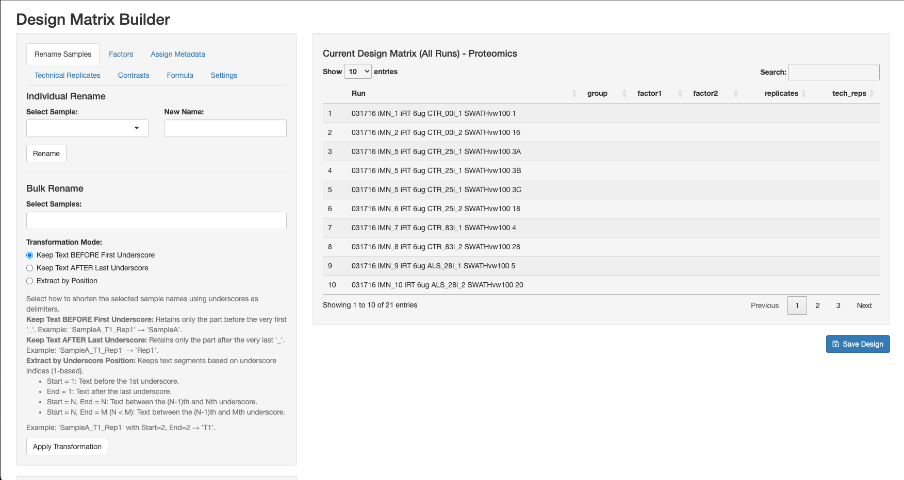
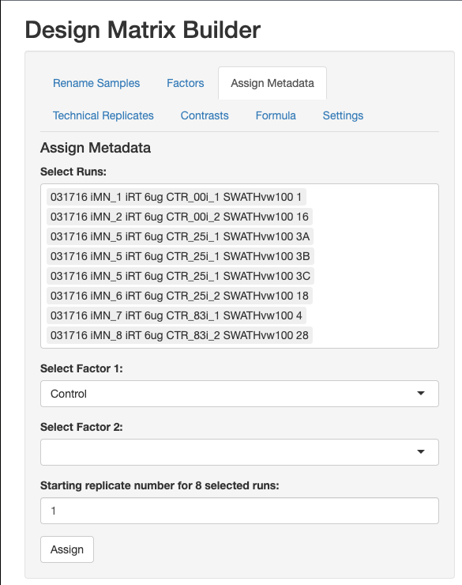
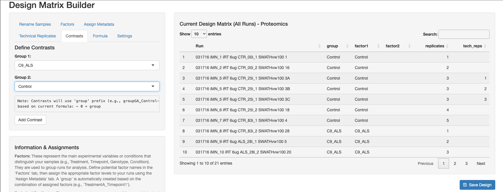

1. This is what the design matrix builder looks like when it is loaded into the browser

2. You can use the **Individual Rename** field to rename a single sample. Alternatively, you can select several samples with the **Bulk Rename** field to select different sections of the name, using underscore "_" as a delimiter. You can keep the test before the first underscore, keep the text after the last underscore, or extract a text based on a specific position. For the human ALS, SMA and control dataset you can ignore the Rename Samples tab.

3. Go to the "Factors" tab
	* Under "New Factor Name:"
		* Type in "Control" in the text box. Click "Add Factor". You've just added the "Control" factor.
		* Then type in "C9_ALS" in the text box. Click "Add Factor". You've just added the "C9_ALS" factor
		* Then type in "SMA_Type1" in the text box. Click "Add Factor". You've just added the "SMA_Type1" factor
		
4. Go to the "Assign Metadata" tab
	* Assigning the Control samples:
	* Under the "Select Runs:" drop down list.
	* Left click each sample name containing the "CTR" substring, which denotes these are control samples. There should be 8 samples with CTR. Count and check that you've got all 8 samples.
	* In the drop box "Select Factor 1:", click and select "Control".
	* Click "Assign"
	
	
	
	* You should see that the "group" column in the table are assigned with Control and that replicates number 1 to 8 are assigned in the "replicates" column.
	* Use delete key to delete all 8 samples from the "Select Runs:" dropdown box.
	* **Assigning the ALS samples:**
	* Under the "Select Runs:" drop down list.
	* Left click each sample name containing the "ALS" substring, which denotes these are control samples. There should be 8 samples with ALS. Count and check that you've got all 8 samples.
	* In the drop box "Select Factor 1:", click and select "C9_ALS".
	* Click "Assign"
	* You should see that the "group" column in the table are assigned with C9_ALS and that replicates number 1 to 8 are assigned in the "replicates" column.
	* Use delete key to delete all 8 samples from the "Select Runs:" dropdown box.
	* * **Assigning the SMA_Type1 samples:**
	* Under the "Select Runs:" drop down list.
	* Left click each sample name containing the "ALS" substring, which denotes these are control samples. There should be 8 samples with ALS. Count and check that you've got all 8 samples.
	* In the drop box "Select Factor 1:", click and select "C9_ALS".
	* Click "Assign"
	* You should see that the "group" column in the table are assigned with C9_ALS and that replicates number 1 to 8 are assigned in the "replicates" column.
	* Use delete key to delete all 8 samples from the "Select Runs:" dropdown box.
	* This is what it looks like after the step above:
	* 

5. Click "Technical Replicate" tab
	* Use the "Select Technical Replicate" drop down box to select the samples ending with the text 3A, 3B, and 3C. There should be three samples selected.
	* Click "Assign Technical Replicates"
	* You will see that the "replicates" column and "tech_reps" column are updated.
	

6. Click the "Contrasts" tab
	* Select "Group 1" drop down menu as "C9_ALS"
	* Select "Group 2" drop down menu as "Control"
	* Click "Add Contrast"
	
	* Select "Group 1" drop down menu as "SMA_Type1"
	* Select "Group 2" drop down menu as "Control"
	* Click "Add Contrast"
	* At the bottom left of the screen you should now see:
	

7. Click "Save Design" blue button at bottom right of the design matrix table.

