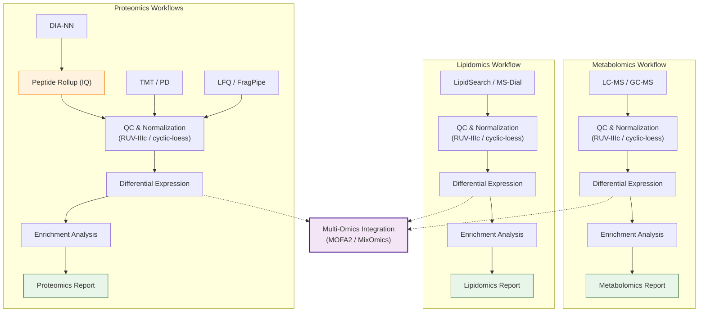

# MultiScholaR 

> **⚠️ Disclaimer:** `MultiScholaR` is under active development. The **end-to-end Multiomics GUI** currently supports Proteomics, Metabolomics, and Lipidomics workflows.

## Overview

**MultiScholaR** bridges the gap between complex multi-omics data and accessible, reproducible analysis. Unlike "black box" tools, it provides transparent, well-documented templates alongside a production-grade GUI, empowering researchers to understand the _how_ and _why_ behind their results.

**Key Features:**

- **Modular Architecture:** Flexible object-oriented design for easy tool integration.
- **Reproducibility:** Standardized workflows with automated, publication-ready reporting.
- **Advanced Quality Control:** Stringent measures including FDR thresholds, intensity filtering, and automated batch effect correction (RUV-IIIc).
- **Multi-Omics Integration:** Seamlessly integrate Proteomics, Metabolomics, and Lipidomics data.

## Analysis Workflow

## Getting Started

### 1. The GUI Experience (Recommended)

For a **code-free, interactive experience**, use the standalone launcher.

1.  Download the appropriate launcher for your OS (Windows/Mac).
2.  Double-click to install/update and launch the application.
3.  Follow the guided wizard for Import, QC, and Analysis.

### 2. R Markdown Workflows (Advanced)

For **programmatic, reproducible analyses**, typically for advanced users or batch processing.

1.  **Install Prerequisites**: R (4.4.3+), RStudio, and Rtools (Windows).
2.  **Setup Project**: Download and run the setup script to generate a structured project with all necessary templates.

    

3.  **Run Workflows**: Open the generated `.Rmd` templates (Proteomics, Metabolomics, etc.) in `inst/workbooks/` and execute chunks sequentially.

> **Need Help?** Visit the [Multiomics Masterclass](https://zenodo.org/records/15573343) for a comprehensive guide and tutorial data.

## Supported Workflows

| Omics Type       | Methods Supported            | Key Features                                              |
| :--------------- | :--------------------------- | :-------------------------------------------------------- |
| **Proteomics**   | DIA-NN, TMT-PD, LFQ-Fragpipe | Peptide rollup (IQ), Auto-RUV-IIIc, Mixed Species support |
| **Metabolomics** | LC-MS, GC-MS (MS-Dial)       | Intensity QC, Internal Standard Normalization             |
| **Lipidomics**   | MS-Dial, LipidSearch         | Lipid-class specific analysis, QC & filtering             |
| **Integration**  | MOFA2, MixOmics              | Multi-view factor analysis, Cross-omics enrichment        |

## Contributors

- Ignatius Pang (ignatius.pang@mq.edu.au)
- Will Klare (william.klare@mq.edu.au)

## Attributions

Derived from [ProteomeRiver](https://bitbucket.org/cmri-bioinformatics/proteomeriver/src/main/) (LGPLv3). Significant modifications by APAF-bioinformatics.
AI assistance used responsibly in development.
