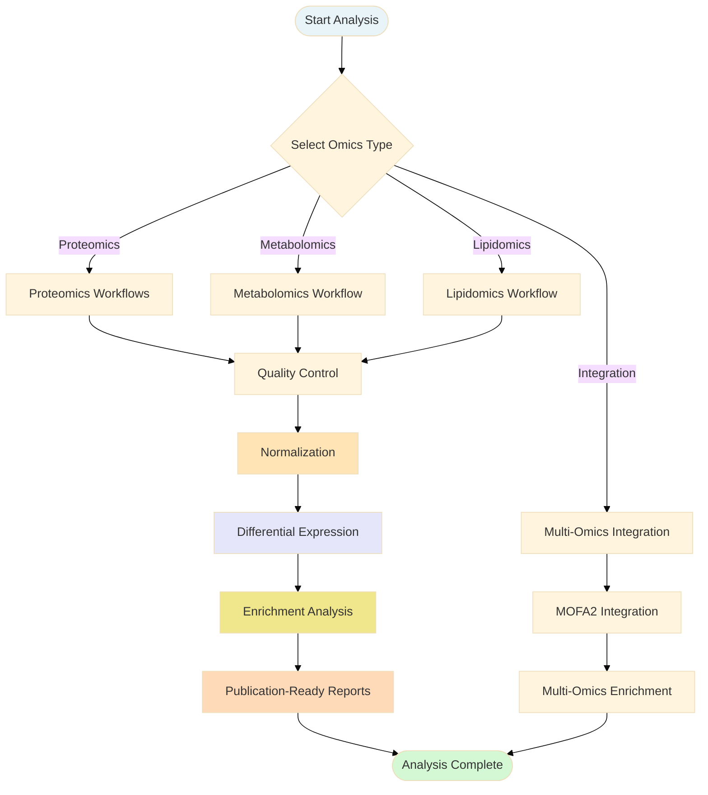
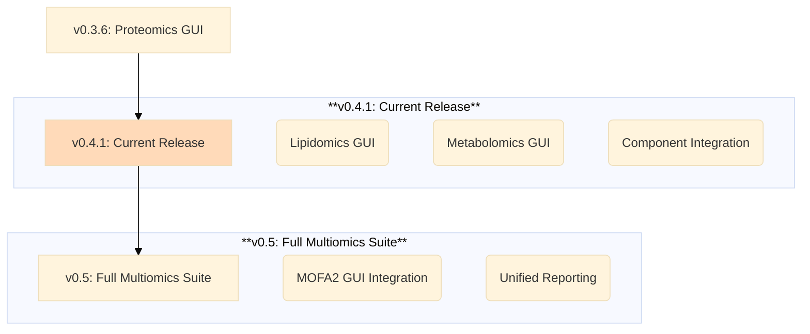
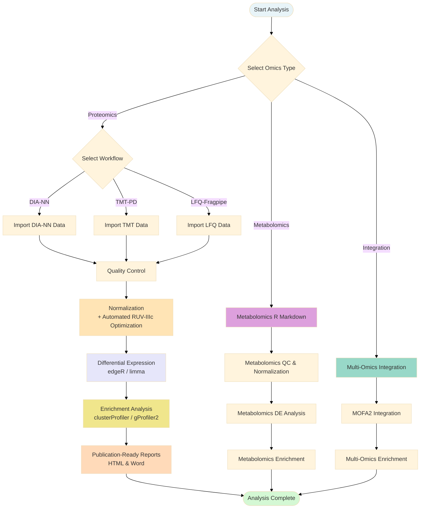
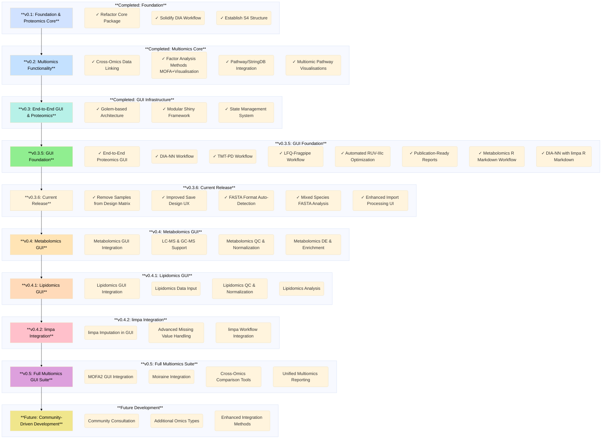

# MultiScholaR 

> **⚠️ Disclaimer:** `MultiScholaR` is currently under active development. The **end-to-end Multiomics GUI** now supports Proteomics, Metabolomics, and Lipidomics workflows, including automated parameter optimization, differential expression analysis, enrichment, and publication-ready reports.

## Overview

MultiScholaR bridges the gap between complex multi-omics data and accessible, reproducible analysis. By providing transparent, well-documented templates and a production-grade GUI, it empowers researchers to not only generate results but understand the _how_ and _why_ behind their analyses.

**Key Features:**

- **Modular Architecture**: Object-oriented design facilitating easy integration of new tools.
- **Reproducibility**: Standardized workflows with publication-ready reporting.
- **Quality Control**: Stringent QC measures including FDR thresholds, missing value filtering, and batch effect correction (RUV-IIIc/cyclic-loess).
- **Multi-Omics Integration**: Tools for integrating Proteomics, Metabolomics, and Lipidomics data.

## Using MultiScholaR

### Option 1: GUI Workflow (Recommended)

For a **code-free, interactive experience**:

1.  **Download the Launcher**: [MultiScholaR Launcher](https://github.com/APAF-bioinformatics/MultiScholaR-launcher)
2.  **Launch**: Double-click to install/update and run.
3.  **Analyze**: Follow the guided workflow for Import, QC, Normalization, DE, and Reporting.

### Option 2: R Markdown Workflows (Advanced)

For **programmatic, reproducible analyses**, use the provided R Markdown templates located in `inst/workbooks/`.

## End-to-End Multiomics GUI

MultiScholaR v0.4.1 features a comprehensive GUI built on the `{golem}` framework.

### Supported Workflows

#### 1. Proteomics

- **DIA-NN**: Peptide-to-protein rollup (IQ), automated RUV-IIIc normalization.
- **TMT-PD**: Protein-level analysis for Tandem Mass Tag data.
- **LFQ-Fragpipe**: Label-free quantification workflow.
- **Mixed Species**: Automatic organism detection and filtering for mixed-species samples.

#### 2. Metabolomics & Lipidomics (New in v0.4.1)

- **Full GUI Integration**: Complete Import -> QC -> Normalization -> DE -> Report pipeline.
- **Vendor Support**: MS-Dial (Metabolomics), MS-Dial + LipidSearch (Lipidomics), and flexible custom annotation mapping.
- **S4 Class Infrastructure**: Robust `MetabolomicsAssayData` and `LipidomicsAssayData` objects.

### Workflow Architecture

All workflows follow a consistent 6-stage pipeline:

1.  **Import**: Load and validate data (e.g., `.txt`, `.csv`, `.tsv`).
2.  **Quality Control**: Interactive filtering (e.g., missing values, intensity cutoffs).
3.  **Normalization**: Automated optimization (RUV-IIIc, cyclic-loess).
4.  **Differential Expression**: Robust statistical analysis (`edgeR`/`limma`).
5.  **Enrichment**: Pathway analysis (`clusterProfiler`, `gProfiler2`).
6.  **Reporting**: Automated HTML/Word reports.

## Quick Start

For a full guide, visit: [Data to Discovery: A Multiomics Masterclass](https://zenodo.org/records/15573343).

**Prerequisites**: R (4.4.3+), RStudio, Rtools (Windows).

## Contributors

- Ignatius Pang (ignatius.pang@mq.edu.au)
- Will Klare (william.klare@mq.edu.au)

## Development Roadmap

> **⚠️ Disclaimer:** `MultiScholaR` is currently under active development. The **end-to-end Multiomics GUI** is now functional with complete proteomics workflows (DIA-NN, TMT-PD, LFQ-Fragpipe) including automated parameter optimization, differential expression analysis, enrichment, and publication-ready reports. Metabolomics workflows are available as R Markdown templates and will be integrated into the GUI in upcoming releases. Functionality described in the roadmap is planned for future releases.

## Overview

Modern multi-omics datasets present a significant challenge: they require substantial programming expertise and practical knowledge, creating a skills gap that makes it difficult for many researchers to apply modern statistical best practices. MultiScholaR addresses this by embracing the philosophy of "teaching you _how_ to fish". While many tools offer quick analytical results, they often function as "black boxes," obscuring the crucial _how_ and _why_ behind the analyses. This limits deep understanding, adaptability, and the potential for innovation.

MultiScholaR is designed to bridge this gap by providing a comprehensive R package with transparent, well-documented workflow templates for single-omic analyses (e.g., transcriptomics, proteomics, metabolomics and others TBA), paired with integrative multi-omics approaches. These templates serve as powerful worked examples, allowing researchers to deconstruct complete analyses—examining functions, parameters, data flow, and logic within a real bioinformatics context. This "reverse engineering" approach accelerates meaningful learning, focusing on transferable skills (R, tidyverse, Bioconductor) and building the confidence to adapt methods to unique research questions. Our goal is not just to enable complex analyses but to empower researchers with the understanding and critical evaluation skills needed to tackle the analytical challenges of modern biology, enhance reproducibility through standardized and citable methods, and foster a more computationally fluent research community.

MultiScholaR implements stringent quality control measures for multi-omics analysis by incorporating criteria such as false discovery rate thresholds, filtering criterias, and missing value limitations across samples. It integrates several sophisticated analytical tools: the IQ tool for peptide-to-protein quantitative data summarization, RUVIII-C for removing unwanted variation, and edgeR and/or limma for sample normalization and linear modelling. Pathway analysis can be performed either using user-supplied annotations via clusterProfiler or through automated analysis with gProfiler2. Multivariate and integrative multi-omics analyses are implemented using MOFA and MixOmics paired with real-time enrichment of weight-ranked results.

Structured on modular, object-oriented components, MultiScholaR's architecture facilitates easy integration of new tools as they emerge. The inclusion of comprehensive, documented workbooks that guide users through each analytical step, facilitates reproducibility and enabling public sharing of analyses.

By streamlining complex multi-omics analyses, MultiScholaR makes advanced analytical techniques accessible to researchers across all levels of programming expertise.

## Using MultiScholaR

MultiScholaR offers two primary ways to analyze your data:

### Option 1: GUI Workflow (Recommended for Most Users)

For a **code-free, interactive experience** using the end-to-end Multiomics GUI:

1. **Download the Launcher**: Visit [MultiScholaR Launcher](https://github.com/APAF-bioinformatics/MultiScholaR-launcher) and download the appropriate launcher for your platform:
   - **Windows**: `Launch_MultiScholaR.bat`
   - **macOS**: `Launch_MultiScholaR.command`
2. **First Launch**: Double-click the launcher - it will automatically:
   - Detect your R installation
   - Install/update MultiScholaR from the GUI branch
   - Launch the interactive application
3. **Use the GUI**: Follow the guided workflow through the interface:
   - Import your data (DIA-NN, TMT-PD, or LFQ-Fragpipe)
   - Define experimental design and contrasts
   - Run quality control and normalization
   - Perform differential expression analysis
   - Generate enrichment results
   - Create publication-ready reports

**Prerequisites for GUI**: R (4.4.3+), Git, Pandoc, and Rtools (Windows only). See the [launcher repository](https://github.com/APAF-bioinformatics/MultiScholaR-launcher) for detailed setup instructions.

### Option 2: R Markdown Workflows (For Advanced Users)

For **programmatic, reproducible analyses** using R Markdown templates:

1. **Use the Setup Script**: Download and run `project_setup.R` (see Setup Script section above)
2. **Choose Your Workflow**:
   - **DIA-NN with limpa imputation**: Use `DIA_workflow_limpa_starter.rmd` or `DIA_workflow_limpa_experienced.rmd` for advanced missing value imputation using the limpa package
   - **Standard DIA-NN**: Use `DIA_workflow_starter.rmd` or `DIA_workflow_experienced.rmd` for standard DIA-NN analysis
   - **Metabolomics**: Use `metabolomics_workflow_starter.rmd` or `metabolomics_workflow_experienced.rmd` for metabolomics analysis
3. **Follow the Workflow**:
   - Copy your data files to the appropriate directories
   - Run chunks sequentially
   - Generate reports using the provided R Markdown templates

**When to Use Each**:

- **GUI**: Best for interactive analysis, learning, and users who prefer point-and-click interfaces
- **R Markdown**: Best for batch processing, custom analyses, reproducibility, and integration into larger pipelines

## End-to-End Multiomics GUI

MultiScholaR v0.3.6 introduces a comprehensive, production-grade graphical user interface built using the `{golem}` framework, following modern Shiny best practices. The GUI implements the "app-as-a-package" philosophy, ensuring maintainability, scalability, and professional deployment capabilities.

### Architecture

The GUI is structured as a modular R package following the `{golem}` framework's "app-as-a-package" philosophy:

- **Modular Shiny architecture**: Self-contained modules implementing specific workflow stages (import, QC, normalization, DE analysis, enrichment)
- **`inst/app/`**: Application entry point and static assets (CSS, images, JavaScript)
- **`dev/`**: Development scripts for building, testing, and deploying the application
- **Centralized state management**: Uses a hybrid R6/S4 architecture with a `WorkflowState` R6 class managing S4 data objects throughout the workflow
- **Function-based organization**: Core functionality organized into reusable functions, with modules orchestrating workflow stages

### Workflow Structure

All proteomics workflows follow a consistent, multi-stage architecture:

1. **Experiment Setup & Data Import**: Load and validate raw data from various proteomics platforms
2. **Quality Control**: Comprehensive QC with interactive visualizations and filtering
3. **Normalization**: Automated normalization with novel RUV-IIIc parameter optimization
4. **Differential Expression**: Statistical analysis with edgeR/limma
5. **Enrichment Analysis**: Pathway and functional enrichment
6. **Publication-Ready Reports**: Automated generation of HTML and Word reports

Each stage is implemented as a self-contained module, allowing for easy maintenance and extension to new omics types.

### Proteomics Workflows

MultiScholaR v0.3.6 provides complete GUI implementations for three major proteomics workflows:

#### DIA-NN Workflow

- **Full GUI implementation** for Data-Independent Acquisition (DIA) proteomics data processed with DIA-NN
- **Peptide-to-protein rollup** using the IQ tool for quantitative data summarization
- **Comprehensive QC pipeline** with peptide-level and protein-level filtering
- **Automated normalization** with RUV-IIIc parameter optimization
- **Modular implementation**: Import, QC, normalization, DE analysis, and enrichment modules

#### TMT-PD Workflow

- **GUI implementation** for Tandem Mass Tag (TMT) data processed with Proteome Discoverer
- **Protein-level analysis** from the start (no peptide rollup required)
- **TMT-specific QC** and normalization procedures
- **Modular implementation**: Same modular structure as DIA-NN, with workflow-specific adaptations

#### LFQ-Fragpipe Workflow

- **GUI implementation** for Label-Free Quantification (LFQ) data processed with FragPipe
- **Protein-level quantification** with FragPipe-specific data handling
- **Optimized for label-free** experimental designs
- **Modular implementation**: Shared modular architecture with workflow-specific import and QC steps

All three workflows share the same analysis pipeline after data import and initial QC, ensuring consistency across different proteomics platforms.

### Mixed Species FASTA Analysis

MultiScholaR v0.3.6 introduces support for **mixed species FASTA databases** across **all proteomics workflows** (DIA-NN, TMT-PD, LFQ-Fragpipe, MaxQuant, Spectronaut). This feature is commonly used in non-specific search strategies or when analyzing samples with spiked-in standards or contaminants.

**Key Features:**

- **Automatic organism detection**: Parses FASTA headers to extract organism information (OS/OX fields)
- **Distribution analysis**: Counts protein matches per organism and calculates percentages
- **Interactive selection**: Modal dialog displays organism distribution with protein counts and percentages
- **Smart defaults**: Pre-selects the most abundant organism based on protein frequency
- **Optional filtering**: Users can choose to filter data to keep only proteins from the selected organism
- **Seamless integration**: Organism selection automatically updates taxonomy ID and organism name for downstream analysis

**How It Works:**

1. Check "Mixed species FASTA" checkbox during data import
2. System processes FASTA file and analyzes organism distribution
3. Modal dialog appears showing organism breakdown (e.g., "Mus musculus: 85%, Homo sapiens: 12%, Other: 3%")
4. Select primary organism from the list (pre-selected to highest frequency)
5. Optionally enable filtering to remove proteins from other organisms
6. Confirm selection to proceed with analysis

This feature is particularly useful for:

- Non-specific search databases containing multiple species
- Samples with spiked-in protein standards
- Contaminant analysis and filtering
- Cross-species comparison studies

### Automated RUV-IIIc Parameter Optimization

MultiScholaR includes a **novel automated algorithm** for selecting optimal parameters for RUV-IIIc (Remove Unwanted Variation) normalization. This eliminates the subjectivity and guesswork typically associated with RUV parameter selection.

#### How It Works

The algorithm (`findBestNegCtrlPercentage` and `findBestNegCtrlPercentagePeptides`) automatically:

1. **Tests multiple negative control percentages**: Systematically evaluates percentages from 1% to 30% (configurable) to identify proteins/peptides least likely to be differentially expressed
2. **Optimizes the number of factors (k)**: Determines the optimal number of unwanted variation factors to remove using canonical correlation analysis
3. **Uses data-driven metrics**: Evaluates separation between experimental groups using metrics like maximum difference in canonical correlation space
4. **Applies composite scoring**: Combines separation quality with k-value penalties to find the optimal balance

#### Key Features

- **Fully automated**: No manual parameter tuning required
- **Dataset-specific optimization**: Adapts to your specific experimental design and data characteristics
- **Integrated into GUI**: Seamlessly integrated into the normalization module (`mod_prot_norm.R`)
- **Visual feedback**: Provides canonical correlation plots showing the optimization process
- **Reproducible**: All optimization parameters and results are logged for reproducibility

This innovation makes RUV-IIIc normalization accessible to users without deep statistical expertise while ensuring optimal results for each dataset.

### Workflow Overview

The following diagram illustrates the complete analysis pipeline available in MultiScholaR:

### Analysis Capabilities

#### Differential Expression Analysis

MultiScholaR provides comprehensive differential expression analysis through the GUI:

- **Statistical frameworks**: Integration with `edgeR` and `limma` for robust linear modeling
- **Flexible experimental designs**: Support for complex designs with multiple factors and contrasts
- **Interactive design matrix builder**: GUI-based tool for defining experimental groups and contrasts
  - Sample renaming with bulk transformation options
  - Factor assignment for up to 3 experimental variables
  - Technical replicate grouping
  - **Remove Samples tab**: Exclude unwanted samples from analysis with easy restoration
  - Contrast definition with formula-aware group naming
- **Multiple testing correction**: Automatic FDR adjustment using Benjamini-Hochberg or other methods
- **Visualization**: Volcano plots, MA plots, and other publication-quality visualizations

#### Enrichment Analysis

Pathway and functional enrichment analysis is seamlessly integrated:

- **Multiple annotation sources**:
  - User-supplied annotations via `clusterProfiler`
  - Automated annotation retrieval via `gProfiler2`
- **Enrichment methods**: Gene Ontology (GO), KEGG, Reactome, and custom pathway databases
- **Multi-omics enrichment**: Cross-omics pathway analysis for integrated datasets
- **Interactive results**: Browse and filter enrichment results within the GUI

#### Publication-Ready Reports

Automated report generation ensures reproducible, publication-quality outputs:

- **Report templates**:
  - `DIANN_report.rmd`: Comprehensive DIA-NN analysis reports
  - `TMT_report.rmd`: TMT proteomics reports
  - `LFQ_report.rmd`: Label-free quantification reports
- **Output formats**: HTML and Word document generation
- **Comprehensive content**: Includes QC plots, statistical results, enrichment analyses, and methodology descriptions
- **Reproducible**: All parameters and analysis steps are documented in the reports

### Metabolomics Workflow

MultiScholaR includes a **fully functional metabolomics analysis workflow** available as R Markdown templates:

- **Data Input**: Support for LC-MS and GC-MS metabolomics data
- **Quality Control**: Comprehensive QC pipeline with metabolite-level filtering
- **Normalization**: Multiple normalization methods including RUVIIIc
- **Differential Analysis**: Statistical analysis tailored for metabolomics data
- **Enrichment**: Metabolite pathway enrichment analysis
- **Workflow Templates**:
  - `metabolomics_workflow_starter.rmd`: Beginner-friendly with detailed explanations
  - `metabolomics_workflow_experienced.rmd`: Streamlined for experienced users

**Note**: The metabolomics workflow is currently available as R Markdown templates. **GUI integration is planned for v0.4**, making it accessible through the same interactive interface as proteomics workflows.

## Quick Start & Setup

## For a FULL AND DETAILED guide, please visit the Data to Discovery: A Multiomics Masterclass resource here https://zenodo.org/records/15573343 for detailed instructions.

### 1. Required Software

#### (4/25) R VERSION 4.4.3 CURRENTLY LATEST SUPPORTED VERSION DUE TO DEPENDENCY MIGRATION LAG to R 4.5.0

#### Windows Users Only:

### 2. Setup Script

### 3. Tutorial Data (Optional)

This tutorial dataset contains example data from _Klebsiella variicola_, including:

- Example DIA-NN search results
- Example organism FASTA file
- NCBI annotation protein data searched against UniProt and UniParc databases
- Example QC + normalised LCMS metabolomics data
- Example QC + normalised GCMS metabolomics data
- Example QC + normalised transcriptomics data
- Annotation files and MOFA model required to run the alpha integration workflow

The data is derived from the publicly available dataset published in [Mu, Klare, Baines, Pang et al., (2023) Nature Communications](https://www.nature.com/articles/s41467-023-37200-w), which performed integrative omics analysis on sepsis-causing bacteria.

## Setup Instructions to work with the tutorial dataset

1. Install RStudio Desktop and R if you haven't already (use button above).
2. (If you are on WindowS). Install RTools (match version numbers to your R install).
3. Download the setup script using the button above (right click + save as)
4. Open the downloaded file in RStudio
5. Change the project name at the top of the script (optional: specify custom directory)
6. Run the entire script (Ctrl+A then Ctrl+Enter)
7. A new RStudio project will open automatically with all required files and structure

## What Gets Set Up

The setup script creates a complete project structure for multiomics analysis:

- **Directory structure**: Organized folders for data, results, and workflows
- **R Markdown workflows**: Latest versions of available workflow templates
  - Proteomics: DIA-NN (standard and limpa versions)
  - Metabolomics: Starter and experienced versions
  - Integration: Multi-omics integration workflows
- **Configuration files**: Pre-configured settings for different omics types
- **R project file**: RStudio project for easy navigation

### Project Architecture

MultiScholaR follows the `{golem}` framework for the GUI application:

- **`R/`**: Modular Shiny application code organized by function and module type
- **`inst/app/`**: Application entry point and static assets (CSS, images)
- **`inst/workbooks/`**: R Markdown workflow templates organized by omics type
- **`inst/reports/`**: Report templates for generating publication-ready outputs
- **`dev/`**: Development scripts for building and deploying the application

This modular architecture ensures maintainability, scalability, and easy extension to new omics types.

## Contributors

- Ignatius Pang (ignatius.pang@mq.edu.au)
- Will Klare (william.klare@mq.edu.au)

## Attributions

This work is a derivative of the tool <a href="https://bitbucket.org/cmri-bioinformatics/proteomeriver/src/main/" target="_blank">ProteomeRiver</a>,
originally built for batching proteomics and phosphoproteomic analysis, which is licensed under the GNU Lesser General Public License v3.
Significant modifications and new code have been made by APAF-bioinformatics to create this independent library.
See LICENSE file for details.

As we are firmly in the age of artificial intelligence, it goes without saying that AI assistance has been used **RESPONSIBLY**
in the development of this project, with all appropriate checks and balances in place and adhering to industry-lead gold standards
of best practice usage. This declaration has been mandated by Macquarie University ICT.

## Development Roadmap

