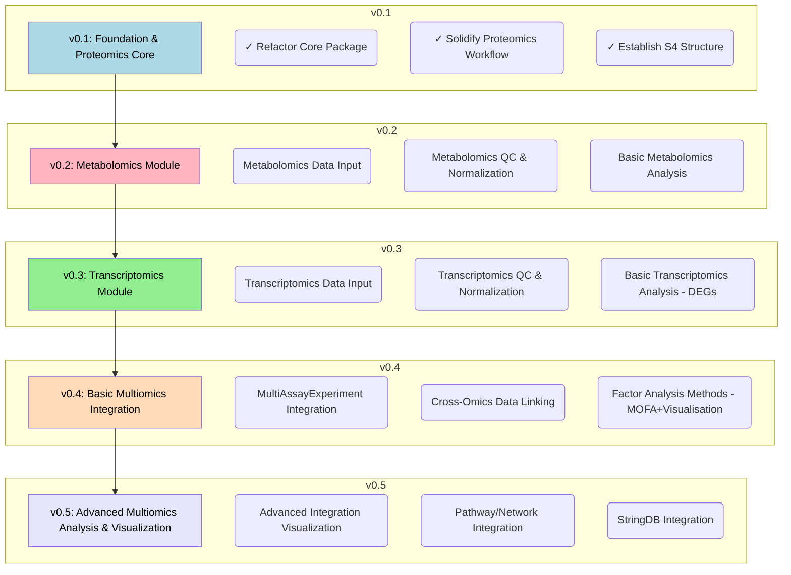

# MultiScholaR 

>**⚠️ Disclaimer:** `MultiScholaR` is currently under active development and is **not yet ready for general use**. The core package structure and initial proteomics workflow are being established. Functionality described in the roadmap is planned for future releases.

## Overview

Modern multi-omics datasets require substantial programming expertise and practical knowledge to analyse. Analysis is skill-gated, making it challenging for many researchers to apply modern statistical best practices. MultiScholaR is a package in R that addresses this challenge by providing a novel pipeline aiming to enable users to perform comprehensive multi-omics analyses, including single-omic analyses (e.g. transcriptomics, proteomics, phosphoproteomics and metabolomics datasets) and integrative multi-omics analysis. Through well-documented workflow templates, researchers can systematically apply best-practice to all steps of integrative multi-omics analysis.

MultiScholaR implements stringent quality control measures for multi-omics analysis by incorporating criteria such as false discovery rate thresholds, filtering criterias, and missing value limitations across samples. It integrates several sophisticated analytical tools: the IQ tool for peptide-to-protein quantitative data summarization, RUVIII-C for removing unwanted variation, and edgeR and/or limma for sample normalization and linear modelling. Pathway analysis can be performed either using user-supplied annotations via clusterProfiler or through automated analysis with gProfiler2. Multivariate and integrative multi-omics analyses are implemented using MOFA and MixOmics.

Structured on modular, object-oriented components, MultiScholaR's architecture facilitates easy integration of new tools as they emerge. The inclusion of comprehensive, documented workbooks that guide users through each analytical step, facilitates reproducibility and enabling public sharing of analyses.

By streamlining complex multi-omics analyses, MultiScholaR makes advanced analytical techniques accessible to researchers across all levels of programming expertise.

## Quick Start & Setup

*(Currently unavailable - See Roadmap)*

Details on installation and setup will be provided as the project matures towards stable releases.

## Contributors
* Ignatius Pang (ignatius.pang@mq.edu.au)
* Will Klare (william.klare@mq.edu.au)

## Development Roadmap

