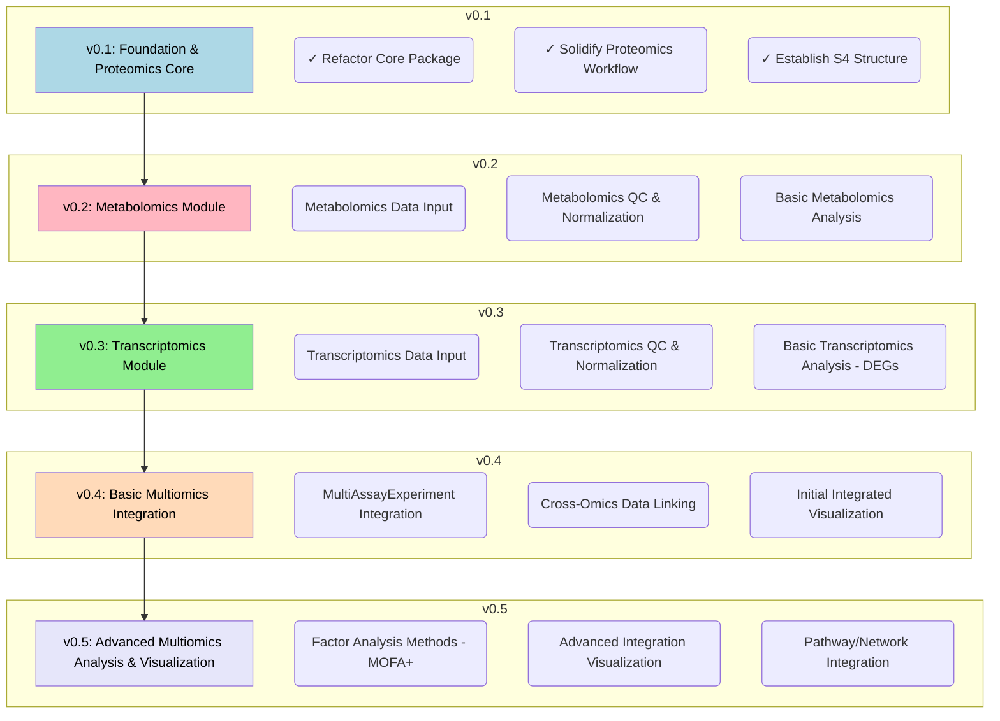

# MultiScholaR 

>**⚠️ Disclaimer:** `MultiScholaR` is currently under active development and is **not yet ready for general use**. The core package structure and initial proteomics workflow are being established. Functionality described in the roadmap is planned for future releases.

## Overview

`MultiScholaR` aims to provide a standardized, reproducible, and user-friendly R environment for the analysis of various omics data types (proteomics, metabolomics, transcriptomics) and their integration. It leverages S4 objects and established Bioconductor principles for robust data handling and analysis.

## Quick Start & Setup

*(Currently unavailable - See Roadmap)*

Details on installation and setup will be provided as the project matures towards stable releases.

## Contributors
* Ignatius Pang (ignatius.pang@mq.edu.au)
* Will Klare (william.klare@mq.edu.au)

## Development Roadmap

