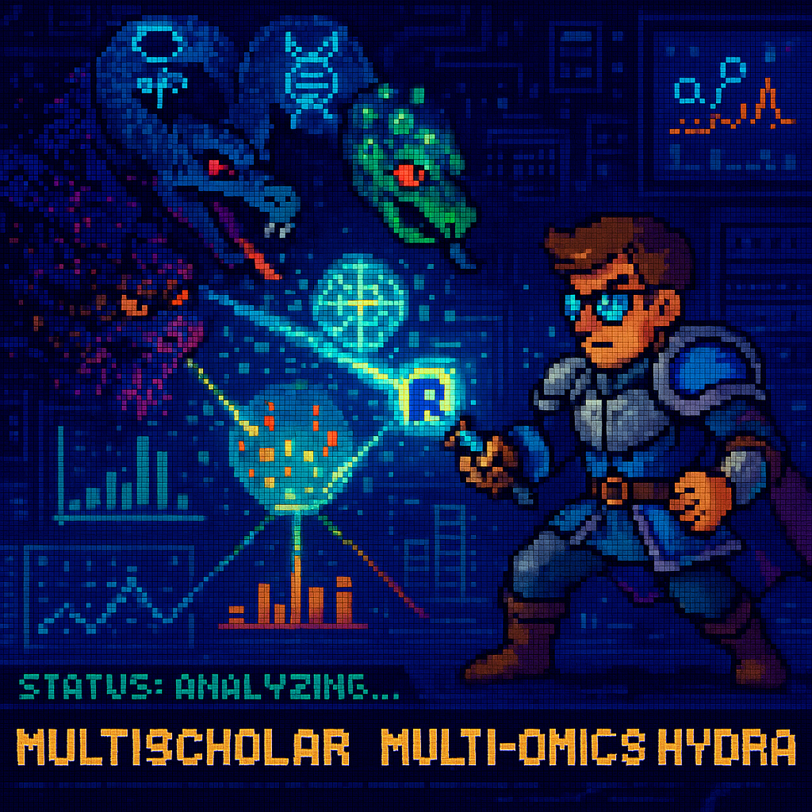

# MultiScholaR 

>**⚠️ Disclaimer:** `MultiScholaR` is currently under active development and is **not yet ready for general use**. The core package structure and initial multiomics workflow are being established. The proteomics functionality is ready however. Functionality described in the roadmap is planned for future releases.

## Overview

Modern multi-omics datasets present a significant challenge: they require substantial programming expertise and practical knowledge, creating a skills gap that makes it difficult for many researchers to apply modern statistical best practices. MultiScholaR addresses this by embracing the philosophy of "teaching you *how* to fish". While many tools offer quick analytical results, they often function as "black boxes," obscuring the crucial *how* and *why* behind the analyses. This limits deep understanding, adaptability, and the potential for innovation.

MultiScholaR is designed to bridge this gap by providing a comprehensive R package with transparent, well-documented workflow templates for single-omic analyses (e.g., transcriptomics, proteomics, metabolomics and others TBA), paired with integrative multi-omics approaches. These templates serve as powerful worked examples, allowing researchers to deconstruct complete analyses—examining functions, parameters, data flow, and logic within a real bioinformatics context. This "reverse engineering" approach accelerates meaningful learning, focusing on transferable skills (R, tidyverse, Bioconductor) and building the confidence to adapt methods to unique research questions. Our goal is not just to enable complex analyses but to empower researchers with the understanding and critical evaluation skills needed to tackle the analytical challenges of modern biology, enhance reproducibility through standardized and citable methods, and foster a more computationally fluent research community.

MultiScholaR implements stringent quality control measures for multi-omics analysis by incorporating criteria such as false discovery rate thresholds, filtering criterias, and missing value limitations across samples. It integrates several sophisticated analytical tools: the IQ tool for peptide-to-protein quantitative data summarization, RUVIII-C for removing unwanted variation, and edgeR and/or limma for sample normalization and linear modelling. Pathway analysis can be performed either using user-supplied annotations via clusterProfiler or through automated analysis with gProfiler2. Multivariate and integrative multi-omics analyses are implemented using MOFA and MixOmics paired with real-time enrichment of weight-ranked results.

Structured on modular, object-oriented components, MultiScholaR's architecture facilitates easy integration of new tools as they emerge. The inclusion of comprehensive, documented workbooks that guide users through each analytical step, facilitates reproducibility and enabling public sharing of analyses.

By streamlining complex multi-omics analyses, MultiScholaR makes advanced analytical techniques accessible to researchers across all levels of programming expertise.

## Quick Start & Setup

## For a FULL AND DETAILED guide, please visit the Data to Discovery: A Multiomics Masterclass resource here https://zenodo.org/records/15573343 for detailed instructions.

### 1. Required Software

#### (4/25) R VERSION 4.4.3 CURRENTLY LATEST SUPPORTED VERSION DUE TO DEPENDENCY MIGRATION LAG to R 4.5.0

#### Windows Users Only:

### 2. Setup Script

### 3. Tutorial Data (Optional)

This tutorial dataset contains example data from *Klebsiella variicola*, including:
- Example DIA-NN search results
- Example organism FASTA file
- NCBI annotation protein data searched against UniProt and UniParc databases
- Example QC + normalised LCMS metabolomics data
- Example QC + normalised GCMS metabolomics data
- Example QC + normalised transcriptomics data
- Annotation files and MOFA model required to run the alpha integration workflow

The data is derived from the publicly available dataset published in [Mu, Klare, Baines, Pang et al., (2023) Nature Communications](https://www.nature.com/articles/s41467-023-37200-w), which performed integrative omics analysis on sepsis-causing bacteria.

## Setup Instructions to work with the tutorial dataset

1. Install RStudio Desktop and R if you haven't already (use button above).
2. (If you are on WindowS). Install RTools (match version numbers to your R install).
3. Download the setup script using the button above (right click + save as)
4. Open the downloaded file in RStudio
5. Change the project name at the top of the script (optional: specify custom directory)
6. Run the entire script (Ctrl+A then Ctrl+Enter)
7. A new RStudio project will open automatically with all required files and structure

## What Gets Set Up

- Complete directory structure for multiomics analysis
- Latest versions of available workflows
- Configuration files
- R project file

## Using the Workflow

1. Run the DIA_workflow_beginner.rmd file (this should automatically have opened if you did the above correctly!)
   - **NEW:** Beginners can try DIA_workflow_starter.rmd with detailed explanations and educational resources
2. Please copy your organism .fasta to the data/UniProt subdirectory
3. Please copy your searched data to the data/proteomics subdirectory
4. Proceed chunk by chunk
5. Use the enhanced Shiny app to define your:
   - Experimental design
   - Contrasts
   - Linear model
6. Find all results in the results_summary folder
7. **NEW:** Run DIA_report.rmd to generate comprehensive HTML and Word reports with publication-quality visualizations
8. Run the Integration_workflow_beginner.rmd file once you have processed the DIA data, and import all the required data to proceed.

## Contributors 
* Ignatius Pang (ignatius.pang@mq.edu.au) 
* Will Klare (william.klare@mq.edu.au) 

## Attributions
This work is a derivative of the tool <a href="https://bitbucket.org/cmri-bioinformatics/proteomeriver/src/main/" target="_blank">ProteomeRiver</a>,
originally built for batching proteomics and phosphoproteomic analysis, which is licensed under the GNU Lesser General Public License v3.
Significant modifications and new code have been made by APAF-bioinformatics to create this independent library.
See LICENSE file for details.

## Development Roadmap

