# MultiScholaR Technical Documentation: Enhanced System Guide

**Target Audience:** Technical R expert with NO prior Shiny/Golem/R6 knowledge  
**Document Version:** 2.0 (Enhanced)  
**Last Updated:** January 2026  
**Repository:** [APAF-bioinformatics/MultiScholaR](https://github.com/APAF-bioinformatics/MultiScholaR)

---

## DOCUMENT OVERVIEW

This guide provides comprehensive technical documentation for MultiScholaR, a production-grade multi-omics analysis platform built on R, Shiny, and the Golem framework. The architecture combines:

- **R6 classes** for mutable state management
- **S4 classes** for rigorous domain data structures  
- **Shiny modules** for reactive UI components
- **Golem framework** for production-ready app packaging

MultiScholaR implements a novel "app-as-a-package" philosophy, treating the entire Shiny application as a structured R package. This enables:

- Modular development with clear separation of concerns
- Reproducible analyses through versioned workflows
- Scalable architecture supporting multiple omics types
- Professional deployment with dependency management

---

## TABLE OF CONTENTS

- **PART I: Fundamentals** (~15 pages)
  - R6 Classes: Mutable State Management
  - S4 Classes: Rigorous Data Structures  
  - Shiny Fundamentals: Reactive Programming
  - Golem Framework: Modular Shiny Apps

- **PART II: Core Architecture** (~10 pages)
  - Application Initialization & Dynamic Loading
  - State Management Architecture
  - Workflow Routing Architecture
  - Multi-Assay Pattern (Metabolomics)

- **PART III: Domain Workflows** (~10 pages)
  - Proteomics Workflow: End-to-End
  - Metabolomics Workflow: End-to-End

- **PART IV: Cross-Cutting Infrastructure** (~7 pages)
  - Plotting Infrastructure
  - File Management & Reproducibility
  - Enrichment Analysis

- **PART V: Advanced Topics** (~4 pages)
  - Global Environment Dependencies (Anti-Pattern)
  - Logging & Debugging
  - Phosphoproteomics Extensions
  - MOFA Multi-Omics Integration

- **PART VI: Appendices** (~5 pages)
  - Complete Code Examples
  - S4 Class Reference
  - Key Functions by Domain
  - WorkflowState R6 API

---

# PART I: FUNDAMENTALS

## Section 1: R6 Classes - Mutable State Management

### 1.1 The Core Problem: Why R6 Exists

Traditional R programming follows a **functional paradigm** where objects are immutable. This is embodied in the S3 and S4 class systems. While immutability provides safety and predictability, it creates significant challenges for application state management—particularly in interactive environments like Shiny.

#### The Immutability Challenge

Consider a typical S4 workflow for proteomics data:

```r
# S4 example (functional, immutable)
# Create initial protein quantification object
my_object <- new("ProteinQuantitativeData", 
  protein_quant_table = raw_data,
  design_matrix = design_df,
  protein_id_column = "Accession",
  sample_id = "Sample",
  group_id = "Group",
  args = list()
)

# Modify the data (creates a NEW object internally)
my_object@protein_quant_table <- filtered_data

# Problem in Shiny: When you pass my_object to multiple reactive expressions,
# each modification creates a new copy. This leads to:
# 1. High memory usage (multiple full copies of large datasets)
# 2. State synchronization issues (which copy is "current"?)
# 3. Complex bookkeeping to track object versions
```

In a Shiny application with dozens of reactive expressions all reading and modifying the same underlying data, this copy-on-modify behavior becomes untenable. You need a way to maintain **shared mutable state** that all parts of your application can reference.

#### The R6 Solution: Reference Semantics

R6 introduces **object-oriented programming** with **pass-by-reference** semantics. Instead of copying objects on every modification, R6 objects are modified in-place:

```r
# R6 example (OOP, mutable)
state_manager <- WorkflowState$new()  # Create state manager

# Save a checkpoint - stores reference to the S4 object
state_manager$saveState(
  name = "post_import",
  object = my_object,  # S4 object stored by reference
  config = list(file = "data.csv")
)

# Later, retrieve the same object (no copying)
current_data <- state_manager$getState("post_import")

# Multiple reactive expressions can share this state manager
# All see the same state without creating copies
```

### 1.2 R6 Syntax: Building Blocks

R6 classes are defined using the `R6::R6Class()` constructor function. The class definition specifies public and private members, initialization logic, and methods.

#### Basic Class Structure

```r
# Define an R6 class for managing workflow state
StateManager <- R6::R6Class("StateManager",
  
  # PUBLIC MEMBERS (accessible from outside the object)
  public = list(
    
    # Public fields (data members)
    current_state = NULL,
    
    # Constructor (initialize method)
    # Called automatically when creating new instance via StateManager$new()
    initialize = function() {
      self$current_state <- "initial"
      private$history <- list()
      message("StateManager initialized")
      invisible(self)  # Return self invisibly for chaining
    },
    
    # Public method: Set current state
    setState = function(new_state) {
      # Validate input
      if (!is.character(new_state)) {
        stop("State must be a character string")
      }
      
      # Update state
      old_state <- self$current_state
      self$current_state <- new_state
      
      # Log to private history
      private$addToHistory(old_state, new_state)
      
      message("State changed: ", old_state, " -> ", new_state)
      invisible(self)
    },
    
    # Public method: Get current state
    getState = function() {
      return(self$current_state)
    },
    
    # Public method: Get full history
    getHistory = function() {
      return(private$history)
    }
  ),
  
  # PRIVATE MEMBERS (accessible only within the class)
  private = list(
    
    # Private field
    history = NULL,
    
    # Private method: Add state transition to history
    addToHistory = function(from, to) {
      transition <- list(
        from = from,
        to = to,
        timestamp = Sys.time()
      )
      private$history <- c(private$history, list(transition))
    }
  )
)
```

#### Using the Class

```r
# Create an instance
manager <- StateManager$new()
# Output: "StateManager initialized"

# Access public fields
print(manager$current_state)
# Output: "initial"

# Call public methods
manager$setState("processing")
# Output: "State changed: initial -> processing"

manager$setState("complete")
# Output: "State changed: processing -> complete"

# Retrieve state
print(manager$getState())
# Output: "complete"

# View history (calls private method via public interface)
history <- manager$getHistory()
print(history)
# Output: List of 2 transitions with timestamps

# Try to access private member directly (will fail)
try(print(manager$history))
# Error: object 'history' not found
```

### 1.3 Key Differences: S4 vs R6

Understanding when to use S4 versus R6 is critical for effective application design:

| Aspect | S4 (Functional) | R6 (OOP) |
|--------|-----------------|----------|
| **Philosophy** | Immutable data structures | Mutable state objects |
| **Instantiation** | `new("ClassName", ...)` | `ClassName$new(...)` |
| **Field Access** | `object@slot_name` | `object$field_name` |
| **Method Call** | `methodName(object, ...)` | `object$method(...)` |
| **Method Dispatch** | S4 generic functions | Methods belong to objects |
| **Semantics** | Copy-on-modify | Pass-by-reference (mutable) |
| **Memory** | Each modification creates copy | Modifications in-place |
| **Use Case** | Data structures, domain objects | Application state, managers |
| **Validation** | `validity` function | Manual in methods |
| **Inheritance** | Multiple inheritance | Single inheritance (simple) |

### 1.4 Memory Model: Understanding Pass-by-Reference

This is perhaps the most critical difference between S4 and R6, and the one that causes the most confusion for R programmers accustomed to functional programming.

#### S4: Copy Semantics (Functional)

```r
# Create original S4 object
prot_data_v1 <- new("ProteinQuantitativeData",
  protein_quant_table = large_dataframe,  # 10 GB dataset
  design_matrix = design_df,
  protein_id_column = "Accession",
  sample_id = "Sample",
  group_id = "Group"
)

# "Assign" to new variable (actually creates a copy)
prot_data_v2 <- prot_data_v1  # Another 10 GB allocated

# Modify v2
prot_data_v2@protein_quant_table <- filtered_data

# Check: v1 and v2 are independent
identical(prot_data_v1@protein_quant_table, prot_data_v2@protein_quant_table)
# Output: FALSE

# Memory usage: 20 GB (two full copies)
```

#### R6: Reference Semantics (OOP)

```r
# Create original R6 object
manager_v1 <- StateManager$new()
manager_v1$setState("processing")

# "Assign" to new variable (actually creates a REFERENCE)
manager_v2 <- manager_v1  # No new memory allocated!

# Modify via v2
manager_v2$setState("complete")

# Check: v1 and v2 reference the SAME object
print(manager_v1$getState())  # Output: "complete"
print(manager_v2$getState())  # Output: "complete"

# Both variables point to the same underlying object
identical(manager_v1, manager_v2)  # Output: TRUE

# Memory usage: Minimal (one object, two pointers)
```

#### Deep Copying When Needed

If you genuinely need independent copies of an R6 object, you must explicitly clone:

```r
# Create original
manager_original <- StateManager$new()
manager_original$setState("processing")

# Create independent copy
manager_copy <- manager_original$clone(deep = TRUE)

# Modify copy
manager_copy$setState("complete")

# Now they're independent
print(manager_original$getState())  # Output: "processing"
print(manager_copy$getState())      # Output: "complete"
```

### 1.5 Integration Pattern: R6 Manages S4

MultiScholaR uses a hybrid architecture that respects the strengths of both systems:

- **S4 objects** hold **domain data** (proteomics datasets, metabolite tables)
- **R6 objects** act as **state managers** that orchestrate S4 snapshots

This pattern provides:
- **Type safety** from S4's rigorous validation
- **Efficient state management** from R6's reference semantics
- **Clear separation** between data (S4) and control logic (R6)

#### Implementation Example

```r
# S4: Define domain data structure
setClass("ProteinQuantitativeData",
  slots = c(
    protein_quant_table = "data.frame",
    design_matrix = "data.frame",
    protein_id_column = "character",
    sample_id = "character",
    group_id = "character",
    args = "list"  # Processing history
  ),
  validity = function(object) {
    # Enforce business rules
    if (!all(object@sample_id %in% names(object@design_matrix))) {
      return("Sample IDs mismatch between data and design matrix")
    }
    return(TRUE)
  }
)

# R6: Define state manager
WorkflowState <- R6::R6Class("WorkflowState",
  public = list(
    # Store named snapshots of S4 objects
    states = list(),
    current_state = NULL,
    
    initialize = function() {
      self$states <- list()
      self$current_state <- NULL
      invisible(self)
    },
    
    # Save a checkpoint: stores S4 object with metadata
    saveState = function(name, object, config = list()) {
      # Validate input is S4
      if (!isS4(object)) {
        stop("Can only save S4 objects")
      }
      
      # Store complete state snapshot
      self$states[[name]] <- list(
        object = object,        # S4 object (stored by reference in list)
        config = config,        # Analysis parameters
        timestamp = Sys.time(), # When created
        class = class(object)   # S4 class name
      )
      
      self$current_state <- name
      message("Saved state: ", name, " (", class(object), ")")
      invisible(self)
    },
    
    # Retrieve a saved S4 object
    getState = function(name = NULL) {
      if (is.null(name)) {
        name <- self$current_state
      }
      
      if (!name %in% names(self$states)) {
        stop("State '", name, "' not found")
      }
      
      # Return the S4 object
      return(self$states[[name]]$object)
    },
    
    # Revert to earlier state (time-travel debugging)
    revertToState = function(name) {
      if (!name %in% names(self$states)) {
        stop("State '", name, "' not found")
      }
      
      # Keep only states up to the target
      state_names <- names(self$states)
      keep_idx <- 1:which(state_names == name)
      self$states <- self$states[keep_idx]
      self$current_state <- name
      
      message("Reverted to state: ", name)
      invisible(self)
    },
    
    # List all available states
    getHistory = function() {
      if (length(self$states) == 0) {
        return(data.frame(
          name = character(),
          class = character(),
          timestamp = as.POSIXct(character()),
          stringsAsFactors = FALSE
        ))
      }
      
      data.frame(
        name = names(self$states),
        class = sapply(self$states, function(s) s$class),
        timestamp = as.POSIXct(sapply(self$states, function(s) s$timestamp)),
        row.names = NULL,
        stringsAsFactors = FALSE
      )
    }
  )
)
```

#### Usage in Practice

```r
# Create state manager (R6)
state_manager <- WorkflowState$new()

# Create domain data (S4)
prot_data <- new("ProteinQuantitativeData",
  protein_quant_table = imported_data,
  design_matrix = design_df,
  protein_id_column = "Accession",
  sample_id = "Sample",
  group_id = "Group",
  args = list(import = list(file = "data.csv"))
)

# Checkpoint 1: After import
state_manager$saveState(
  name = "post_import",
  object = prot_data,
  config = list(format = "DIA-NN")
)

# Perform QC filtering (creates modified S4 object)
prot_data_qc <- filterByIntensity(prot_data, threshold = 100)
prot_data_qc@args$qc <- list(threshold = 100)

# Checkpoint 2: After QC
state_manager$saveState(
  name = "post_qc",
  object = prot_data_qc,
  config = list(threshold = 100)
)

# Perform normalization (creates another modified object)
prot_data_norm <- normaliseBetweenSamples(prot_data_qc, method = "cyclicloess")
prot_data_norm@args$normalization <- list(method = "cyclicloess")

# Checkpoint 3: After normalization
state_manager$saveState(
  name = "post_normalization",
  object = prot_data_norm,
  config = list(method = "cyclicloess")
)

# View history
print(state_manager$getHistory())
#                name                       class           timestamp
# 1       post_import ProteinQuantitativeData 2026-01-13 10:00:00
# 2            post_qc ProteinQuantitativeData 2026-01-13 10:15:00
# 3 post_normalization ProteinQuantitativeData 2026-01-13 10:30:00

# Retrieve any state
qc_data <- state_manager$getState("post_qc")

# Revert to earlier state (undo normalization)
state_manager$revertToState("post_qc")
print(state_manager$getHistory())
#           name                       class           timestamp
# 1 post_import ProteinQuantitativeData 2026-01-13 10:00:00
# 2      post_qc ProteinQuantitativeData 2026-01-13 10:15:00
```

---

## Section 2: S4 Classes - Rigorous Data Structures

### 2.1 S4 Philosophy: Type Safety and Validation

While R6 provides flexible state management, S4 classes enforce **rigorous type constraints** and **data validation**. This makes S4 ideal for domain objects where data integrity is critical.

S4 provides:
- **Formal class definitions** with explicit slot types
- **Automatic validation** on object creation and modification
- **Multiple inheritance** for complex domain hierarchies
- **Method polymorphism** via generic functions

#### S4 Class Definition Anatomy

```r
# Define a proteomics data structure
setClass("ProteinQuantitativeData",
  
  # SLOTS: Define data members with explicit types
  slots = c(
    protein_quant_table = "data.frame",   # Quantitative matrix
    design_matrix = "data.frame",         # Experimental design
    protein_id_column = "character",      # Column name for protein IDs
    sample_id = "character",              # Column name for sample IDs
    group_id = "character",               # Column name for groups
    args = "list"                         # Processing parameters history
  ),
  
  # PROTOTYPE: Default values (optional)
  prototype = list(
    protein_quant_table = data.frame(),
    design_matrix = data.frame(),
    protein_id_column = character(),
    sample_id = character(),
    group_id = character(),
    args = list()
  ),
  
  # VALIDITY: Enforce business rules
  validity = function(object) {
    errors <- character()
    
    # Rule 1: Protein ID column must exist in data
    if (!object@protein_id_column %in% names(object@protein_quant_table)) {
      errors <- c(errors, 
        paste("Protein ID column '", object@protein_id_column, 
              "' not found in data table"))
    }
    
    # Rule 2: Sample ID column must exist in design
    if (!object@sample_id %in% names(object@design_matrix)) {
      errors <- c(errors,
        paste("Sample ID column '", object@sample_id,
              "' not found in design matrix"))
    }
    
    # Rule 3: Group ID column must exist in design
    if (!object@group_id %in% names(object@design_matrix)) {
      errors <- c(errors,
        paste("Group ID column '", object@group_id,
              "' not found in design matrix"))
    }
    
    # Rule 4: Sample columns in data must match design
    data_samples <- setdiff(names(object@protein_quant_table), 
                            object@protein_id_column)
    design_samples <- object@design_matrix[[object@sample_id]]
    
    if (!all(data_samples %in% design_samples)) {
      errors <- c(errors,
        "Data contains samples not in design matrix")
    }
    
    # Return TRUE if valid, character vector of errors if not
    if (length(errors) == 0) {
      return(TRUE)
    } else {
      return(errors)
    }
  }
)
```

#### Creating and Validating S4 Objects

```r
# Valid instantiation
prot_data <- new("ProteinQuantitativeData",
  protein_quant_table = data.frame(
    Accession = c("P12345", "P67890"),
    Sample_A = c(100, 200),
    Sample_B = c(150, 250)
  ),
  design_matrix = data.frame(
    Sample = c("Sample_A", "Sample_B"),
    Group = c("Control", "Treatment")
  ),
  protein_id_column = "Accession",
  sample_id = "Sample",
  group_id = "Group",
  args = list()
)
# Validation runs automatically - succeeds

# Invalid instantiation (column name mismatch)
try({
  bad_data <- new("ProteinQuantitativeData",
    protein_quant_table = data.frame(
      Protein = c("P12345"),  # Wrong column name!
      Sample_A = c(100)
    ),
    design_matrix = data.frame(
      Sample = c("Sample_A"),
      Group = c("Control")
    ),
    protein_id_column = "Accession",  # Expects "Accession" but table has "Protein"
    sample_id = "Sample",
    group_id = "Group"
  )
})
# Error in validObject(.Object) : 
#   invalid class "ProteinQuantitativeData" object: 
#   Protein ID column 'Accession' not found in data table
```

### 2.2 MultiScholaR S4 Class Hierarchy

Multi Scholar defines a hierarchy of S4 classes for different omics types:

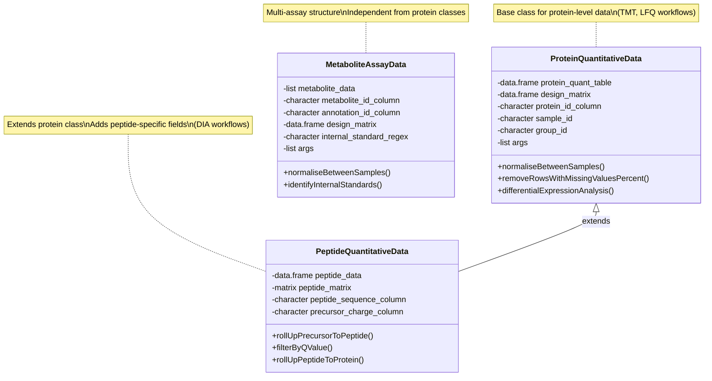

#### Inheritance Example: PeptideQuantitativeData

```r
# PeptideQuantitativeData inherits all slots from ProteinQuantitativeData
# and adds peptide-specific slots
setClass("PeptideQuantitativeData",
  contains = "ProteinQuantitativeData",  # Inheritance
  
  # Additional slots beyond parent
  slots = c(
    peptide_data = "data.frame",              # Raw peptide-level data
    peptide_matrix = "matrix",                # Wide-format matrix
    peptide_sequence_column = "character",    # Peptide sequence column
    precursor_charge_column = "character"     # Precursor charge column
  ),
  
  # Extended validation
  validity = function(object) {
    errors <- character()
    
    # Call parent validation first
    parent_valid <- callNextMethod()
    if (!isTRUE(parent_valid)) {
      errors <- c(errors, parent_valid)
    }
    
    # Peptide-specific validation
    if (!object@peptide_sequence_column %in% names(object@peptide_data)) {
      errors <- c(errors,
        paste("Peptide sequence column '", object@peptide_sequence_column,
              "' not found in peptide data"))
    }
    
    if (length(errors) == 0) {
      return(TRUE)
    } else {
      return(errors)
    }
  }
)
```

### 2.3 The `@args` Slot: Reproducible Processing History

Every MultiScholaR S4 object includes an `@args` list that accumulates a complete audit trail of processing steps. This enables full reproducibility—you can regenerate the exact analysis by replaying the stored parameters.

#### Progressive Parameter Accumulation

```r
# Initialize with empty args
prot_data <- new("ProteinQuantitativeData",
  protein_quant_table = raw_data,
  design_matrix = design_df,
  protein_id_column = "Accession",
  sample_id = "Sample",
  group_id = "Group",
  args = list()  # Empty initially
)

# Step 1: QC Filtering
prot_data@args$qc <- list(
  method = "intensity_filter",
  threshold = 100,
  missing_percent_threshold = 0.5,
  timestamp = Sys.time(),
  rows_before = nrow(raw_data),
  rows_after = nrow(filtered_data),
  rows_removed = nrow(raw_data) - nrow(filtered_data)
)

# Step 2: Normalization
prot_data@args$normalization <- list(
  method = "cyclicloess",
  timestamp = Sys.time(),
  params = list(
    iterations = 3,
    span = 0.75
  )
)

# Step 3: Batch Correction
prot_data@args$batch_correction <- list(
  method = "RUV-III",
  k = 3,  # Number of factors
  negative_control_percentage = 0.1,
  timestamp = Sys.time()
)

# Step 4: Differential Expression
prot_data@args$de <- list(
  method = "limma",
  design_formula = "~Group",
  contrasts = c("TreatmentVsControl"),
  adjust_method = "BH",  # Benjamini-Hochberg FDR
  timestamp = Sys.time()
)

# Final state: Complete parameter history
str(prot_data@args, max.level = 2)
# List of 4
#  $ qc              :List of 7
#   ..$ method                 : chr "intensity_filter"
#   ..$ threshold              : num 100
#   ..$ missing_percent_threshold: num 0.5
#   ..$ timestamp              : POSIXct[1:1], format: "2026-01-13 10:15:00"
#   ..$ rows_before            : int 5000
#   ..$ rows_after             : int 4500
#   ..$ rows_removed           : int 500
#  $ normalization   :List of 3
#   ..$ method   : chr "cyclicloess"
#   ..$ timestamp: POSIXct[1:1], format: "2026-01-13 10:30:00"
#   ..$ params   :List of 2
#  $ batch_correction:List of 4
#   ..$ method                      : chr "RUV-III"
#   ..$ k                           : num 3
#   ..$ negative_control_percentage : num 0.1
#   ..$ timestamp                   : POSIXct[1:1], format: "2026-01-13 10:45:00"
#  $ de              :List of 5
#   ..$ method        : chr "limma"
#   ..$ design_formula: chr "~Group"
#   ..$ contrasts     : chr "TreatmentVsControl"
#   ..$ adjust_method : chr "BH"
#   ..$ timestamp     : POSIXct[1:1], format: "2026-01-13 11:00:00"
```

#### Exporting Parameters for Reproducibility

At the end of the workflow, the `@args` slot is exported to a human-readable file:

```r
# Function to export parameters
createWorkflowArgsFromConfig <- function(final_s4_object, 
                                         config_list = list(), 
                                         output_dir) {
  # Extract all parameters from @args
  workflow_args <- final_s4_object@args
  
  # Merge with global configuration
  all_params <- c(workflow_args, config_list)
  
  # Add metadata
  all_params$session_info <- sessionInfo()
  all_params$export_timestamp <- Sys.time()
  all_params$git_commit <- tryCatch(
    system("git rev-parse HEAD", intern = TRUE),
    error = function(e) "Not under version control"
  )
  
  # Write to YAML
  yaml_content <- yaml::as.yaml(all_params)
  output_file <- file.path(output_dir, "study_parameters.txt")
  writeLines(yaml_content, output_file)
  
  message("Parameters exported to: ", output_file)
  invisible(all_params)
}

# Usage
createWorkflowArgsFromConfig(
  final_s4_object = prot_data,
  config_list = list(
    organism = "Homo sapiens",
    taxid = 9606,
    analyst = "Research Team"
  ),
  output_dir = "./scripts"
)
```

Example output `study_parameters.txt`:

```yaml
qc:
  method: intensity_filter
  threshold: 100
  missing_percent_threshold: 0.5
  timestamp: 2026-01-13 10:15:00 UTC
  rows_before: 5000
  rows_after: 4500
  rows_removed: 500

normalization:
  method: cyclicloess
  timestamp: 2026-01-13 10:30:00 UTC
  params:
    iterations: 3
    span: 0.75

batch_correction:
  method: RUV-III
  k: 3
  negative_control_percentage: 0.1
  timestamp: 2026-01-13 10:45:00 UTC

de:
  method: limma
  design_formula: ~Group
  contrasts: TreatmentVsControl
  adjust_method: BH
  timestamp: 2026-01-13 11:00:00 UTC

organism: Homo sapiens
taxid: 9606
analyst: Research Team
export_timestamp: 2026-01-13 11:30:00 UTC
git_commit: abc123def456...
```

### 2.4 S4 Method Dispatch: Polymorphism

S4 methods provide **polymorphism**—the same function name can have different implementations for different object types. This is implemented through **generic functions** and **method dispatch**.

#### Defining a Generic Function

```r
# Define a generic function for normalization
setGeneric("normaliseBetweenSamples",
  function(object, method = "cyclicloess") {
    standardGeneric("normaliseBetweenSamples")
  }
)
```

#### Method for ProteinQuantitativeData

```r
setMethod("normaliseBetweenSamples", "ProteinQuantitativeData",
  function(object, method = "cyclicloess") {
    message("Normalizing protein data using: ", method)
    
    # Extract quantitative matrix (exclude ID column)
    protein_ids <- object@protein_quant_table[[object@protein_id_column]]
    quant_cols <- setdiff(names(object@protein_quant_table), 
                         object@protein_id_column)
    quant_matrix <- as.matrix(object@protein_quant_table[, quant_cols])
    rownames(quant_matrix) <- protein_ids
    
    # Apply normalization method
    normalized_matrix <- switch(method,
      "cyclicloess" = {
        # Iterative loess normalization
        affy::normalize.cyclicloess(quant_matrix, 
                                    iterations = 3, 
                                    span = 0.75)
      },
      "quantile" = {
        # Quantile normalization (makes all distributions identical)
        preprocessCore::normalize.quantiles(quant_matrix)
      },
      "median" = {
        # Median centering
        apply(quant_matrix, 2, function(col) {
          col - median(col, na.rm = TRUE) + median(quant_matrix, na.rm = TRUE)
        })
      },
      stop("Unknown normalization method: ", method)
    )
    
    # Update object with normalized data
    object@protein_quant_table[, quant_cols] <- normalized_matrix
    
    # Record parameters
    object@args$normalization <- list(
      method = method,
      timestamp = Sys.time(),
      mean_before = mean(quant_matrix, na.rm = TRUE),
      mean_after = mean(normalized_matrix, na.rm = TRUE)
    )
    
    message("Normalization complete")
    return(object)
  }
)
```

#### Method for MetaboliteAssayData (Different Implementation)

```r
setMethod("normaliseBetweenSamples", "MetaboliteAssayData",
  function(object, method = "cyclicloess") {
    message("Normalizing metabolomics data using: ", method)
    message("Processing ", length(object@metabolite_data), " assays independently")
    
    # Apply normalization to EACH assay independently
    normalized_assays <- lapply(names(object@metabolite_data), 
      function(assay_name) {
        message("  Normalizing assay: ", assay_name)
        
        assay_df <- object@metabolite_data[[assay_name]]
        
        # Separate annotation from quantitative columns
        annot_cols <- c(object@metabolite_id_column, 
                       object@annotation_id_column)
        quant_cols <- setdiff(names(assay_df), annot_cols)
        quant_matrix <- as.matrix(assay_df[, quant_cols])
        
        # Apply normalization
        normalized_matrix <- switch(method,
          "cyclicloess" = affy::normalize.cyclicloess(quant_matrix),
          "quantile" = preprocessCore::normalize.quantiles(quant_matrix),
          stop("Unknown method")
        )
        
        # Reconstruct data frame
        assay_df[, quant_cols] <- normalized_matrix
        return(assay_df)
      })
    
    # Update object
    names(normalized_assays) <- names(object@metabolite_data)
    object@metabolite_data <- normalized_assays
    
    # Record parameters
    object@args$normalization <- list(
      method = method,
      timestamp = Sys.time(),
      assays_processed = names(object@metabolite_data)
    )
    
    message("All assays normalized")
    return(object)
  }
)
```

#### Polymorphic Usage

```r
# Same function call, different implementations

# Proteomics data → ProteinQuantitativeData method
prot_data_norm <- normaliseBetweenSamples(prot_data, method = "cyclicloess")
# Output: "Normalizing protein data using: cyclicloess"
# Output: "Normalization complete"

# Metabolomics data → MetaboliteAssayData method
metab_data_norm <- normaliseBetweenSamples(metab_data, method = "cyclicloess")
# Output: "Normalizing metabolomics data using: cyclicloess"
# Output: "Processing 3 assays independently"
# Output: "  Normalizing assay: LCMS_Pos"
# Output: "  Normalizing assay: LCMS_Neg"
# Output: "  Normalizing assay: GCMS"
# Output: "All assays normalized"
```

The dispatcher automatically selects the correct method based on the object's class. This allows you to write generic code that works across multiple omics types without conditional logic.

---

## Section 3: Shiny Fundamentals - Reactive Programming

### 3.1 Conceptual Model: The Reactive Graph

Shiny implements **functional reactive programming** (FRP). At its core, Shiny maintains a **dependency graph** where inputs flow through reactive expressions to outputs. When an input changes, Shiny automatically recomputes only the affected downstream components.

This is fundamentally different from traditional imperative programming where you explicitly tell the computer what to recalculate. In Shiny, you declare **relationships** and the framework handles execution.

#### The Reactive Graph Visualization

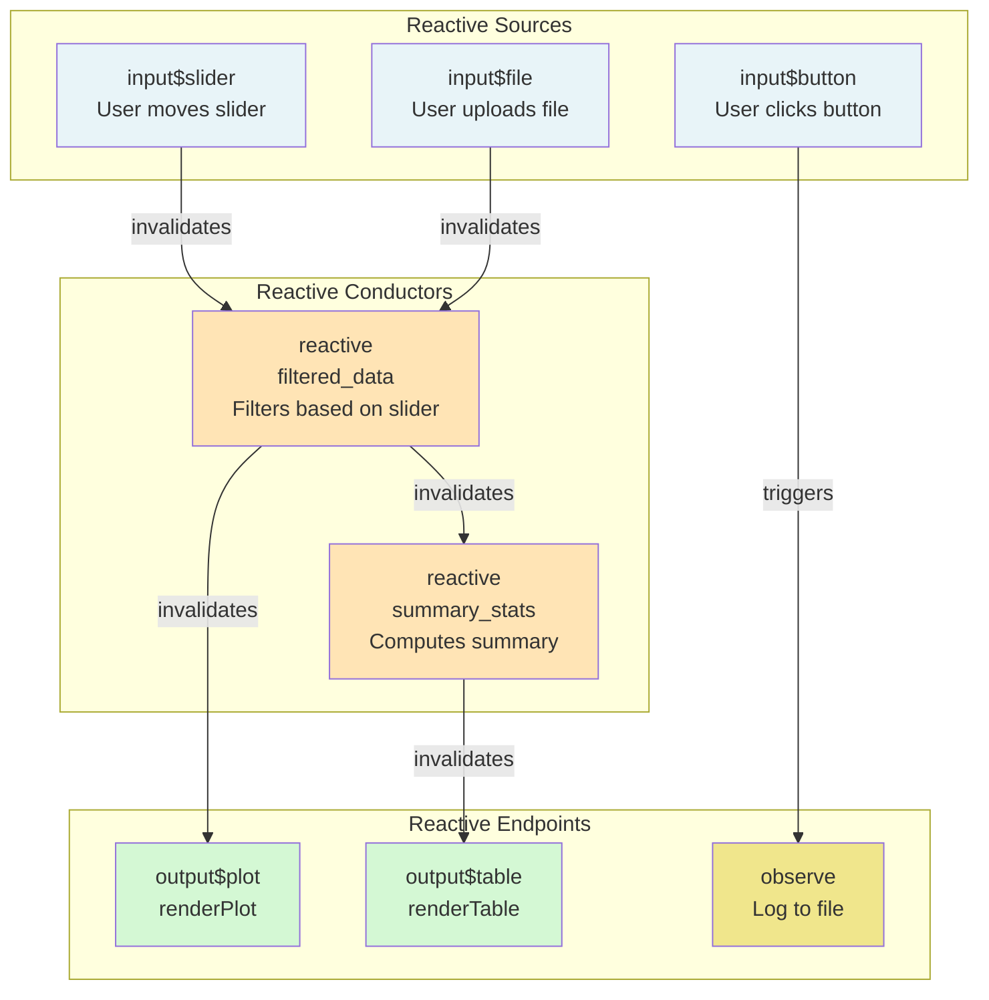

**Key Principles:**

1. **Reactive Sources** (inputs) are always reactive—they notify dependents when they change
2. **Reactive Conductors** (reactive expressions) cache their results and only recompute when dependencies invalidate
3. **Reactive Endpoints** (observers/outputs) execute side effects and don't return values
4. **Lazy evaluation**: Nothing computes until actually needed by an endpoint

### 3.2 Core Shiny Constructs

Let's build understanding through increasingly complex examples.

#### 3.2.1 Reactive Expressions: Cached Computation

```r
server <- function(input, output, session) {
  
  # Reactive expression: filters data based on user input
  filtered_data <- reactive({
    # This code block re-runs whenever input$threshold changes
    
    # req() blocks execution if input is NULL/missing
    req(input$threshold)
    
    # Print to console for debugging (helps understand reactive flow)
    message("filtered_data() is recomputing...")
    
    # Perform computation
    df <- mtcars
    result <- df[df$mpg > input$threshold, ]
    
    # Return result (last expression is returned)
    result
  })
  
  # Usage: Call filtered_data as a function
  output$table <- renderTable({
    # Calling filtered_data() establishes a reactive dependency
    data <- filtered_data()
    message("Rendering table with ", nrow(data), " rows")
    data
  })
  
  output$summary <- renderPrint({
    # Multiple consumers can use the same reactive expression
    # But filtered_data() only recomputes once, then returns cached result
    data <- filtered_data()
    message("Rendering summary")
    summary(data)
  })
}
```

**Execution Flow:**

1. User changes `input$threshold` from 15 to 20
2. Shiny marks `filtered_data()` as **invalid**
3. `output$table` needs to render, so it calls `filtered_data()`
4. `filtered_data()` recomputes (console: "filtered_data() is recomputing...")
5. Result is **cached**
6. `output$summary` needs to render, calls `filtered_data()`
7. Cached result is returned immediately (no recomputation)

#### 3.2.2 Observers: Side Effects

Observers execute side effects (logging, file I/O, database updates) but don't return values:

```r
server <- function(input, output, session) {
  
  filtered_data <- reactive({
    req(input$threshold)
    mtcars[mtcars$mpg > input$threshold, ]
  })
  
  # Observer: runs whenever dependencies change
  observe({
    # This code executes for side effects only
    data <- filtered_data()
    
    # Log to console
    message("[", Sys.time(), "] Data filtered to ", nrow(data), " rows")
    
    # Write to file
    log_entry <- paste(Sys.time(), ":", nrow(data), "rows\n")
    cat(log_entry, file = "app.log", append = TRUE)
  })
  
  # Observer with explicit priority
  observe(priority = 100, {
    # Higher priority observers run first
    message("High-priority observer running")
  })
}
```

#### 3.2.3 ReactiveValues: Mutable Reactive Container

`reactiveValues()` creates a list-like object where each element is individually reactive:

```r
server <- function(input, output, session) {
  
  # Create mutable reactive container
  values <- reactiveValues(
    current_data = NULL,
    status = "idle",
    error_msg = NULL,
    processing_count = 0
  )
  
  # Modify values directly (no <- assignment needed for updates)
  observeEvent(input$run_button, {
    values$status <- "processing"
    values$processing_count <- values$processing_count + 1
    
    tryCatch({
      # Simulate processing
      result <- process_data(input$file$datapath)
      values$current_data <- result
      values$status <- "complete"
      values$error_msg <- NULL
    }, error = function(e) {
      values$status <- "error"
      values$error_msg <- e$message
    })
  })
  
  # Reactive endpoint monitoring status
  output$status_text <- renderText({
    paste("Status:", values$status, 
          "| Count:", values$processing_count)
  })
  
  # Conditional output based on status
  output$result_table <- renderTable({
    req(values$status == "complete")
    values$current_data
  })
  
  output$error_display <- renderText({
    req(values$status == "error")
    values$error_msg
  })
}
```

#### 3.2.4 observeEvent: Targeted Triggering

`observeEvent()` creates observers that respond only to specific inputs:

```r
server <- function(input, output, session) {
  
  values <- reactiveValues(data = NULL)
  
  # This observer ONLY runs when input$run_button changes
  # It does NOT run when input$file changes
  observeEvent(input$run_button, {
    # input$file is used but does NOT create a dependency
    # because we're inside observeEvent()
    
    req(input$file)  # Block if no file
    
    message("Processing file: ", input$file$name)
    values$data <- read.csv(input$file$datapath)
  })
  
  # Multiple trigger inputs
  observeEvent(c(input$refresh_button, input$auto_refresh), {
    # Runs when EITHER input changes
    message("Refreshing data...")
    values$data <- fetch_latest_data()
  })
  
  # Ignoring NULL values
  observeEvent(input$slider, ignoreNULL = TRUE, {
    # Doesn't run when input$slider is NULL (app initialization)
    # Only runs when user actually interacts with slider
    message("Slider changed to: ", input$slider)
  })
  
  # One-time execution
  observeEvent(input$setup_button, once = TRUE, {
    # Runs only on first click, then self-destructs
    message("One-time setup complete")
    initialize_database()
  })
}
```

#### 3.2.5 eventReactive: Conditional Computation

`eventReactive()` creates a reactive expression that only recomputes when specific triggers fire:

```r
server <- function(input, output, session) {
  
  # This reactive expression ONLY recomputes when input$run_button is clicked
  # Changes to input$file do NOT trigger recomputation
  processed_data <- eventReactive(input$run_button, {
    req(input$file)
    
    message("Processing file: ", input$file$name)
    result <- heavy_computation(input$file$datapath)
    
    result
  })
  
  # Use like a normal reactive expression
  output$result_plot <- renderPlot({
    data <- processed_data()  # Establishes dependency
    plot(data$x, data$y)
  })
  
  # Multiple triggers
  filtered_data <- eventReactive(c(input$apply_filter, input$reset), {
    if (input$reset > 0) {
      # Reset clicked
      return(raw_data)
    } else {
      # Filter clicked
      return(apply_filters(raw_data, input$filter_settings))
    }
  })
}
```

### 3.3 MultiScholaR's Reactive Pattern: Shared State Bus

Unlike typical Shiny apps that pass reactive expressions between modules, MultiScholaR uses a **shared `ReactiveValues` object** as a central message bus. This is a deliberate architectural choice optimized for a complex, multi-module application.

#### Standard Pattern (Not Used in MultiScholaR)

```r
# Standard Shiny: Pass reactive expressions between modules

# Parent module
mod_parent_server <- function(id) {
  moduleServer(id, function(input, output, session) {
    
    # Create reactive expression
    shared_data <- reactive({
      process_data(input$file$datapath)
    })
    
    # Pass reactive expression to child modules
    mod_child1_server("child1", data = shared_data)
    mod_child2_server("child2", data = shared_data)
  })
}

# Child module
mod_child1_server <- function(id, data) {
  moduleServer(id, function(input, output, session) {
    # Use the passed reactive expression
    output$table <- renderTable({
      data()  # Call as function
    })
  })
}
```

**Problems with this pattern:**
- Each module needs explicit reactive expression parameters
- Complex dependency chains require careful wiring
- State sharing requires nested reactive expressions
- Difficult to implement global state (undo/redo, checkpointing)

#### MultiScholaR Pattern: Shared ReactiveValues

```r
# MultiScholaR: Shared mutable state bus

# Parent module creates and owns the state bus
mod_proteomics_server <- function(id, project_dirs) {
  moduleServer(id, function(input, output, session) {
    
    # Create shared ReactiveValues object
    # This is the "state bus" passed by reference to all children
    workflow_data <- reactiveValues(
      # Current data (mutable)
      data_tbl = NULL,
      
      # UI state tracking
      tab_status = list(
        import = NULL,
        qc = NULL,
        norm = NULL,
        de = NULL
      ),
      
      # State manager (R6 object holding S4 snapshots)
      state_manager = WorkflowState$new(),
      
      # Current configuration
      current_config = list()
    )
    
    # Pass workflow_data to ALL child modules
    mod_prot_import_server("import", workflow_data, project_dirs)
    mod_prot_qc_server("qc", workflow_data)
    mod_prot_norm_server("norm", workflow_data)
    mod_prot_de_server("de", workflow_data)
    
    # Parent can monitor state changes
    observe({
      req(workflow_data$data_tbl)
      message("Parent: Data updated, ", nrow(workflow_data$data_tbl), " rows")
    })
  })
}

# Child module MUTATES shared state directly
mod_prot_import_server <- function(id, workflow_data, project_dirs) {
  moduleServer(id, function(input, output, session) {
    
    observeEvent(input$upload_file, {
      # 1. Process file
      raw_data <- read.csv(input$upload_file$datapath)
      
      # 2. Create S4 object
      s4_object <- new("ProteinQuantitativeData",
        protein_quant_table = raw_data,
        design_matrix = input$design_matrix,
        protein_id_column = input$protein_id_col,
        sample_id = input$sample_id_col,
        group_id = input$group_id_col,
        args = list(import = list(file = input$upload_file$name))
      )
      
      # 3. MUTATE shared state directly
      workflow_data$data_tbl <- s4_object
      workflow_data$tab_status$import <- "complete"
      
      # 4. Checkpoint to R6 state manager
      workflow_data$state_manager$saveState(
        name = "post_import",
        object = s4_object,
        config = list(file = input$upload_file$name)
      )
      
      message("Import complete: ", input$upload_file$name)
    })
    
    # Display current data
    output$data_preview <- renderTable({
      req(workflow_data$data_tbl)
      head(workflow_data$data_tbl@protein_quant_table, 10)
    })
  })
}

# Another child module reads the same shared state
mod_prot_qc_server <- function(id, workflow_data) {
  moduleServer(id, function(input, output, session) {
    
    # Direct access to shared state (NOT via passed reactive expression)
    observe({
      # Block until data exists
      req(workflow_data$data_tbl)
      
      # This observer re-runs whenever workflow_data$data_tbl changes
      # (because workflow_data$data_tbl is a reactive value)
      message("QC module: Received data with ", 
              nrow(workflow_data$data_tbl@protein_quant_table), " rows")
    })
    
    observeEvent(input$run_qc, {
      # Read current state
      current_data <- workflow_data$data_tbl
      
      # Process
      qc_data <- filterByIntensity(current_data, threshold = input$threshold)
      qc_data@args$qc <- list(threshold = input$threshold)
      
      # MUTATE shared state
      workflow_data$data_tbl <- qc_data
      workflow_data$tab_status$qc <- "complete"
      
      # Checkpoint
      workflow_data$state_manager$saveState(
        name = "post_qc",
        object = qc_data,
        config = list(threshold = input$threshold)
      )
    })
  })
}
```

#### Why This Pattern?

**Advantages:**
1. **Simpler module signatures**: No need to pass dozens of reactive expressions
2. **Centralized state**: Single source of truth for entire workflow
3. **Easy checkpointing**: R6 state manager has consistent access to all data
4. **Global operations**: Undo/redo, state inspection, debugging
5. **Reduced boilerplate**: No need to wire up complex reactive chains

**Tradeoffs:**
1. **Tight coupling**: Modules depend on specific `workflow_data` structure
2. **No type safety**: Structure is implicit, not enforced
3. **Harder testing**: Requires setting up full state bus for unit tests
4. **Global state risks**: Multiple modules can mutate simultaneously (requires discipline)

**When to use:**
- Single-user desktop applications (like MultiScholaR)
- Complex workflows with many interdependent steps
- Applications requiring global state management (undo/redo, checkpointing)

**When NOT to use:**
- Multi-user server applications (state isolation issues)
- Simple apps with few modules
- Apps where module reusability across projects is critical

### 3.4 Reactivity Invalidation Cascade

Understanding the reactive invalidation cascade is essential for debugging and optimizing Shiny apps.

#### Example: Multi-Layer Reactive Chain

```r
server <- function(input, output, session) {
  
  # LAYER 1: Reactive source (user input)
  # input$threshold is created automatically by Shiny
  
  # LAYER 2: First reactive expression
  filtered_data <- reactive({
    message("[filtered_data] Computing...")
    req(input$threshold)  # Depends on input$threshold
    
    result <- mtcars[mtcars$mpg > input$threshold, ]
    message("[filtered_data] Returning ", nrow(result), " rows")
    result
  })
  
  # LAYER 3: Second reactive expression (depends on Layer 2)
  summary_stats <- reactive({
    message("[summary_stats] Computing...")
    req(filtered_data())  # Depends on filtered_data
    
    data <- filtered_data()
    result <- list(
      n_rows = nrow(data),
      mean_mpg = mean(data$mpg),
      median_mpg = median(data$mpg)
    )
    message("[summary_stats] Computed stats for ", result$n_rows, " rows")
    result
  })
  
  # LAYER 4: Third reactive expression (depends on Layer 3)
  formatted_summary <- reactive({
    message("[formatted_summary] Computing...")
    stats <- summary_stats()  # Depends on summary_stats
    
    result <- sprintf(
      "Analysis of %d cars: mean MPG = %.1f, median MPG = %.1f",
      stats$n_rows, stats$mean_mpg, stats$median_mpg
    )
    message("[formatted_summary] Created text: ", substr(result, 1, 30), "...")
    result
  })
  
  # LAYER 5: Observer (side effect)
  observe({
    message("[observe] Running...")
    summary <- formatted_summary()  # Depends on formatted_summary
    
    # Log to file
    cat(Sys.time(), ":", summary, "\n", 
        file = "app.log", append = TRUE)
    message("[observe] Logged to file")
  })
  
  # LAYER 5: Output (endpoint)
  output$table <- renderTable({
    message("[output$table] Rendering...")
    filtered_data()  # Depends on filtered_data
  })
  
  output$summary_text <- renderText({
    message("[output$summary_text] Rendering...")
    formatted_summary()  # Depends on formatted_summary
  })
}
```

#### Execution Trace When User Changes Threshold

```
User changes input$threshold from 15 to 20

[Step 1: Invalidation Phase]
→ input$threshold changes (reactive source)
  → filtered_data() invalidated (direct dependency)
    → summary_stats() invalidated (depends on filtered_data)
      → formatted_summary() invalidated (depends on summary_stats)
        → observe() invalidated (depends on formatted_summary)
        → output$summary_text invalidated (depends on formatted_summary)
  → output$table invalidated (depends on filtered_data)

[Step 2: Recomputation Phase - Lazy Evaluation]
Shiny only recomputes what's actually needed for rendering

→ output$table needs to render
  → filtered_data() needs to recompute
    [filtered_data] Computing...
    [filtered_data] Returning 14 rows
  → filtered_data() result cached
  [output$table] Rendering...

→ output$summary_text needs to render
  → formatted_summary() needs to recompute
    → summary_stats() needs to recompute
      → filtered_data() already computed (returns cached result)
      [summary_stats] Computing...
      [summary_stats] Computed stats for 14 rows
    → summary_stats() result cached
    [formatted_summary] Computing...
    [formatted_summary] Created text: Analysis of 14 cars: mean MPG...
  → formatted_summary() result cached
  [output$summary_text] Rendering...

→ observe() needs to run
  → formatted_summary() already computed (returns cached result)
  [observe] Running...
  [observe] Logged to file
```

**Key Insights:**

1. **Invalidation is immediate**: All dependents marked invalid instantly
2. **Recomputation is lazy**: Only executes when endpoint actually needs value
3. **Caching is automatic**: Each reactive expression caches its result
4. **Shared dependencies optimize**: `filtered_data()` only recomputes once despite multiple consumers
5. **Order is non-deterministic**: Observers and outputs may execute in any order

---

## Section 4: Golem Framework - Modular Shiny Apps

### 4.1 The "App-as-a-Package" Philosophy

Traditional Shiny apps are often developed as loose collections of R scripts. This works for prototypes but creates problems for production applications:

- **No dependency management**: Manual `library()` calls scattered across files
- **No testing infrastructure**: Hard to write unit tests
- **No versioning**: Difficult to track changes or roll back
- **No documentation**: Functions lack formal documentation
- **Deployment complexity**: Manual steps to prepare for deployment

**Golem solves these problems** by treating your Shiny app as a formal R package. This provides:

- **Dependency management**: DESCRIPTION file tracks all dependencies
- **Testing infrastructure**: Standard `tests/` directory with testthat
- **Version control**: Semantic versioning via DESCRIPTION
- **Documentation**: Roxygen2 comments generate help files
- **Reproducibility**: Exact package versions locked in
- **Professional deployment**: Standard R package installation

### 4.2 Golem Project Structure

```
MultiScholaR/
├── R/                          # All R code (modules, functions, utilities)
│   ├── app_ui.R               # Main UI definition
│   ├── app_server.R           # Main server logic
│   ├── run_app.R              # Entry point function
│   │
│   ├── mod_home.R             # Home/setup module
│   ├── mod_proteomics.R       # Proteomics parent module
│   ├── mod_prot_import.R      # Proteomics import submodule
│   ├── mod_prot_qc.R          # Proteomics QC submodule
│   ├── mod_prot_norm.R        # Proteomics normalization submodule
│   ├── mod_prot_de.R          # Proteomics DE submodule
│   │
│   ├── func_proteomics.R      # Proteomics domain functions
│   ├── func_metabolomics.R    # Metabolomics domain functions
│   ├── func_plotting.R        # Plotting helper functions
│   │
│   ├── utils_state.R          # State management utilities (R6 classes)
│   ├── utils_data.R           # Data manipulation utilities
│   └── utils_shiny.R          # Shiny helper functions
│
├── inst/                       # Installed files (accessible in deployed app)
│   ├── app/
│   │   └── www/               # Static assets (CSS, JS, images)
│   │       ├── custom.css     # Custom styling
│   │       ├── app.js         # Client-side JavaScript
│   │       └── logo.png       # Application logo
│   │
│   ├── config/
│   │   └── config.ini         # Configuration file
│   │
│   ├── workbooks/              # R Markdown workflow templates
│   │   ├── proteomics/
│   │   │   ├── DIA_workflow_starter.Rmd
│   │   │   └── DIA_workflow_experienced.Rmd
│   │   └── metabolomics/
│   │       └── metabolomics_workflow_starter.Rmd
│   │
│   └── reports/                # Report templates
│       ├── DIANN_report.Rmd
│       └── TMT_report.Rmd
│
├── man/                        # Generated documentation (via roxygen2)
│   ├── run_app.Rd
│   ├── mod_proteomics_ui.Rd
│   └── ...
│
├── tests/                      # Unit tests
│   ├── testthat/
│   │   ├── test-mod_import.R
│   │   └── test-utils_data.R
│   └── testthat.R
│
├── DESCRIPTION                 # Package metadata and dependencies
├── NAMESPACE                   # Exported functions (auto-generated)
├── LICENSE.md                  # License information
├── README.md                   # Project documentation
└── NEWS.md                     # Changelog
```

### 4.3 Core Golem Concepts

#### 4.3.1 Module Namespacing

Modules solve the **ID collision problem**. In a large app with many inputs/outputs, ensuring unique IDs manually is error-prone. Golem uses **namespacing** to make IDs unique automatically.

**The Problem (Without Modules):**

```r
# Suppose you have two filter panels in different tabs
# Both want a slider called "threshold"

ui <- fluidPage(
  tabsetPanel(
    tabPanel("Panel 1",
      sliderInput("threshold", "Threshold", min = 0, max = 100, value = 50),
      plotOutput("plot")
    ),
    tabPanel("Panel 2",
      sliderInput("threshold", "Threshold", min = 0, max = 100, value = 50),  # COLLISION!
      plotOutput("plot")  # COLLISION!
    )
  )
)

# Both sliders have ID "threshold" - they'll conflict
# Both plots have ID "plot" - they'll conflict
```

**The Solution (With Modules):**

```r
# Module UI function
mod_filter_ui <- function(id) {
  # Create namespace function
  ns <- NS(id)
  
  tagList(
    sliderInput(ns("threshold"), "Threshold", min = 0, max = 100, value = 50),
    plotOutput(ns("plot"))
  )
}

# Module server function
mod_filter_server <- function(id) {
  moduleServer(id, function(input, output, session) {
    # Inside moduleServer, input$threshold automatically refers to
    # the namespaced input (e.g., "panel1-threshold")
    
    output$plot <- renderPlot({
      threshold <- input$threshold
      plot(1:10, 1:10, main = paste("Threshold:", threshold))
    })
  })
}

# Main app
ui <- fluidPage(
  tabsetPanel(
    tabPanel("Panel 1", mod_filter_ui("panel1")),  # IDs: "panel1-threshold", "panel1-plot"
    tabPanel("Panel 2", mod_filter_ui("panel2"))   # IDs: "panel2-threshold", "panel2-plot"
  )
)

server <- function(input, output, session) {
  mod_filter_server("panel1")  # Server for panel1
  mod_filter_server("panel2")  # Server for panel2
}

shinyApp(ui, server)
```

**How Namespacing Works:**

```r
# When you call:
ns <- NS("panel1")
ns("threshold")  # Returns: "panel1-threshold"
ns("plot")       # Returns: "panel1-plot"

# HTML generated:
# <input id="panel1-threshold" ...>
# <div id="panel1-plot" ...>

# Inside moduleServer("panel1", ...):
# input$threshold  →  Automatically resolves to "panel1-threshold"
# output$plot      →  Automatically resolves to "panel1-plot"
```

#### 4.3.2 Module Communication Patterns

Modules need to communicate. Golem supports several patterns:

**Pattern 1: Return Values (Parent → Child)**

```r
# Child module returns a reactive expression
mod_import_server <- function(id) {
  moduleServer(id, function(input, output, session) {
    
    # Return a reactive expression
    return(reactive({
      req(input$file)
      read.csv(input$file$datapath)
    }))
  })
}

# Parent uses returned reactive
mod_parent_server <- function(id) {
  moduleServer(id, function(input, output, session) {
    
    # Get reactive from child
    imported_data <- mod_import_server("import")
    
    # Use in parent
    output$summary <- renderPrint({
      data <- imported_data()  # Call as function
      summary(data)
    })
  })
}
```

**Pattern 2: Shared ReactiveValues (Bidirectional)**

```r
# This is MultiScholaR's primary pattern

# Parent creates and passes state bus
mod_parent_server <- function(id) {
  moduleServer(id, function(input, output, session) {
    
    # Create shared state
    workflow_data <- reactiveValues(
      data = NULL,
      status = "idle"
    )
    
    # Pass to children
    mod_child1_server("child1", workflow_data)
    mod_child2_server("child2", workflow_data)
  })
}

# Child mutates shared state
mod_child1_server <- function(id, workflow_data) {
  moduleServer(id, function(input, output, session) {
    
    observeEvent(input$process, {
      # Mutate shared state
      workflow_data$data <- process_data()
      workflow_data$status <- "complete"
    })
  })
}

# Another child reads shared state
mod_child2_server <- function(id, workflow_data) {
  moduleServer(id, function(input, output, session) {
    
    observe({
      req(workflow_data$data)
      # React to state changes
      message("Child2: Data updated")
    })
  })
}
```

**Pattern 3: Event Bus (Decoupled Communication)**

```r
# Use session$sendCustomMessage() for loosely coupled events

# Sender module
mod_sender_server <- function(id) {
  moduleServer(id, function(input, output, session) {
    
    observeEvent(input$trigger, {
      # Send event to JavaScript
      session$sendCustomMessage("data_updated", list(
        timestamp = Sys.time(),
        rows = 100
      ))
    })
  })
}

# Receiver module (JavaScript client-side)
# In www/app.js:
Shiny.addCustomMessageHandler("data_updated", function(message) {
  console.log("Data updated at", message.timestamp);
  console.log("Rows:", message.rows);
  // Update UI elements, show notifications, etc.
});
```

### 4.4 MultiScholaR's Hierarchical Module Pattern

MultiScholaR implements a **three-level module hierarchy**:

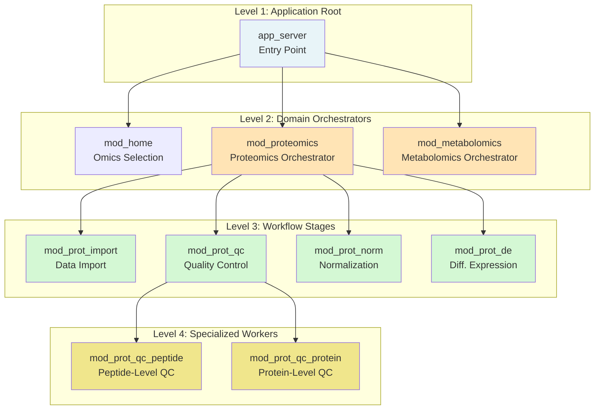

#### Level 1: Application Root

```r
# File: R/app_server.R
app_server <- function(input, output, session) {
  
  # Global reactive values
  app_state <- reactiveValues(
    selected_omics = NULL,
    proceed_with_analysis = FALSE,
    project_dirs = NULL
  )
  
  # Home module (omics selection)
  mod_home_server("home", app_state)
  
  # Initialize project structure
  observeEvent(app_state$proceed_with_analysis, {
    # Create directory structure
    app_state$project_dirs <- setupDirectories()
    
    # Dynamically render domain-specific modules
    if ("Proteomics" %in% app_state$selected_omics) {
      mod_proteomics_server("proteomics", app_state$project_dirs)
    }
    
    if ("Metabolomics" %in% app_state$selected_omics) {
      mod_metabolomics_server("metabolomics", app_state$project_dirs)
    }
  })
}
```

#### Level 2: Domain Orchestrator

```r
# File: R/mod_proteomics.R
mod_proteomics_ui <- function(id) {
  ns <- NS(id)
  
  tagList(
    tabsetPanel(id = ns("main_tabs"),
      tabPanel("Import", 
        icon = icon("upload"),
        mod_prot_import_ui(ns("import"))
      ),
      tabPanel("Quality Control",
        icon = icon("check-circle"),
        mod_prot_qc_ui(ns("qc"))
      ),
      tabPanel("Normalization",
        icon = icon("chart-line"),
        mod_prot_norm_ui(ns("norm"))
      ),
      tabPanel("Differential Expression",
        icon = icon("flask"),
        mod_prot_de_ui(ns("de"))
      )
    )
  )
}

mod_proteomics_server <- function(id, project_dirs) {
  moduleServer(id, function(input, output, session) {
    
    # PARENT CREATES THE STATE BUS
    workflow_data <- reactiveValues(
      # Current data object (S4)
      data_tbl = NULL,
      
      # Tab completion status
      tab_status = list(
        import = NULL,
        qc = NULL,
        norm = NULL,
        de = NULL
      ),
      
      # State manager (R6)
      state_manager = WorkflowState$new(),
      
      # Configuration
      current_config = list()
    )
    
    # PASS STATE BUS TO ALL CHILDREN
    mod_prot_import_server("import", workflow_data, project_dirs)
    mod_prot_qc_server("qc", workflow_data)
    mod_prot_norm_server("norm", workflow_data)
    mod_prot_de_server("de", workflow_data)
    
    # PARENT MONITORS STATE FOR TAB ENABLING
    observe({
      # Enable QC tab only after import complete
      shinyjs::toggleState(
        selector = paste0("#", session$ns("main_tabs"), " a[data-value='Quality Control']"),
        condition = workflow_data$tab_status$import == "complete"
      )
    })
    
    observe({
      # Enable normalization tab only after QC complete
      shinyjs::toggleState(
        selector = paste0("#", session$ns("main_tabs"), " a[data-value='Normalization']"),
        condition = workflow_data$tab_status$qc == "complete"
      )
    })
    
    observe({
      # Enable DE tab only after normalization complete
      shinyjs::toggleState(
        selector = paste0("#", session$ns("main_tabs"), " a[data-value='Differential Expression']"),
        condition = workflow_data$tab_status$norm == "complete"
      )
    })
  })
}
```

#### Level 3: Workflow Stage Worker

```r
# File: R/mod_prot_import.R
mod_prot_import_ui <- function(id) {
  ns <- NS(id)
  
  fluidPage(
    h3("Data Import"),
    fluidRow(
      column(6,
        fileInput(ns("data_file"), "Upload Proteomics Data",
                 accept = c(".txt", ".tsv", ".csv")),
        fileInput(ns("design_file"), "Upload Design Matrix",
                 accept = c(".txt", ".tsv", ".csv"))
      ),
      column(6,
        selectInput(ns("protein_id_col"), "Protein ID Column", choices = NULL),
        selectInput(ns("sample_id_col"), "Sample ID Column", choices = NULL),
        selectInput(ns("group_id_col"), "Group ID Column", choices = NULL),
        actionButton(ns("import"), "Import Data", icon = icon("upload"),
                    class = "btn-primary")
      )
    ),
    fluidRow(
      column(12,
        h4("Data Preview"),
        DT::dataTableOutput(ns("preview"))
      )
    )
  )
}

mod_prot_import_server <- function(id, workflow_data, project_dirs) {
  moduleServer(id, function(input, output, session) {
    
    # Local reactive for data file
    data_file <- reactive({
      req(input$data_file)
      input$data_file
    })
    
    # Local reactive for design file
    design_file <- reactive({
      req(input$design_file)
      input$design_file
    })
    
    # Update column selectors when file uploaded
    observe({
      req(data_file())
      
      # Read headers
      headers <- names(read.delim(data_file()$datapath, nrows = 1))
      
      # Update select inputs
      updateSelectInput(session, "protein_id_col", choices = headers)
      updateSelectInput(session, "sample_id_col", choices = headers)
      updateSelectInput(session, "group_id_col", choices = headers)
    })
    
    # Import button handler
    observeEvent(input$import, {
      req(data_file(), design_file())
      req(input$protein_id_col, input$sample_id_col, input$group_id_col)
      
      # Show progress
      withProgress(message = "Importing data...", {
        
        # Read files
        data_df <- read.delim(data_file()$datapath)
        design_df <- read.delim(design_file()$datapath)
        
        incProgress(0.3)
        
        # Create S4 object
        s4_object <- new("ProteinQuantitativeData",
          protein_quant_table = data_df,
          design_matrix = design_df,
          protein_id_column = input$protein_id_col,
          sample_id = input$sample_id_col,
          group_id = input$group_id_col,
          args = list(import = list(
            data_file = data_file()$name,
            design_file = design_file()$name,
            timestamp = Sys.time()
          ))
        )
        
        incProgress(0.3)
        
        # MUTATE SHARED STATE
        workflow_data$data_tbl <- s4_object
        workflow_data$tab_status$import <- "complete"
        
        # CHECKPOINT TO STATE MANAGER
        workflow_data$state_manager$saveState(
          name = "post_import",
          object = s4_object,
          config = list(
            data_file = data_file()$name,
            design_file = design_file()$name
          )
        )
        
        incProgress(0.4)
      })
      
      # Show success message
      showNotification("Import successful!", type = "message")
    })
    
    # Display preview
    output$preview <- DT::renderDataTable({
      req(workflow_data$data_tbl)
      
      # Show first 100 rows
      head(workflow_data$data_tbl@protein_quant_table, 100)
    }, options = list(pageLength = 10, scrollX = TRUE))
  })
}
```

#### Level 4: Specialized Sub-Worker

```r
# File: R/mod_prot_qc_peptide.R
mod_prot_qc_peptide_ui <- function(id) {
  ns <- NS(id)
  
  fluidPage(
    h4("Peptide-Level Quality Control"),
    fluidRow(
      column(4,
        numericInput(ns("qvalue_threshold"), "Q-Value Threshold", 
                    value = 0.01, min = 0, max = 1, step = 0.001),
        actionButton(ns("filter_qvalue"), "Apply Q-Value Filter",
                    icon = icon("filter"))
      ),
      column(8,
        plotOutput(ns("qvalue_distribution"))
      )
    ),
    hr(),
    fluidRow(
      column(4,
        actionButton(ns("rollup_precursor"), "Rollup Precursors to Peptides",
                    icon = icon("layer-group"))
      ),
      column(8,
        verbatimTextOutput(ns("rollup_summary"))
      )
    )
  )
}

mod_prot_qc_peptide_server <- function(id, workflow_data) {
  moduleServer(id, function(input, output, session) {
    
    # Q-value filtering
    observeEvent(input$filter_qvalue, {
      req(workflow_data$data_tbl)
      
      pept_data <- workflow_data$data_tbl
      threshold <- input$qvalue_threshold
      
      withProgress(message = "Filtering by Q-value...", {
        # Filter peptides
        filtered_data <- pept_data[pept_data$Q.Value < threshold, ]
        
        # Update args
        filtered_data@args$qvalue_filter <- list(
          threshold = threshold,
          rows_before = nrow(pept_data),
          rows_after = nrow(filtered_data),
          rows_removed = nrow(pept_data) - nrow(filtered_data),
          timestamp = Sys.time()
        )
        
        # MUTATE SHARED STATE
        workflow_data$data_tbl <- filtered_data
        
        # CHECKPOINT
        workflow_data$state_manager$saveState(
          name = "post_qvalue_filter",
          object = filtered_data,
          config = list(threshold = threshold)
        )
      })
      
      showNotification(
        paste("Filtered", 
              nrow(pept_data) - nrow(workflow_data$data_tbl),
              "peptides"),
        type = "message"
      )
    })
    
    # Precursor rollup
    observeEvent(input$rollup_precursor, {
      req(workflow_data$data_tbl)
      
      pept_data <- workflow_data$data_tbl
      
      withProgress(message = "Rolling up precursors...", {
        # Perform rollup
        rolled_data <- rollUpPrecursorToPeptide(pept_data)
        
        # Update args
        rolled_data@args$precursor_rollup <- list(
          timestamp = Sys.time(),
          peptides_before = nrow(pept_data),
          peptides_after = nrow(rolled_data)
        )
        
        # MUTATE SHARED STATE
        workflow_data$data_tbl <- rolled_data
        
        # CHECKPOINT
        workflow_data$state_manager$saveState(
          name = "post_precursor_rollup",
          object = rolled_data,
          config = list()
        )
      })
      
      showNotification("Precursor rollup complete", type = "message")
    })
    
    # Visualizations
    output$qvalue_distribution <- renderPlot({
      req(workflow_data$data_tbl)
      
      qvalues <- workflow_data$data_tbl$Q.Value
      
      hist(qvalues, breaks = 100, 
           main = "Q-Value Distribution",
           xlab = "Q-Value",
           col = "steelblue",
           border = "white")
      abline(v = input$qvalue_threshold, col = "red", lwd = 2, lty = 2)
    })
    
    output$rollup_summary <- renderPrint({
      req(workflow_data$data_tbl)
      
      if ("precursor_rollup" %in% names(workflow_data$data_tbl@args)) {
        rollup_info <- workflow_data$data_tbl@args$precursor_rollup
        cat("Rollup Summary:\n")
        cat("  Peptides before:", rollup_info$peptides_before, "\n")
        cat("  Peptides after:", rollup_info$peptides_after, "\n")
        cat("  Reduction:", rollup_info$peptides_before - rollup_info$peptides_after, "\n")
      } else {
        cat("Rollup not yet performed\n")
      }
    })
  })
}
```

---

# PART II: CORE ARCHITECTURE

## Section 5: Application Initialization & Dynamic Loading

### 5.1 The Bootstrap Sequence

MultiScholaR implements a **dynamic loading architecture** where the application structure adapts based on user selections. This provides flexibility—users only load the omics modules they need for their analysis.

#### Application Entry Point

```r
# File: R/run_app.R
#' Run the MultiScholaR Shiny Application
#'
#' @param ... arguments to pass to golem_opts
#' @export
run_app <- function(...) {
  # Set golem options
  golem::with_golem_options(
    app = shinyApp(
      ui = app_ui,      # UI definition
      server = app_server  # Server logic
    ),
    golem_opts = list(...)
  )
}
```

#### Static UI Construction

The initial UI is **static**—it defines the shell of the application but not the content:

```r
# File: R/app_ui.R
app_ui <- function(request) {
  tagList(
    # Load external resources
    golem_add_external_resources(),
    
    # Main dashboard structure
    dashboardPage(
      
      # HEADER
      dashboardHeader(
        title = "MultiScholaR",
        tags$li(class = "dropdown",
          tags$a(href = "https://github.com/APAF-bioinformatics/MultiScholaR",
                target = "_blank",
                icon("github"), "GitHub")
        )
      ),
      
      # SIDEBAR (navigation menu)
      dashboardSidebar(
        sidebarMenu(id = "main_menu",
          menuItem("Home", 
                  tabName = "home", 
                  icon = icon("home")),
          # Dynamic menu items will be inserted here by server
          uiOutput("dynamic_menu_items")
        )
      ),
      
      # BODY (main content area)
      dashboardBody(
        # Include custom CSS
        tags$head(
          tags$link(rel = "stylesheet", type = "text/css", 
                   href = "www/custom.css")
        ),
        
        # Tab items container
        tabItems(
          # Home tab (always present)
          tabItem(tabName = "home",
            mod_home_ui("home")
          ),
          
          # Dynamic tabs will be inserted here by server
          uiOutput("dynamic_tabs")
        )
      )
    )
  )
}

# Helper function to load external resources
golem_add_external_resources <- function() {
  add_resource_path(
    'www', 
    app_sys('app/www')  # Maps to inst/app/www/
  )
  
  tags$head(
    favicon(),
    bundle_resources(
      path = app_sys('app/www'),
      app_title = 'MultiScholaR'
    )
  )
}
```

#### Dynamic Module Loading

The server determines which modules to load based on user selections:

```r
# File: R/app_server.R
app_server <- function(input, output, session) {
  
  # ============================================
  # PHASE 1: INITIALIZATION
  # ============================================
  
  # Create global reactive values
  app_state <- reactiveValues(
    selected_omics = NULL,       # User's omics selections (character vector)
    proceed_with_analysis = FALSE,  # Flag to trigger project setup
    project_dirs = NULL          # Project directory structure
  )
  
  # Initialize home module (always runs)
  mod_home_server("home", app_state)
  
  # ============================================
  # PHASE 2: PROJECT SETUP
  # ============================================
  
  observeEvent(app_state$proceed_with_analysis, {
    
    # Only run once when proceed flag is set
    req(app_state$proceed_with_analysis == TRUE)
    
    message("Setting up project structure...")
    
    # Create directory structure
    app_state$project_dirs <- setupDirectories()
    
    # ============================================
    # PHASE 3: DYNAMIC MODULE RENDERING
    # ============================================
    
    # Render dynamic menu items
    output$dynamic_menu_items <- renderUI({
      menu_items <- list()
      
      if ("Proteomics" %in% app_state$selected_omics) {
        menu_items <- c(menu_items, list(
          menuItem("Proteomics", 
                  tabName = "proteomics",
                  icon = icon("microscope"))
        ))
      }
      
      if ("Metabolomics" %in% app_state$selected_omics) {
        menu_items <- c(menu_items, list(
          menuItem("Metabolomics",
                  tabName = "metabolomics",
                  icon = icon("flask"))
        ))
      }
      
      # Return combined menu
      tagList(menu_items)
    })
    
    # Render dynamic tab content
    output$dynamic_tabs <- renderUI({
      tab_items <- list()
      
      if ("Proteomics" %in% app_state$selected_omics) {
        tab_items <- c(tab_items, list(
          tabItem(tabName = "proteomics",
            mod_proteomics_ui("proteomics_module")
          )
        ))
      }
      
      if ("Metabolomics" %in% app_state$selected_omics) {
        tab_items <- c(tab_items, list(
          tabItem(tabName = "metabolomics",
            mod_metabolomics_ui("metabolomics_module")
          )
        ))
      }
      
      # Return combined tabs
      do.call(tagList, tab_items)
    })
    
    # ============================================
    # PHASE 4: MODULE SERVER INITIALIZATION
    # ============================================
    
    # Initialize server logic for selected modules
    if ("Proteomics" %in% app_state$selected_omics) {
      message("Initializing proteomics module...")
      mod_proteomics_server("proteomics_module", app_state$project_dirs)
    }
    
    if ("Metabolomics" %in% app_state$selected_omics) {
      message("Initializing metabolomics module...")
      mod_metabolomics_server("metabolomics_module", app_state$project_dirs)
    }
    
    message("Project setup complete!")
  })
}
```

#### Execution Sequence Diagram

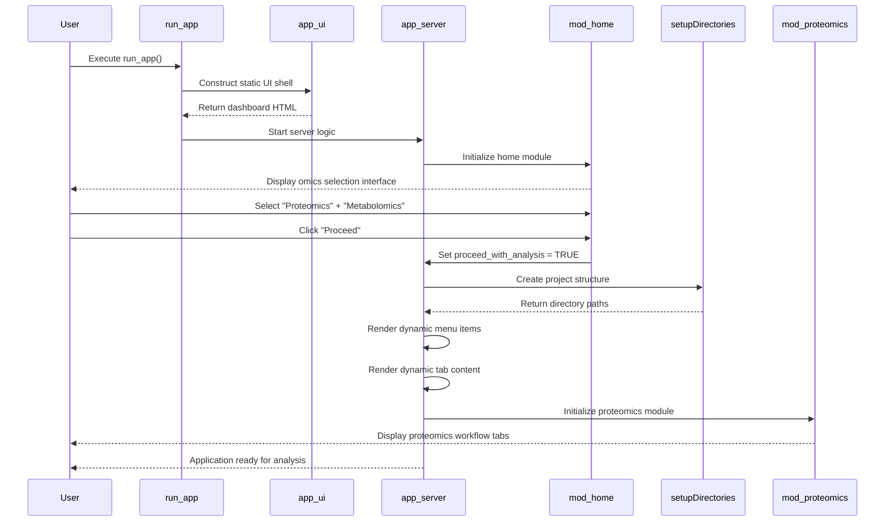

### 5.2 Directory Structure Initialization

The `setupDirectories()` function creates a standardized project structure:

```r
# File: R/utils_setup.R
#' Setup Project Directory Structure
#'
#' Creates a standardized directory hierarchy for organizing
#' multi-omics analysis results
#'
#' @param project_root Character. Root directory path (default: current directory)
#' @return List. Named list of directory paths
#' @export
setupDirectories <- function(project_root = getwd()) {
  
  message("Creating project structure in: ", project_root)
  
  # Define directory structure
  dirs <- list(
    # Top-level directories
    root = project_root,
    data = file.path(project_root, "data"),
    results = file.path(project_root, "results"),
    results_summary = file.path(project_root, "results_summary"),
    scripts = file.path(project_root, "scripts"),
    
    # Proteomics subdirectories
    proteomics = file.path(project_root, "results", "proteomics"),
    proteomics_qc = file.path(project_root, "results", "proteomics", "qc"),
    proteomics_norm = file.path(project_root, "results", "proteomics", "normalization"),
    proteomics_de = file.path(project_root, "results", "proteomics", "differential_expression"),
    proteomics_enrichment = file.path(project_root, "results", "proteomics", "enrichment"),
    proteomics_graphs = file.path(project_root, "results", "proteomics", "publication_graphs"),
    
    # Metabolomics subdirectories
    metabolomics = file.path(project_root, "results", "metabolomics"),
    metabolomics_qc = file.path(project_root, "results", "metabolomics", "qc"),
    metabolomics_norm = file.path(project_root, "results", "metabolomics", "normalization"),
    metabolomics_de = file.path(project_root, "results", "metabolomics", "differential_expression"),
    metabolomics_enrichment = file.path(project_root, "results", "metabolomics", "enrichment"),
    metabolomics_graphs = file.path(project_root, "results", "metabolomics", "publication_graphs"),
    
    # Integration directories
    integration = file.path(project_root, "results", "integration"),
    integration_mofa = file.path(project_root, "results", "integration", "mofa"),
    integration_graphs = file.path(project_root, "results", "integration", "graphs")
  )
  
  # Create all directories
  created_count <- 0
  for (dir_name in names(dirs)) {
    dir_path <- dirs[[dir_name]]
    
    if (!dir.exists(dir_path)) {
      dir.create(dir_path, recursive = TRUE, showWarnings = FALSE)
      created_count <- created_count + 1
      message("  Created: ", dir_name, " -> ", dir_path)
    }
  }
  
  message("Project structure complete (", created_count, " directories created)")
  
  # Store in global environment (documented anti-pattern)
  # See Section 14 for discussion of global environment usage
  assign("project_dirs", dirs, envir = .GlobalEnv)
  
  return(invisible(dirs))
}
```

#### Resulting Directory Structure

```
my_project/
├── data/                          # User uploads raw data here
│
├── results/
│   ├── proteomics/
│   │   ├── qc/                   # QC plots and metrics
│   │   ├── normalization/        # Normalization diagnostics
│   │   ├── differential_expression/  # DE results tables
│   │   ├── enrichment/           # Pathway enrichment results
│   │   └── publication_graphs/   # Final plots for manuscripts
│   │
│   ├── metabolomics/
│   │   ├── qc/
│   │   ├── normalization/
│   │   ├── differential_expression/
│   │   ├── enrichment/
│   │   └── publication_graphs/
│   │
│   └── integration/
│       ├── mofa/                 # MOFA model files
│       └── graphs/               # Cross-omics visualizations
│
├── results_summary/              # Curated outputs for distribution
│
└── scripts/
    └── study_parameters.txt      # Complete parameter log
```

---

## Section 6: State Management Architecture

MultiScholaR implements a **three-layer state management** system that balances performance, persistence, and reproducibility.

### 6.1 The Three-Layer Model

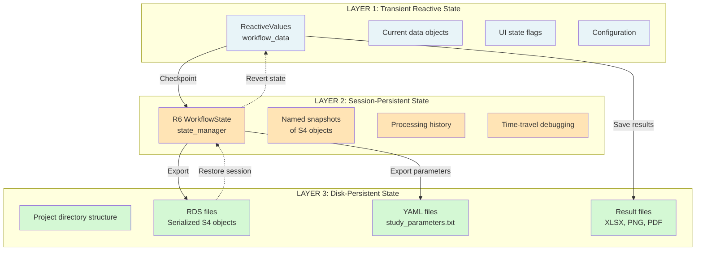

#### Layer 1: Transient Reactive State

This is the **working memory** of the application—the state that modules read and write during active analysis:

```r
# Created in parent module server
workflow_data <- reactiveValues(
  # Primary data object (current state of analysis)
  data_tbl = NULL,  # S4 object: ProteinQuantitativeData, MetaboliteAssayData, etc.
  
  # Workflow progress tracking
  tab_status = list(
    import = NULL,       # NULL | "complete" | "error"
    qc = NULL,
    norm = NULL,
    de = NULL,
    enrichment = NULL
  ),
  
  # State manager reference (R6 object)
  state_manager = WorkflowState$new(),
  
  # Current analysis configuration
  current_config = list(
    organism = NULL,
    taxid = NULL,
    workflow_type = NULL,  # "DIA", "TMT", "LFQ", "Metabolomics"
    normalization_method = NULL,
    de_method = NULL
  ),
  
  # UI state
  show_advanced_options = FALSE,
  current_plot_type = "PCA",
  
  # Error tracking
  last_error = NULL,
  error_timestamp = NULL
)
```

**Characteristics:**
- **Ephemeral**: Disappears when the Shiny session ends
- **Fast**: Direct in-memory access, no I/O overhead
- **Reactive**: Changes automatically propagate to dependent UI elements
- **Mutable**: Can be modified by any module with access

#### Layer 2: Session-Persistent State (R6 WorkflowState)

This layer provides **versioned snapshots** of the analysis at key checkpoints:

```r
# WorkflowState R6 class manages historical snapshots
state_manager <- WorkflowState$new()

# After each major processing step, save a named checkpoint
state_manager$saveState(
  name = "post_import",
  object = imported_s4_object,  # S4 object snapshot
  config = list(
    file = "data.csv",
    format = "DIA-NN"
  )
)

state_manager$saveState(
  name = "post_qc",
  object = qc_s4_object,
  config = list(
    qvalue_threshold = 0.01,
    intensity_threshold = 100
  )
)

state_manager$saveState(
  name = "post_normalization",
  object = normalized_s4_object,
  config = list(
    method = "cyclicloess",
    batch_correction = "RUV-III"
  )
)
```

**Key Features:**

1. **Time-Travel Debugging**: Revert to any previous state

```r
# View history
history <- state_manager$getHistory()
print(history)
#                name                       class           timestamp
# 1       post_import ProteinQuantitativeData 2026-01-13 10:00:00
# 2            post_qc ProteinQuantitativeData 2026-01-13 10:15:00
# 3 post_normalization ProteinQuantitativeData 2026-01-13 10:30:00

# Retrieve any state
qc_data <- state_manager$getState("post_qc")

# Revert workflow (discard later states)
state_manager$revertToState("post_qc")
```

2. **Configuration Tracking**: Each state stores its configuration

```r
# Get configuration for a specific state
state_info <- state_manager$states[["post_normalization"]]
print(state_info$config)
# $method
# [1] "cyclicloess"
#
# $batch_correction
# [1] "RUV-III"
```

3. **Comparative Analysis**: Compare states to understand processing impact

```r
# Helper function to compare two states
compareStates <- function(state_manager, state1_name, state2_name) {
  obj1 <- state_manager$getState(state1_name)
  obj2 <- state_manager$getState(state2_name)
  
  list(
    rows_changed = nrow(obj1@protein_quant_table) - nrow(obj2@protein_quant_table),
    cols_changed = ncol(obj1@protein_quant_table) - ncol(obj2@protein_quant_table),
    mean_intensity_before = mean(as.matrix(obj1@protein_quant_table[,-1]), na.rm = TRUE),
    mean_intensity_after = mean(as.matrix(obj2@protein_quant_table[,-1]), na.rm = TRUE)
  )
}

# Example usage
comparison <- compareStates(state_manager, "post_qc", "post_normalization")
print(comparison)
# $rows_changed
# [1] 0
#
# $cols_changed
# [1] 0
#
# $mean_intensity_before
# [1] 245678.3
#
# $mean_intensity_after
# [1] 15.67  # Log-transformed and normalized
```

#### Layer 3: Disk-Persistent State

This layer ensures analyses are **reproducible** and **shareable**:

**1. Serialized S4 Objects (RDS files)**

```r
# Save complete S4 object to disk
saveRDS(
  object = workflow_data$data_tbl,
  file = file.path(project_dirs$proteomics, "normalized_data.rds")
)

# Load in future session
restored_data <- readRDS(
  file.path(project_dirs$proteomics, "normalized_data.rds")
)

# Object includes complete @args history
str(restored_data@args, max.level = 1)
# List of 4
#  $ import          :List of 3
#  $ qc              :List of 7
#  $ normalization   :List of 3
#  $ batch_correction:List of 4
```

**2. Parameter Logs (YAML files)**

```r
# Export complete parameter history
createWorkflowArgsFromConfig(
  final_s4_object = workflow_data$data_tbl,
  config_list = workflow_data$current_config,
  output_dir = project_dirs$scripts
)
```

Generated `study_parameters.txt`:

```yaml
import:
  file: proteomics_data.tsv
  format: DIA-NN
  timestamp: 2026-01-13 10:00:00 UTC
  
qc:
  qvalue_threshold: 0.01
  intensity_threshold: 100
  missing_percent_threshold: 0.5
  rows_before: 5000
  rows_after: 4200
  rows_removed: 800
  timestamp: 2026-01-13 10:15:00 UTC
  
normalization:
  method: cyclicloess
  iterations: 3
  span: 0.75
  timestamp: 2026-01-13 10:30:00 UTC
  
batch_correction:
  method: RUV-III
  k: 3
  negative_control_percentage: 0.1
  timestamp: 2026-01-13 10:45:00 UTC
  
differential_expression:
  method: limma
  design_formula: ~Group + Batch
  contrasts:
    - TreatmentVsControl
  adjust_method: BH
  timestamp: 2026-01-13 11:00:00 UTC
  
metadata:
  organism: Homo sapiens
  taxid: 9606
  analyst: Research Team
  workflow_type: DIA
  multischolar_version: 0.3.6
  git_commit: abc123def456
  export_timestamp: 2026-01-13 11:30:00 UTC
  
session_info:
  R_version: 4.4.3
  platform: x86_64-pc-linux-gnu
  packages:
    - MultiScholaR_0.3.6
    - Shiny_1.7.0
    - limma_3.50.0
    - ...
```

**3. Results Files**

```r
# Export results table
write.xlsx(
  de_results,
  file = file.path(project_dirs$proteomics_de, "differential_expression.xlsx"),
  sheetName = "DE Results",
  rowNames = FALSE
)

# Export plots
ggsave(
  filename = file.path(project_dirs$proteomics_graphs, "volcano_plot.png"),
  plot = volcano_plot,
  width = 8,
  height = 6,
  dpi = 300
)
```

### 6.2 Parameter Tracking Lifecycle

The complete lifecycle of parameter tracking from user input to final export:

```mermaid
sequenceDiagram
    participant User
    participant UI as Shiny UI
    participant Module as Module Server
    participant S4 as S4 Object
    participant StateManager as R6 StateManager
    participant Disk as File System
    
    User->>UI: Set threshold = 0.01
    UI->>Module: input$qvalue_threshold
    Module->>Module: Perform QC filtering
    
    Module->>S4: Update @args slot
    Note right of S4: object@args$qc &lt;- list(<br/>threshold=0.01,<br/>rows_removed=800,<br/>...)
    
    Module->>StateManager: saveState("post_qc", object)
    Note right of StateManager: Stores S4 snapshot<br/>with configuration
    
    Module->>UI: Update progress indicator
    UI->>User: Display "QC Complete"
    
    Note over Module,Disk: Later, at analysis completion...
    
    Module->>Module: createWorkflowArgsFromConfig()
    Module->>S4: Extract @args history
    Module->>Disk: Write study_parameters.txt
    Note right of Disk: YAML file contains<br/>complete audit trail
    
    Module->>Disk: Write results.xlsx
    Module->>Disk: Write plots (PNG, PDF)
    
    Disk-->>User: Download results package
```

#### Implementation Example

```r
# In mod_prot_qc_server
observeEvent(input$run_qc, {
  
  # STEP 1: Get user-specified parameters
  qvalue_threshold <- input$qvalue_threshold
  intensity_threshold <- input$intensity_threshold
  missing_pct_threshold <- input$missing_pct_threshold
  
  # STEP 2: Retrieve current data
  current_data <- workflow_data$data_tbl
  rows_before <- nrow(current_data@protein_quant_table)
  
  # STEP 3: Perform filtering
  qc_data <- current_data %>%
    filterByQValue(threshold = qvalue_threshold) %>%
    filterByIntensity(threshold = intensity_threshold) %>%
    removeRowsWithMissingValuesPercent(threshold = missing_pct_threshold)
  
  rows_after <- nrow(qc_data@protein_quant_table)
  
  # STEP 4: Record parameters in S4 @args
  qc_data@args$qc <- list(
    qvalue_threshold = qvalue_threshold,
    intensity_threshold = intensity_threshold,
    missing_percent_threshold = missing_pct_threshold,
    timestamp = Sys.time(),
    rows_before = rows_before,
    rows_after = rows_after,
    rows_removed = rows_before - rows_after,
    percent_removed = round((rows_before - rows_after) / rows_before * 100, 2)
  )
  
  # STEP 5: Update transient state (Layer 1)
  workflow_data$data_tbl <- qc_data
  workflow_data$tab_status$qc <- "complete"
  
  # STEP 6: Checkpoint to session state (Layer 2)
  workflow_data$state_manager$saveState(
    name = "post_qc",
    object = qc_data,
    config = list(
      qvalue_threshold = qvalue_threshold,
      intensity_threshold = intensity_threshold,
      missing_pct_threshold = missing_pct_threshold
    )
  )
  
  # STEP 7: Optional - Save snapshot to disk (Layer 3)
  saveRDS(
    qc_data,
    file = file.path(project_dirs$proteomics_qc, "qc_data_snapshot.rds")
  )
  
  # STEP 8: Provide user feedback
  showNotification(
    sprintf("QC complete: %d rows removed (%.1f%%)", 
            rows_before - rows_after,
            (rows_before - rows_after) / rows_before * 100),
    type = "message",
    duration = 5
  )
})

# Later, at workflow completion...
observeEvent(input$export_final_results, {
  
  # Extract final data object
  final_data <- workflow_data$data_tbl
  
  # Export complete parameter history to disk
  createWorkflowArgsFromConfig(
    final_s4_object = final_data,
    config_list = workflow_data$current_config,
    output_dir = project_dirs$scripts
  )
  
  # Save final data object
  saveRDS(
    final_data,
    file = file.path(project_dirs$results_summary, "final_analysis.rds")
  )
  
  showNotification("Results exported successfully!", type = "message")
})
```

---

## Section 7: Workflow Routing Architecture

MultiScholaR supports multiple proteomics platforms (DIA-NN, TMT, LFQ) that require different processing workflows. The **routing architecture** automatically detects file formats and adapts the analysis pipeline accordingly.

### 7.1 Format Detection System

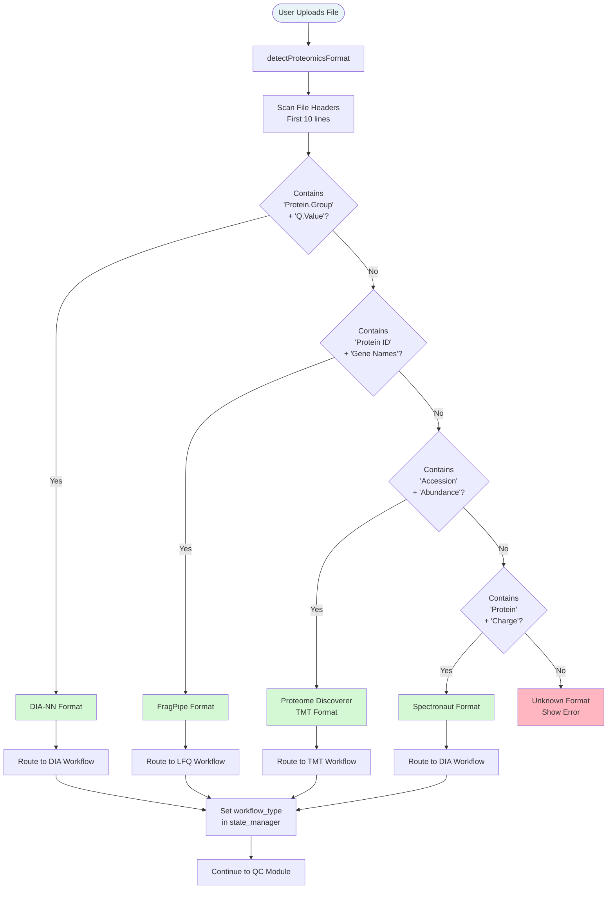

#### Implementation: Format Detection

```r
# File: R/func_proteomics_import.R
#' Detect Proteomics File Format
#'
#' Scans file headers to identify the source platform
#' 
#' @param file_path Character. Path to proteomics data file
#' @return Character. Format name: "DIANN", "MaxQuant", "FragPipe", "Spectronaut", "TMT-PD"
#' @export
detectProteomicsFormat <- function(file_path) {
  
  # Read first 10 lines (header and a few data rows)
  header_lines <- readLines(file_path, n = 10)
  
  # Extract column names (assumed to be first line)
  header_line <- header_lines[1]
  headers <- strsplit(header_line, "\t")[[1]]
  
  # Remove leading/trailing whitespace
  headers <- trimws(headers)
  
  message("Scanning headers: ", paste(head(headers, 5), collapse = ", "), "...")
  
  # ========================================
  # DIA-NN Detection
  # ========================================
  diann_markers <- c("Protein.Group", "Q.Value", "PG.Quantity")
  if (all(diann_markers %in% headers)) {
    message("Detected format: DIA-NN")
    return("DIANN")
  }
  
  # ========================================
  # MaxQuant Detection
  # ========================================
  maxquant_markers <- c("Protein IDs", "Majority protein IDs", "LFQ intensity")
  if (all(maxquant_markers[1:2] %in% headers) && 
      any(grepl("LFQ intensity", headers))) {
    message("Detected format: MaxQuant")
    return("MaxQuant")
  }
  
  # ========================================
  # FragPipe Detection
  # ========================================
  fragpipe_markers <- c("Protein ID", "Gene", "Intensity")
  if (all(fragpipe_markers[1:2] %in% headers)) {
    message("Detected format: FragPipe")
    return("FragPipe")
  }
  
  # ========================================
  # Spectronaut Detection
  # ========================================
  spectronaut_markers <- c("PG.ProteinGroups", "PG.Qvalue", "PG.Quantity")
  if (all(spectronaut_markers %in% headers)) {
    message("Detected format: Spectronaut")
    return("Spectronaut")
  }
  
  # ========================================
  # Proteome Discoverer (TMT) Detection
  # ========================================
  if ("Accession" %in% headers && any(grepl("Abundance:", headers))) {
    message("Detected format: Proteome Discoverer (TMT)")
    return("TMT-PD")
  }
  
  # ========================================
  # Unknown Format
  # ========================================
  stop(
    "Could not detect proteomics format.\n",
    "Supported formats: DIA-NN, MaxQuant, FragPipe, Spectronaut, Proteome Discoverer.\n",
    "Found headers: ", paste(head(headers, 10), collapse = ", ")
  )
}
```

### 7.2 Dynamic Workflow Routing

Once the format is detected, the workflow type is set, and subsequent modules adapt their behavior:

```r
# In mod_prot_import_server
observeEvent(input$import_button, {
  
  # STEP 1: Detect format
  format <- detectProteomicsFormat(input$data_file$datapath)
  
  # STEP 2: Determine workflow type
  workflow_type <- switch(format,
    "DIANN" = "DIA",
    "Spectronaut" = "DIA",
    "MaxQuant" = "LFQ",
    "FragPipe" = "LFQ",
    "TMT-PD" = "TMT",
    stop("Unsupported format: ", format)
  )
  
  message("Workflow type: ", workflow_type)
  
  # STEP 3: Load data using format-specific parser
  raw_data <- switch(format,
    "DIANN" = importDIANNData(input$data_file$datapath),
    "MaxQuant" = importMaxQuantData(input$data_file$datapath),
    "FragPipe" = importFragPipeData(input$data_file$datapath),
    "Spectronaut" = importSpectronautData(input$data_file$datapath),
    "TMT-PD" = importTMTPDData(input$data_file$datapath)
  )
  
  # STEP 4: Create appropriate S4 object
  if (workflow_type == "DIA") {
    # DIA workflows start with peptide-level data
    s4_object <- new("PeptideQuantitativeData",
      peptide_data = raw_data,
      design_matrix = design_df,
      peptide_sequence_column = "Stripped.Sequence",
      precursor_charge_column = "Precursor.Charge",
      protein_id_column = "Protein.Group",
      sample_id = "Sample",
      group_id = "Group",
      args = list(import = list(
        file = input$data_file$name,
        format = format,
        workflow_type = workflow_type
      ))
    )
  } else {
    # TMT/LFQ workflows start with protein-level data
    s4_object <- new("ProteinQuantitativeData",
      protein_quant_table = raw_data,
      design_matrix = design_df,
      protein_id_column = "Accession",
      sample_id = "Sample",
      group_id = "Group",
      args = list(import = list(
        file = input$data_file$name,
        format = format,
        workflow_type = workflow_type
      ))
    )
  }
  
  # STEP 5: Store workflow type in state manager
  workflow_data$state_manager$setWorkflowType(workflow_type)
  
  # STEP 6: Update transient state
  workflow_data$data_tbl <- s4_object
  workflow_data$tab_status$import <- "complete"
  workflow_data$current_config$workflow_type <- workflow_type
  workflow_data$current_config$format <- format
  
  # STEP 7: Checkpoint
  workflow_data$state_manager$saveState(
    name = "post_import",
    object = s4_object,
    config = list(
      file = input$data_file$name,
      format = format,
      workflow_type = workflow_type
    )
  )
  
  showNotification(
    paste0("Import complete: ", format, " (", workflow_type, " workflow)"),
    type = "message"
  )
})
```

### 7.3 Conditional Module Rendering

The QC module adapts its UI based on workflow type:

```r
# File: R/mod_prot_qc.R
mod_prot_qc_server <- function(id, workflow_data) {
  moduleServer(id, function(input, output, session) {
    
    # Reactive: Get workflow type
    workflow_type <- reactive({
      workflow_data$state_manager$getWorkflowType()
    })
    
    # Conditional UI: Render appropriate QC tabs
    output$qc_tabs <- renderUI({
      req(workflow_type())
      
      if (workflow_type() == "DIA") {
        # DIA: Show BOTH peptide and protein QC tabs
        tabsetPanel(
          tabPanel("Peptide QC",
            icon = icon("layer-group"),
            mod_prot_qc_peptide_ui(session$ns("peptide_qc"))
          ),
          tabPanel("Protein QC",
            icon = icon("microscope"),
            mod_prot_qc_protein_ui(session$ns("protein_qc"))
          )
        )
      } else {
        # TMT/LFQ: Show ONLY protein QC tab
        tabsetPanel(
          tabPanel("Protein QC",
            icon = icon("microscope"),
            mod_prot_qc_protein_ui(session$ns("protein_qc"))
          )
        )
      }
    })
    
    # Conditional server initialization
    observe({
      req(workflow_type())
      
      if (workflow_type() == "DIA") {
        # Initialize peptide QC module
        mod_prot_qc_peptide_server("peptide_qc", workflow_data)
      }
      
      # Always initialize protein QC
      mod_prot_qc_protein_server("protein_qc", workflow_data)
    })
  })
}
```

---

---

# SECTION 7.4: WORKFLOW-SPECIFIC ROUTING

---

## Section 7.4: Workflow-Specific Routing to QC Modules

### 7.4.1 The Data-Level Distinction

MultiScholaR's three proteomics workflows enter the QC phase at different data levels, requiring intelligent routing:

- **DIA workflows** (DIA-NN, Spectronaut): Import **peptide-level** precursor data → require peptide QC + rollup before protein QC
- **TMT/LFQ workflows** (Proteome Discoverer, MaxQuant, FragPipe): Import **protein-level** quantification → proceed directly to protein QC

This fundamental distinction drives conditional module initialization and UI rendering throughout the QC stage.

### 7.4.2 Routing Architecture

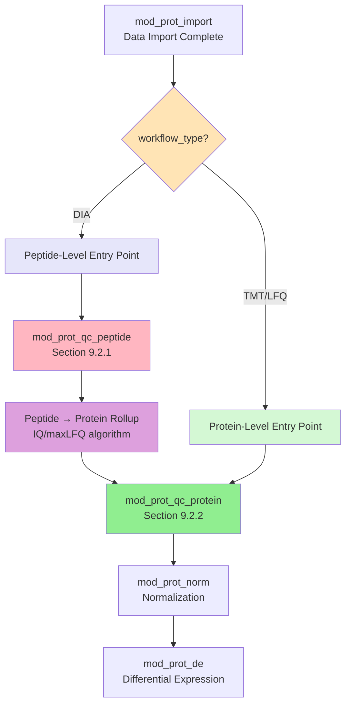

### 7.4.3 Conditional Module Initialization

The parent proteomics module initializes child modules based on the detected workflow type:

```r
# File: R/mod_proteomics.R
mod_proteomics_server <- function(id, project_dirs) {
  moduleServer(id, function(input, output, session) {
    
    # Create shared state bus
    workflow_data <- reactiveValues(
      data_tbl = NULL,
      state_manager = WorkflowState$new(),
      current_config = list()
    )
    
    # Import module (always initialized)
    mod_prot_import_server("import", workflow_data, project_dirs)
    
    # CONDITIONAL MODULE INITIALIZATION
    # Based on workflow_type set during import
    observe({
      req(workflow_data$current_config$workflow_type)
      
      workflow_type <- workflow_data$current_config$workflow_type
      
      if (workflow_type == "DIA") {
        # DIA: Initialize BOTH peptide and protein QC modules
        message("Initializing DIA workflow: peptide + protein QC modules")
        mod_prot_qc_peptide_server("peptide_qc", workflow_data)
        mod_prot_qc_protein_server("protein_qc", workflow_data)
        
      } else if (workflow_type %in% c("TMT", "LFQ")) {
        # TMT/LFQ: Initialize ONLY protein QC module
        message("Initializing ", workflow_type, " workflow: protein QC module only")
        mod_prot_qc_protein_server("protein_qc", workflow_data)
      }
      
      # Normalization and DE modules (always initialized)
      mod_prot_norm_server("norm", workflow_data)
      mod_prot_de_server("de", workflow_data)
    })
  })
}
```

### 7.4.4 Conditional UI Rendering

The QC module UI adapts based on workflow type:

```r
# File: R/mod_prot_qc.R
mod_prot_qc_ui <- function(id) {
  ns <- NS(id)
  uiOutput(ns("dynamic_qc_tabs"))  # Rendered dynamically by server
}

mod_prot_qc_server <- function(id, workflow_data) {
  moduleServer(id, function(input, output, session) {
    
    # Render appropriate QC tabs based on workflow
    output$dynamic_qc_tabs <- renderUI({
      req(workflow_data$current_config$workflow_type)
      
      workflow_type <- workflow_data$current_config$workflow_type
      
      if (workflow_type == "DIA") {
        # DIA: Two-tab interface
        tabsetPanel(
          tabPanel("Peptide QC", 
                  icon = icon("layer-group"),
                  mod_prot_qc_peptide_ui(session$ns("peptide_qc"))),
          tabPanel("Protein QC",
                  icon = icon("microscope"),
                  mod_prot_qc_protein_ui(session$ns("protein_qc")))
        )
      } else {
        # TMT/LFQ: Single protein QC tab
        mod_prot_qc_protein_ui(session$ns("protein_qc"))
      }
    })
  })
}
```

### 7.4.5 State Flow and Tab Enabling

The workflow type propagates through the state manager and controls tab access:

```r
# In mod_proteomics_server()

# Enable QC tab only after import complete
observe({
  req(workflow_data$tab_status$import == "complete")
  shinyjs::enable(selector = "#qc_tab")
})

# Enable normalization tab based on workflow-specific completion
observe({
  workflow_type <- workflow_data$current_config$workflow_type
  
  if (workflow_type == "DIA") {
    # DIA: Require both peptide QC AND protein rollup complete
    req(workflow_data$tab_status$peptide_qc == "complete",
        workflow_data$tab_status$protein_rollup == "complete")
  } else {
    # TMT/LFQ: Only require protein QC complete
    req(workflow_data$tab_status$protein_qc == "complete")
  }
  
  shinyjs::enable(selector = "#normalization_tab")
})
```

**Key Insight:** This routing architecture ensures that despite different entry points, all workflows converge at the protein-level QC stage, allowing shared normalization, DE, and enrichment modules downstream.

---

## Section 8: Multi-Assay Pattern (Metabolomics)

Metabolomics data often originates from multiple analytical platforms analyzed in parallel (e.g., LC-MS positive mode, LC-MS negative mode, GC-MS). The **multi-assay pattern** manages these heterogeneous datasets while maintaining synchronization.

### 8.1 MetaboliteAssayData S4 Structure

```r
# File: R/class_metabolite_assay_data.R
setClass("MetaboliteAssayData",
  slots = c(
    # Named list of data.frames (one per assay)
    metabolite_data = "list",
    
    # Column identifiers (same across all assays)
    metabolite_id_column = "character",      # Feature ID
    annotation_id_column = "character",      # Metabolite name
    
    # Shared design matrix (samples must match across assays)
    design_matrix = "data.frame",
    sample_id = "character",
    group_id = "character",
    
    # Internal standards identification
    internal_standard_regex = "character",
    
    # Processing history
    args = "list"
  ),
  
  validity = function(object) {
    errors <- character()
    
    # Ensure metabolite_data is a named list
    if (!is.list(object@metabolite_data) || 
        length(names(object@metabolite_data)) == 0) {
      errors <- c(errors, "metabolite_data must be a named list")
    }
    
    # Verify all assays have the same sample columns
    design_samples <- object@design_matrix[[object@sample_id]]
    
    for (assay_name in names(object@metabolite_data)) {
      assay_df <- object@metabolite_data[[assay_name]]
      
      # Extract sample columns (exclude annotation columns)
      annot_cols <- c(object@metabolite_id_column, 
                     object@annotation_id_column)
      sample_cols <- setdiff(names(assay_df), annot_cols)
      
      # Check: sample columns must be subset of design matrix
      if (!all(sample_cols %in% design_samples)) {
        errors <- c(errors,
          paste("Assay", assay_name, "contains samples not in design matrix"))
      }
      
      # Check: design matrix samples must be present in assay
      if (!all(design_samples %in% sample_cols)) {
        errors <- c(errors,
          paste("Assay", assay_name, "missing samples from design matrix"))
      }
    }
    
    if (length(errors) == 0) {
      return(TRUE)
    } else {
      return(errors)
    }
  }
)
```

#### Creating a MetaboliteAssayData Object

```r
# Example: Three-assay metabolomics dataset
metab_data <- new("MetaboliteAssayData",
  metabolite_data = list(
    LCMS_Pos = lcms_pos_df,  # 500 features x 30 samples
    LCMS_Neg = lcms_neg_df,  # 400 features x 30 samples
    GCMS = gcms_df           # 200 features x 30 samples
  ),
  metabolite_id_column = "feature_id",
  annotation_id_column = "metabolite_name",
  design_matrix = design_df,  # 30 samples x 3 factors
  sample_id = "Sample",
  group_id = "Group",
  internal_standard_regex = "^IS_|^ITSD_|_d\\d+$",
  args = list()
)

# Validation runs automatically
# Ensures all assays have the same 30 samples
```

### 8.2 Parallel Processing Pattern

Operations are applied independently to each assay, maintaining consistency:

```r
# S4 method for normalization
setMethod("normaliseBetweenSamples", "MetaboliteAssayData",
  function(object, method = "cyclicloess") {
    
    message("Normalizing ", length(object@metabolite_data), " assays")
    
    # Apply normalization to each assay INDEPENDENTLY
    normalized_assays <- lapply(names(object@metabolite_data), 
      function(assay_name) {
        message("  Processing: ", assay_name)
        
        assay_df <- object@metabolite_data[[assay_name]]
        
        # Separate annotation from quantitative columns
        annot_cols <- c(object@metabolite_id_column, 
                       object@annotation_id_column)
        quant_cols <- setdiff(names(assay_df), annot_cols)
        
        # Extract quantitative matrix
        quant_matrix <- as.matrix(assay_df[, quant_cols])
        
        # Apply normalization
        normalized_matrix <- switch(method,
          "cyclicloess" = {
            affy::normalize.cyclicloess(quant_matrix, 
                                        iterations = 3,
                                        span = 0.75)
          },
          "quantile" = {
            preprocessCore::normalize.quantiles(quant_matrix)
          },
          "median" = {
            # Median centering per sample
            sweep(quant_matrix, 2, apply(quant_matrix, 2, median, na.rm = TRUE), "-") +
              median(quant_matrix, na.rm = TRUE)
          },
          stop("Unknown normalization method: ", method)
        )
        
        # Reconstruct data frame
        assay_df[, quant_cols] <- normalized_matrix
        
        message("  Complete: ", assay_name, 
                " (mean intensity: ", round(mean(normalized_matrix, na.rm = TRUE), 2), ")")
        
        return(assay_df)
      })
    
    # Update object with normalized assays
    names(normalized_assays) <- names(object@metabolite_data)
    object@metabolite_data <- normalized_assays
    
    # Record parameters
    object@args$normalization <- list(
      method = method,
      timestamp = Sys.time(),
      assays_processed = names(object@metabolite_data)
    )
    
    message("Normalization complete")
    return(object)
  }
)
```

#### Usage Example

```r
# Normalize all three assays
metab_data_norm <- normaliseBetweenSamples(metab_data, method = "cyclicloess")

# Output:
# Normalizing 3 assays
#   Processing: LCMS_Pos
#   Complete: LCMS_Pos (mean intensity: 15.23)
#   Processing: LCMS_Neg
#   Complete: LCMS_Neg (mean intensity: 14.87)
#   Processing: GCMS
#   Complete: GCMS (mean intensity: 16.45)
# Normalization complete

# Each assay normalized independently but consistently
```

### 8.3 Assay-Specific Quality Control

Some QC operations are assay-specific (e.g., internal standards analysis):

```r
# Identify internal standards across all assays
identifyInternalStandards <- function(object) {
  
  regex <- object@internal_standard_regex
  message("Searching for internal standards with pattern: ", regex)
  
  is_list <- lapply(names(object@metabolite_data), function(assay_name) {
    assay_df <- object@metabolite_data[[assay_name]]
    
    # Search in both ID and annotation columns
    is_in_id <- grepl(regex, assay_df[[object@metabolite_id_column]])
    is_in_annot <- grepl(regex, assay_df[[object@annotation_id_column]])
    
    is_rows <- which(is_in_id | is_in_annot)
    
    if (length(is_rows) > 0) {
      message("  Found ", length(is_rows), " internal standards in ", assay_name)
      
      # Extract sample columns
      annot_cols <- c(object@metabolite_id_column, 
                     object@annotation_id_column)
      sample_cols <- setdiff(names(assay_df), annot_cols)
      
      # Calculate CV for each internal standard
      is_data <- assay_df[is_rows, ]
      is_data$assay <- assay_name
      is_data$mean_intensity <- apply(is_data[, sample_cols], 1, mean, na.rm = TRUE)
      is_data$sd_intensity <- apply(is_data[, sample_cols], 1, sd, na.rm = TRUE)
      is_data$cv_percent <- (is_data$sd_intensity / is_data$mean_intensity) * 100
      
      return(is_data[, c(object@metabolite_id_column, 
                        object@annotation_id_column,
                        "assay", "mean_intensity", "sd_intensity", "cv_percent")])
    } else {
      message("  No internal standards found in ", assay_name)
      return(NULL)
    }
  })
  
  # Combine results across assays
  is_df <- do.call(rbind, is_list[!sapply(is_list, is.null)])
  
  # Classify quality
  if (!is.null(is_df)) {
    is_df$quality <- cut(is_df$cv_percent,
                         breaks = c(0, 15, 30, Inf),
                         labels = c("Good", "Acceptable", "Poor"))
  }
  
  return(is_df)
}

# Usage
is_metrics <- identifyInternalStandards(metab_data_norm)
print(is_metrics)
#    feature_id metabolite_name    assay mean_intensity sd_intensity cv_percent quality
# 1     IS_001     d8-Tryptophan LCMS_Pos       1234567        98765       8.00    Good
# 2     IS_002       d3-Leucine LCMS_Pos       2345678       187654       8.00    Good
# 3     IS_003      d7-Arginine LCMS_Neg        987654       123456      12.50    Good
# 4     IS_004         d3-Serine LCMS_Neg        765432       178901      23.37 Acceptable
```

---

# PART III: DOMAIN WORKFLOWS

## Section 9: Proteomics Workflow - End-to-End

### 9.1 Import & Format Detection

The proteomics workflow begins with intelligent file format detection and data normalization. This section shows the complete import process from raw files to structured S4 objects.

#### The Import Challenge

Different proteomics platforms (DIA-NN, MaxQuant, FragPipe, Spectronaut, Proteome Discoverer) produce outputs with different:
- Column naming conventions
- Data organization (wide vs. long format)
- Quality metrics (Q-values, PEP scores, confidence levels)
- Quantitative measures (intensity, abundance, spectral counts)

MultiScholaR abstracts these differences through format-specific parsers that converge to a unified S4 structure.

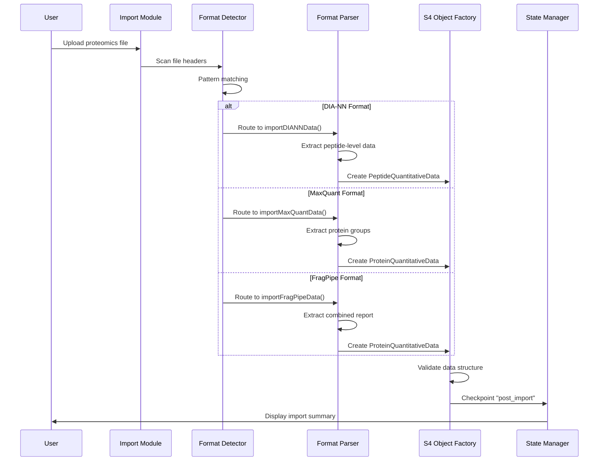

#### Complete Import Implementation

```r
# File: R/func_proteomics_import.R

#' Import DIA-NN Output
#'
#' Parses DIA-NN report.tsv file into PeptideQuantitativeData object.
#' DIA-NN produces peptide-level quantification with precursor charges.
#'
#' @param file_path Character. Path to DIA-NN report.tsv
#' @return data.frame. Parsed peptide-level data
#' @export
importDIANNData <- function(file_path) {
  message("Importing DIA-NN data from: ", basename(file_path))
  
  # Read tab-separated file
  raw_data <- read.delim(file_path, stringsAsFactors = FALSE)
  
  # Validate required columns
  required_cols <- c("Protein.Group", "Modified.Sequence", "Precursor.Charge", 
                     "Q.Value", "PG.Quantity")
  missing_cols <- setdiff(required_cols, names(raw_data))
  
  if (length(missing_cols) > 0) {
    stop("Missing required columns: ", paste(missing_cols, collapse = ", "))
  }
  
  message("  Found ", nrow(raw_data), " precursors")
  message("  Found ", length(unique(raw_data$Protein.Group)), " protein groups")
  message("  Found ", length(unique(raw_data$Modified.Sequence)), " peptide sequences")
  
  # DIA-NN specific cleaning
  # Remove decoys (reverse hits)
  raw_data <- raw_data[!grepl("^REV_", raw_data$Protein.Group), ]
  message("  After removing decoys: ", nrow(raw_data), " precursors")
  
  # Remove contaminants
  raw_data <- raw_data[!grepl("^CON_", raw_data$Protein.Group), ]
  message("  After removing contaminants: ", nrow(raw_data), " precursors")
  
  return(raw_data)
}

#' Import MaxQuant proteinGroups.txt
#'
#' Parses MaxQuant protein-level output (LFQ workflow).
#' MaxQuant produces protein-level quantification with LFQ intensities.
#'
#' @param file_path Character. Path to proteinGroups.txt
#' @return data.frame. Parsed protein-level data
#' @export
importMaxQuantData <- function(file_path) {
  message("Importing MaxQuant data from: ", basename(file_path))
  
  # MaxQuant files can be large - use data.table for speed
  raw_data <- data.table::fread(file_path, data.table = FALSE)
  
  # Validate required columns
  required_cols <- c("Protein IDs", "Majority protein IDs")
  if (!all(required_cols %in% names(raw_data))) {
    stop("Not a valid MaxQuant proteinGroups.txt file")
  }
  
  # Identify LFQ intensity columns
  lfq_cols <- grep("^LFQ intensity ", names(raw_data), value = TRUE)
  
  if (length(lfq_cols) == 0) {
    stop("No LFQ intensity columns found. Is this an LFQ experiment?")
  }
  
  message("  Found ", nrow(raw_data), " protein groups")
  message("  Found ", length(lfq_cols), " LFQ samples")
  
  # MaxQuant specific cleaning
  # Remove reverse hits
  if ("Reverse" %in% names(raw_data)) {
    raw_data <- raw_data[is.na(raw_data$Reverse) | raw_data$Reverse == "", ]
    message("  After removing reverse hits: ", nrow(raw_data), " protein groups")
  }
  
  # Remove potential contaminants
  if ("Potential.contaminant" %in% names(raw_data)) {
    raw_data <- raw_data[is.na(raw_data$Potential.contaminant) | 
                         raw_data$Potential.contaminant == "", ]
    message("  After removing contaminants: ", nrow(raw_data), " protein groups")
  }
  
  # Remove proteins only identified by site
  if ("Only.identified.by.site" %in% names(raw_data)) {
    raw_data <- raw_data[is.na(raw_data$Only.identified.by.site) | 
                         raw_data$Only.identified.by.site == "", ]
    message("  After removing site-only IDs: ", nrow(raw_data), " protein groups")
  }
  
  return(raw_data)
}
```

#### Integration with Module

```r
# In mod_prot_import_server
observeEvent(input$import_button, {
  req(input$data_file, input$design_file)
  
  withProgress(message = "Importing data...", value = 0, {
    
    # STEP 1: Detect format (25% progress)
    incProgress(0.25, detail = "Detecting format...")
    format <- detectProteomicsFormat(input$data_file$datapath)
    
    # STEP 2: Parse data (50% progress)
    incProgress(0.25, detail = paste("Parsing", format, "data..."))
    raw_data <- switch(format,
      "DIANN" = importDIANNData(input$data_file$datapath),
      "MaxQuant" = importMaxQuantData(input$data_file$datapath),
      "FragPipe" = importFragPipeData(input$data_file$datapath),
      stop("Unsupported format: ", format)
    )
    
    # STEP 3: Load design matrix (65% progress)
    incProgress(0.15, detail = "Loading design matrix...")
    design_df <- read.delim(input$design_file$datapath)
    
    # Validate design matrix
    if (!input$sample_id_col %in% names(design_df)) {
      stop("Sample ID column '", input$sample_id_col, "' not found in design matrix")
    }
    
    if (!input$group_id_col %in% names(design_df)) {
      stop("Group ID column '", input$group_id_col, "' not found in design matrix")
    }
    
    # STEP 4: Create S4 object (80% progress)
    incProgress(0.15, detail = "Creating data object...")
    workflow_type <- switch(format,
      "DIANN" = "DIA",
      "Spectronaut" = "DIA",
      "MaxQuant" = "LFQ",
      "FragPipe" = "LFQ",
      "TMT-PD" = "TMT"
    )
    
    if (workflow_type == "DIA") {
      # DIA workflows: Start with peptide-level data
      s4_object <- new("PeptideQuantitativeData",
        peptide_data = raw_data,
        design_matrix = design_df,
        peptide_sequence_column = input$peptide_seq_col,
        precursor_charge_column = input$charge_col,
        protein_id_column = input$protein_id_col,
        sample_id = input$sample_id_col,
        group_id = input$group_id_col,
        args = list(import = list(
          data_file = input$data_file$name,
          design_file = input$design_file$name,
          format = format,
          workflow_type = workflow_type,
          timestamp = Sys.time(),
          rows_imported = nrow(raw_data),
          samples_imported = nrow(design_df)
        ))
      )
    } else {
      # TMT/LFQ workflows: Start with protein-level data
      s4_object <- new("ProteinQuantitativeData",
        protein_quant_table = raw_data,
        design_matrix = design_df,
        protein_id_column = input$protein_id_col,
        sample_id = input$sample_id_col,
        group_id = input$group_id_col,
        args = list(import = list(
          data_file = input$data_file$name,
          design_file = input$design_file$name,
          format = format,
          workflow_type = workflow_type,
          timestamp = Sys.time(),
          rows_imported = nrow(raw_data),
          samples_imported = nrow(design_df)
        ))
      )
    }
    
    # STEP 5: Validate and checkpoint (100% progress)
    incProgress(0.20, detail = "Finalizing...")
    
    # Validate S4 object (triggers validity function)
    if (!validObject(s4_object)) {
      stop("Data validation failed. Check column mappings.")
    }
    
    # Store in state manager
    workflow_data$state_manager$setWorkflowType(workflow_type)
    workflow_data$state_manager$saveState(
      name = "post_import",
      object = s4_object,
      config = list(
        format = format,
        workflow_type = workflow_type,
        data_file = input$data_file$name,
        design_file = input$design_file$name
      )
    )
    
    # Update reactive state
    workflow_data$data_tbl <- s4_object
    workflow_data$tab_status$import <- "complete"
    workflow_data$current_config$format <- format
    workflow_data$current_config$workflow_type <- workflow_type
  })
  
  # Success notification
  showNotification(
    paste0("Import successful: ", workflow_data$current_config$format,
           " (", workflow_data$current_config$workflow_type, " workflow)"),
    type = "message",
    duration = 5
  )
})
```

### 9.1.3 Multiple Organism FASTA Detection and Selection

#### The Mixed-Species Challenge

Proteomics FASTA databases often contain proteins from multiple organisms, particularly in:
- **Non-specific searches**: Broad databases covering multiple species
- **Spiked-in standards**: E.g., human samples with yeast spike-ins for QC
- **Contaminant analysis**: Human keratins in bacterial samples
- **Cross-species studies**: Host-pathogen interaction experiments

Accurate enrichment analysis requires knowing which organism's annotation databases to query. MultiScholaR automates organism detection and allows intelligent selection.

#### FASTA Parsing and Organism Detection

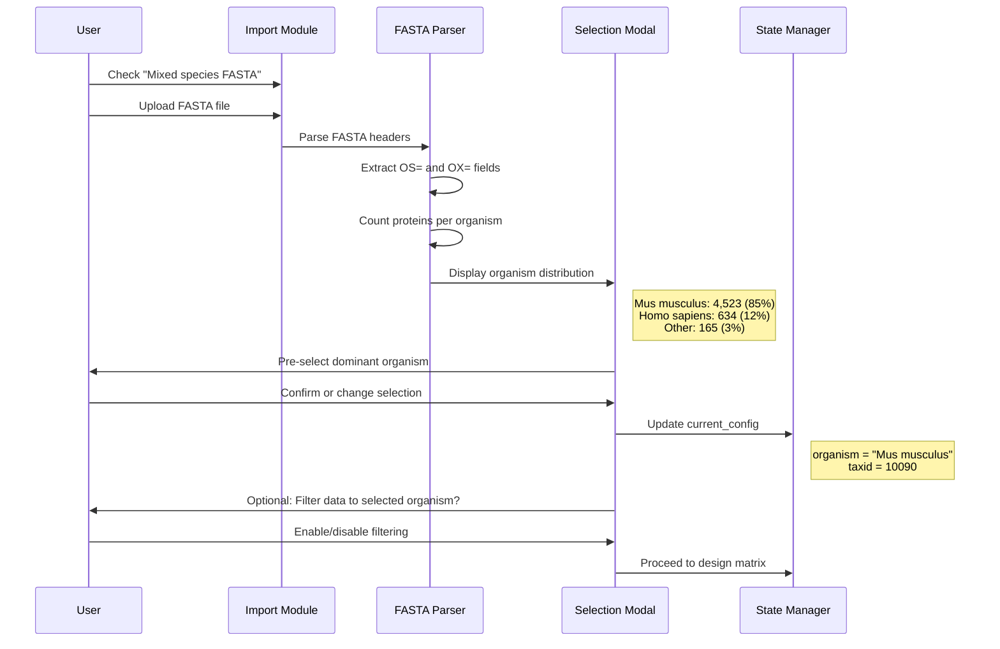

#### Implementation Pattern

```r
# File: R/func_proteomics_import.R

#' Parse FASTA File for Organism Distribution
#'
#' Extracts organism information from FASTA headers.
#' Typical header format: >sp|P12345|PROT_HUMAN Protein name OS=Homo sapiens OX=9606 GN=GENE
#'
#' @param fasta_path Character. Path to FASTA file
#' @return data.frame. Columns: organism, taxid, count, percentage
#' @export
parseFASTAOrganisms <- function(fasta_path) {
  message("Analyzing FASTA file for organism distribution...")
  
  # Read FASTA headers (lines starting with >)
  fasta_lines <- readLines(fasta_path)
  headers <- fasta_lines[grepl("^>", fasta_lines)]
  
  message("  Found ", length(headers), " protein entries")
  
  # Extract OS (organism) and OX (taxonomy ID) fields
  organism_matches <- regmatches(headers, regexpr("OS=([^=]+?)(?=OX=|GN=|PE=|$)", 
                                                  headers, perl = TRUE))
  taxid_matches <- regmatches(headers, regexpr("OX=([0-9]+)", headers, perl = TRUE))
  
  # Parse extracted fields
  organisms <- sub("OS=", "", organism_matches)
  organisms <- trimws(organisms)
  
  taxids <- sub("OX=", "", taxid_matches)
  taxids <- as.integer(taxids)
  
  # Count occurrences
  organism_counts <- table(organisms)
  
  # Build results data frame
  organism_df <- data.frame(
    organism = names(organism_counts),
    count = as.integer(organism_counts),
    percentage = round(as.integer(organism_counts) / length(headers) * 100, 1),
    taxid = sapply(names(organism_counts), function(org) {
      unique(taxids[organisms == org])[1]  # Take first TaxID for each organism
    }),
    stringsAsFactors = FALSE
  )
  
  # Sort by count descending
  organism_df <- organism_df[order(-organism_df$count), ]
  
  message("  Detected ", nrow(organism_df), " unique organisms")
  
  return(organism_df)
}
```

#### Integration in Import Module

```r
# File: R/mod_prot_import.R

observeEvent(input$process_import, {
  req(input$data_file, input$design_file)
  
  # Check if mixed species FASTA analysis requested
  if (input$mixed_species_checkbox && !is.null(input$fasta_file)) {
    
    # Parse FASTA for organism distribution
    organism_dist <- parseFASTAOrganisms(input$fasta_file$datapath)
    
    # Store for modal display
    organism_distribution(organism_dist)
    
    # Show organism selection modal
    showModal(modalDialog(
      title = "Select Primary Organism for Enrichment",
      size = "l",
      
      fluidRow(
        column(12,
          h4("Detected Organism Distribution:"),
          DT::renderDataTable({
            organism_dist
          }, options = list(pageLength = 10))
        )
      ),
      
      hr(),
      
      fluidRow(
        column(6,
          selectInput(
            session$ns("selected_organism"),
            "Primary Organism:",
            choices = organism_dist$organism,
            selected = organism_dist$organism[1]  # Pre-select most abundant
          )
        ),
        column(6,
          checkboxInput(
            session$ns("filter_to_organism"),
            "Filter data to selected organism only?",
            value = FALSE
          )
        )
      ),
      
      footer = tagList(
        modalButton("Cancel"),
        actionButton(session$ns("confirm_organism"), "Confirm Selection", 
                    class = "btn-primary")
      )
    ))
  }
})

# Handle organism selection
observeEvent(input$confirm_organism, {
  
  selected_row <- organism_distribution()[
    organism_distribution()$organism == input$selected_organism, 
  ]
  
  # Update workflow configuration
  workflow_data$current_config$organism <- selected_row$organism
  workflow_data$current_config$taxid <- selected_row$taxid
  
  # Optional: Filter data to selected organism
  if (input$filter_to_organism) {
    workflow_data$data_tbl <- filterToOrganism(
      workflow_data$data_tbl, 
      organism = selected_row$organism
    )
  }
  
  # Record in @args
  workflow_data$data_tbl@args$organism_selection <- list(
    organism = selected_row$organism,
    taxid = selected_row$taxid,
    total_proteins = selected_row$count,
    percentage = selected_row$percentage,
    filtered = input$filter_to_organism,
    timestamp = Sys.time()
  )
  
  removeModal()
  
  showNotification(
    paste0("Primary organism set: ", selected_row$organism, 
           " (TaxID: ", selected_row$taxid, ")"),
    type = "message"
  )
})
```

#### Downstream Impact

The selected organism and taxonomy ID are used for:

1. **Enrichment Analysis** (Section 13): Queries organism-specific GO/KEGG databases
2. **Annotation Lookup** (Section 9.1.4): Filters UniProt queries to organism
3. **Report Generation**: Documents organism composition in methods section
4. **Parameter Export**: Organism metadata included in `study_parameters.txt`

**Use Case Example**: A researcher analyzes a mouse proteomics dataset searched against a combined human+mouse+contaminant FASTA (common in MaxQuant). The system detects 85% mouse, 12% human, 3% contaminants, pre-selects mouse, and ensures all downstream enrichment uses *Mus musculus* (TaxID 10090) annotation databases.

---

# SECTION 9.1.4: DESIGN MATRIX BUILDER WITH ANNOTATION RETRIEVAL
*Insert after Section 9.1.3 (page ~37)*

---

### 9.1.4 Design Matrix Configuration and Annotation Retrieval

#### The Two-File Experimental Design System

MultiScholaR separates data from experimental metadata through a two-file architecture:

**File 1: Quantification Data**
- Proteomics platform output (DIA-NN, TMT-PD, MaxQuant, etc.)
- Wide format: proteins × samples

**File 2: Design Matrix**
- Sample metadata (CSV/TSV)
- Required columns: `Sample` (matching data column names), `Group` (experimental condition)
- Optional columns: `Batch`, `Treatment`, `Timepoint`, custom factors

This separation enables flexible experimental design configuration without modifying raw data files.

#### The Six-Step Configuration Workflow

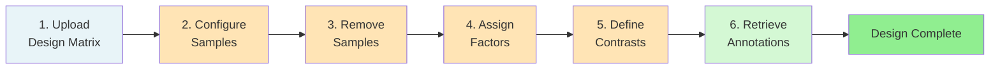

#### Steps 1-5: Interactive Design Matrix Builder

**Sample Configuration** provides bulk operations:
- Rename samples (remove prefixes/suffixes, pattern replacement)
- Group technical replicates for averaging
- Flag samples for exclusion with restoration capability

**Factor Assignment** allows up to 3 experimental factors:
```r
# Example: Two-factor design with batch effect
design_matrix <- data.frame(
  Sample = c("S1", "S2", "S3", "S4", "S5", "S6"),
  Group = c("Control", "Control", "Control", 
            "Treatment", "Treatment", "Treatment"),
  Batch = c("A", "B", "A", "B", "A", "B")
)

# Resulting formula: ~Group + Batch
# Allows testing Treatment effect while accounting for batch variation
```

**Contrast Definition** uses formula-aware naming:
```r
# User defines contrasts through UI dropdowns
contrasts <- c(
  "TreatmentVsControl",           # Main effect of interest
  "Treatment_BatchBVsBatchA"      # Interaction term if needed
)

# Validation ensures contrasts reference valid factor levels
# Preview shows contrast matrix before proceeding
```

#### Step 6: Automatic Annotation Retrieval

After design matrix finalization, MultiScholaR retrieves protein annotations from UniProt for all proteins in the dataset. This prepares for enrichment analysis without requiring separate annotation files.

**Why Annotation at This Stage?**
- Validates protein IDs against UniProt database early
- Flags obsolete accessions before investing analysis time
- Enriches results tables with gene symbols for readability
- Pre-fetches GO terms and pathways for enrichment (Section 13)

**Implementation Pattern:**

```r
# File: R/func_annotation.R

#' Retrieve UniProt Annotations via REST API
#'
#' Batch queries UniProt for gene symbols, GO terms, KEGG pathways.
#' Handles rate limiting and fallback to UniParc for archived entries.
#'
#' @param protein_ids Character vector. UniProt accessions
#' @param organism_taxid Integer. Taxonomy ID to filter results (optional)
#' @return data.frame. Protein annotations
#' @export
retrieveUniProtAnnotations <- function(protein_ids, organism_taxid = NULL) {
  
  library(httr)
  library(jsonlite)
  
  message("Retrieving annotations for ", length(protein_ids), " proteins...")
  
  # UniProt REST API endpoint
  base_url <- "https://rest.uniprot.org/uniprotkb/search"
  
  # Batch processing (500 IDs per request due to API limits)
  batch_size <- 500
  batches <- split(protein_ids, ceiling(seq_along(protein_ids) / batch_size))
  
  all_annotations <- lapply(seq_along(batches), function(i) {
    message("  Batch ", i, "/", length(batches))
    
    batch_ids <- batches[[i]]
    query <- paste0("(accession:", paste(batch_ids, collapse=" OR accession:"), ")")
    
    # Add organism filter if provided
    if (!is.null(organism_taxid)) {
      query <- paste0(query, " AND (organism_id:", organism_taxid, ")")
    }
    
    # Request with specific fields
    response <- GET(
      url = base_url,
      query = list(
        query = query,
        format = "json",
        fields = "accession,gene_primary,protein_name,go_id,xref_kegg",
        size = batch_size
      )
    )
    
    if (status_code(response) == 200) {
      results <- fromJSON(content(response, "text"), flatten = TRUE)$results
      return(results)
    } else {
      warning("API request failed for batch ", i)
      return(NULL)
    }
    
    Sys.sleep(0.5)  # Rate limiting
  })
  
  # Combine and format results
  annotations_df <- do.call(rbind, all_annotations)
  
  # Clean formatting
  formatted <- data.frame(
    Accession = annotations_df$primaryAccession,
    Gene = extractGeneSymbols(annotations_df$genes),
    Protein_Name = annotations_df$proteinDescription$recommendedName$fullName$value,
    GO_Terms = extractGOTerms(annotations_df$goTerms),
    KEGG_Pathway = extractKEGGPathways(annotations_df$uniProtKBCrossReferences),
    stringsAsFactors = FALSE
  )
  
  message("  Successfully annotated ", nrow(formatted), "/", length(protein_ids), " proteins")
  
  return(formatted)
}
```

#### Integration in Design Module

```r
# File: R/mod_prot_design.R

observeEvent(input$finalize_design, {
  
  # Validate design matrix completeness
  req(validateDesignMatrix())
  
  # Extract protein IDs from data
  protein_ids <- unique(workflow_data$data_tbl@protein_quant_table[[
    workflow_data$data_tbl@protein_id_column
  ]])
  
  # Show progress
  showModal(modalDialog(
    title = "Retrieving Protein Annotations",
    "Querying UniProt database... This may take 1-2 minutes for large datasets.",
    footer = NULL,
    easyClose = FALSE
  ))
  
  # Retrieve annotations
  annotations <- tryCatch({
    retrieveUniProtAnnotations(
      protein_ids = protein_ids,
      organism_taxid = workflow_data$current_config$taxid  # From FASTA selection
    )
  }, error = function(e) {
    showNotification(paste("Annotation retrieval failed:", e$message),
                    type = "error", duration = 10)
    return(NULL)
  })
  
  removeModal()
  
  if (!is.null(annotations)) {
    # Store in workflow state
    workflow_data$protein_annotations <- annotations
    
    # Record in @args
    workflow_data$data_tbl@args$annotations <- list(
      timestamp = Sys.time(),
      n_proteins_annotated = nrow(annotations),
      n_with_gene_symbols = sum(!is.na(annotations$Gene)),
      n_with_go_terms = sum(!is.na(annotations$GO_Terms))
    )
    
    # Show coverage summary
    showNotification(
      sprintf("Annotations retrieved: %d/%d proteins (%.1f%%) with gene symbols",
              sum(!is.na(annotations$Gene)),
              nrow(annotations),
              mean(!is.na(annotations$Gene)) * 100),
      type = "message",
      duration = 10
    )
    
    workflow_data$tab_status$design <- "complete"
  }
})
```

#### Annotation Usage Throughout Workflow

**Immediate Use:**
- Gene symbols displayed in QC plots (PCA point labels)
- Protein descriptions shown in interactive data tables
- Validation of protein ID format and database currency

**Downstream Use:**
- **Section 9.2**: QC module displays gene symbols instead of accessions
- **Section 9.4**: DE results tables include gene symbol column
- **Section 13**: Enrichment analysis uses pre-fetched GO terms/KEGG pathways
- **Reports**: Gene-centric results more interpretable for biologists

**Handling Missing Annotations:**
```r
# Proteins without annotations flagged but retained in analysis
# Warning displayed in UI with count of unannotated proteins
# Enrichment analysis proceeds with annotated subset
# Export includes both accession and gene symbol columns (NA where unavailable)
```

**Example Output:**
```
Annotation Summary:
  Total proteins: 4,523
  With gene symbols: 4,201 (92.9%)
  With GO terms: 3,987 (88.1%)
  With KEGG pathways: 2,456 (54.3%)
  Unannotated: 322 (7.1%) - flagged for review
```

This integrated annotation step ensures downstream analyses have maximum biological context without requiring manual curation of annotation files.

---

# SECTION 9.2 RESTRUCTURE: PEPTIDE + PROTEIN QC


---

## Section 9.2: Quality Control - Workflow-Dependent Strategies

MultiScholaR implements a **two-tier QC architecture** that adapts to the data level at which each workflow enters:

- **DIA workflows**: Require **both** peptide-level QC (9.2.1) and protein-level QC (9.2.2)
- **TMT/LFQ workflows**: Skip directly to **protein-level QC only** (9.2.2)

This architecture ensures appropriate quality filtering while allowing shared downstream modules (normalization, DE) across all workflows.

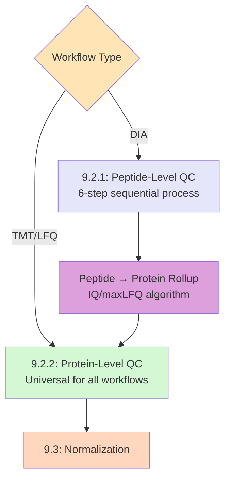

---

### 9.2.1: Peptide-Level Quality Control (DIA Workflows Only)

**Note**: This content already exists in the current document. The 6-step DIA QC process is documented with:
1. Q-value filtering (FDR threshold)
2. Precursor rollup (charge state aggregation)
3. Intensity filtering
4. Protein/peptide count filtering
5. Sample-level filtering
6. Imputation strategies

*[Existing content from current Section 9.2 "Quality Control: DIA Workflow" remains here unchanged]*

After peptide QC completion, DIA workflows proceed to peptide-to-protein rollup using the IQ algorithm (documented in current Section 9.2.2), then enter protein-level QC.

---

### 9.2.2: Protein-Level Quality Control (Universal - All Workflows)

All workflows—whether entering from DIA peptide rollup or directly from TMT/LFQ import—converge at this protein-level QC stage. This module implements universal filtering and annotation cleanup applicable regardless of upstream processing.

#### Phase 1: Annotation Cleanup

Before statistical filtering, protein identifications are cleaned to remove common contaminants and artifacts:

**A. Contaminant Removal**
```r
# File: R/func_proteomics_qc.R

#' Remove Common Contaminants from Protein Data
#'
#' Filters out proteins matching known contaminant patterns.
#' 
#' @param protein_data S4 ProteinQuantitativeData object
#' @return ProteinQuantitativeData. Cleaned object
#' @export
removeContaminants <- function(protein_data) {
  
  protein_ids <- protein_data@protein_quant_table[[protein_data@protein_id_column]]
  rows_before <- length(protein_ids)
  
  # Define contaminant patterns
  contaminant_patterns <- c(
    "^CON_|^CON__",           # MaxQuant contaminant prefix
    "^REV_|^REV__",           # Reverse (decoy) sequences
    "Keratin|^KRT",           # Human keratins (skin contamination)
    "Trypsin",                # Residual trypsin
    "^TRYP_PIG"               # Porcine trypsin
  )
  
  # Identify contaminants
  is_contaminant <- grepl(paste(contaminant_patterns, collapse = "|"), 
                          protein_ids, ignore.case = TRUE)
  
  # Filter
  protein_data@protein_quant_table <- protein_data@protein_quant_table[!is_contaminant, ]
  
  rows_after <- nrow(protein_data@protein_quant_table)
  
  message("Contaminant removal: ", rows_before, " → ", rows_after, " proteins")
  message("  Removed: ", rows_before - rows_after, " contaminants")
  
  # Record in @args
  protein_data@args$contaminant_removal <- list(
    rows_before = rows_before,
    rows_after = rows_after,
    rows_removed = rows_before - rows_after,
    patterns = contaminant_patterns,
    timestamp = Sys.time()
  )
  
  return(protein_data)
}
```

**B. Protein ID Standardization**
```r
# Remove database prefixes for cleaner display
# sp|P12345|PROT_HUMAN → P12345
# tr|Q67890|Q67890_MOUSE → Q67890

standardizeProteinIDs <- function(protein_ids) {
  # Remove Swiss-Prot/TrEMBL prefixes
  protein_ids <- gsub("^sp\\||^tr\\|", "", protein_ids)
  
  # Remove trailing organism suffixes for cleaner gene-centric view
  protein_ids <- gsub("\\|.*$", "", protein_ids)
  
  return(protein_ids)
}
```

#### Phase 2: Missing Value Filtering

Proteomics data inherently contains missing values due to stochastic sampling. MultiScholaR applies **dual-threshold filtering**:

**Per-Protein Threshold**: Retain proteins detected in sufficient samples
```r
#' Filter Proteins by Completeness Across Samples
#'
#' @param protein_data ProteinQuantitativeData object
#' @param threshold Numeric. Minimum proportion of samples where protein must be present (0-1)
#' @return ProteinQuantitativeData. Filtered object
#' @export
filterByProteinCompleteness <- function(protein_data, threshold = 0.5) {
  
  quant_matrix <- extractQuantMatrix(protein_data)
  
  # Calculate proportion of non-missing values per protein
  protein_completeness <- rowMeans(!is.na(quant_matrix))
  
  # Filter
  keep_proteins <- protein_completeness >= threshold
  
  protein_data@protein_quant_table <- protein_data@protein_quant_table[keep_proteins, ]
  
  message("Protein completeness filter (≥", threshold * 100, "% samples)")
  message("  Retained: ", sum(keep_proteins), "/", length(keep_proteins), " proteins")
  
  return(protein_data)
}
```

**Per-Sample Threshold**: Remove samples with excessive missing data
```r
#' Identify Samples with High Missing Value Rates
#'
#' Flags samples that may have failed during sample preparation or MS acquisition.
#'
#' @param protein_data ProteinQuantitativeData object
#' @param threshold Numeric. Maximum allowable missing proportion (0-1)
#' @return Character vector. Sample names flagged for review
#' @export
identifyProblematicSamples <- function(protein_data, threshold = 0.3) {
  
  quant_matrix <- extractQuantMatrix(protein_data)
  
  # Calculate missing proportion per sample
  sample_missing <- colMeans(is.na(quant_matrix))
  
  # Flag samples exceeding threshold
  problematic <- names(sample_missing)[sample_missing > threshold]
  
  if (length(problematic) > 0) {
    message("Warning: ", length(problematic), " samples exceed ", 
            threshold * 100, "% missing values:")
    message("  ", paste(problematic, collapse = ", "))
  }
  
  return(problematic)
}
```

#### Phase 3: Intensity-Based Filtering

Remove low-abundance proteins likely representing noise:

```r
#' Filter by Maximum Intensity Threshold
#'
#' Removes proteins where the maximum intensity across all samples
#' falls below a minimum threshold (indicates low signal).
#'
#' @param protein_data ProteinQuantitativeData object
#' @param min_intensity Numeric. Minimum max intensity threshold
#' @return ProteinQuantitativeData. Filtered object
#' @export
filterByMaxIntensity <- function(protein_data, min_intensity = 100) {
  
  quant_matrix <- extractQuantMatrix(protein_data)
  
  # Calculate max intensity per protein
  max_intensities <- apply(quant_matrix, 1, max, na.rm = TRUE)
  
  # Filter
  keep <- max_intensities >= min_intensity
  protein_data@protein_quant_table <- protein_data@protein_quant_table[keep, ]
  
  message("Intensity filter (max ≥ ", min_intensity, ")")
  message("  Retained: ", sum(keep), "/", length(keep), " proteins")
  
  return(protein_data)
}
```

#### Phase 4: QC Visualizations

The protein QC module generates diagnostic plots applicable to all workflows:

**Missing Value Heatmap**
```r
plotMissingValueHeatmap <- function(protein_data) {
  quant_matrix <- extractQuantMatrix(protein_data)
  
  # Binary matrix: 1 = present, 0 = missing
  presence_matrix <- !is.na(quant_matrix)
  
  # Cluster samples and proteins by missingness pattern
  pheatmap::pheatmap(
    presence_matrix,
    cluster_rows = TRUE,
    cluster_cols = TRUE,
    color = c("white", "darkblue"),
    legend_labels = c("Missing", "Present"),
    main = "Missing Value Pattern"
  )
}
```

**Sample Correlation Heatmap**
```r
# Assess sample similarity before normalization
# Identifies outlier samples or batch effects

plotSampleCorrelationHeatmap <- function(protein_data) {
  quant_matrix <- extractQuantMatrix(protein_data)
  
  # Pairwise Pearson correlation
  sample_cor <- cor(quant_matrix, use = "pairwise.complete.obs")
  
  pheatmap::pheatmap(
    sample_cor,
    cluster_rows = TRUE,
    cluster_cols = TRUE,
    main = "Sample Correlation (Pre-Normalization)"
  )
}
```

**PCA (Pre-Normalization)**
```r
# Use existing plotPcaHelper from Section 11
# Visualize sample clustering by experimental groups
# Identify outliers or unexpected batch effects
```

#### Integration in QC Module

```r
# File: R/mod_prot_qc_protein.R

observeEvent(input$run_protein_qc, {
  
  req(workflow_data$data_tbl)
  
  current_data <- workflow_data$data_tbl
  
  withProgress(message = "Running protein-level QC...", {
    
    # Phase 1: Annotation cleanup
    incProgress(0.2, detail = "Removing contaminants...")
    qc_data <- removeContaminants(current_data)
    
    # Phase 2: Missing value filtering
    incProgress(0.2, detail = "Filtering by completeness...")
    qc_data <- filterByProteinCompleteness(qc_data, 
                                           threshold = input$completeness_threshold)
    
    # Identify problematic samples (display warning, don't auto-remove)
    problematic <- identifyProblematicSamples(qc_data, 
                                             threshold = input$sample_missing_threshold)
    if (length(problematic) > 0) {
      workflow_data$qc_warnings$problematic_samples <- problematic
    }
    
    # Phase 3: Intensity filtering
    incProgress(0.2, detail = "Filtering by intensity...")
    qc_data <- filterByMaxIntensity(qc_data, 
                                    min_intensity = input$min_intensity)
    
    # Phase 4: Generate QC plots
    incProgress(0.2, detail = "Generating QC visualizations...")
    workflow_data$qc_plots$missing_value_heatmap <- plotMissingValueHeatmap(qc_data)
    workflow_data$qc_plots$sample_correlation <- plotSampleCorrelationHeatmap(qc_data)
    workflow_data$qc_plots$pca_pre_norm <- plotPcaHelper(
      extractQuantMatrix(qc_data),
      qc_data@design_matrix,
      color_by = qc_data@group_id
    )
    
    # Update state
    workflow_data$data_tbl <- qc_data
    workflow_data$tab_status$protein_qc <- "complete"
    
    # Checkpoint
    workflow_data$state_manager$saveState(
      name = "post_protein_qc",
      object = qc_data,
      config = list(
        completeness_threshold = input$completeness_threshold,
        min_intensity = input$min_intensity
      )
    )
    
    incProgress(0.2, detail = "Complete")
  })
  
  showNotification("Protein QC complete", type = "message")
})
```

**Key Distinction from Peptide QC:**
- No Q-value filtering (peptide-level metric)
- No precursor rollup (already at protein level)
- Universal applicability (works for DIA, TMT, LFQ)
- Simpler filtering criteria (completeness + intensity)
- Focuses on data quality rather than identification confidence

After protein QC completion, all workflows proceed to normalization (Section 9.3) with a clean, consistent protein-level dataset.

-----

### 9.3 Normalization

Normalization removes systematic technical variation between samples.

```r
# S4 generic method for normalization
setMethod("normaliseBetweenSamples", "ProteinQuantitativeData",
  function(object, method = "cyclicloess") {
    
    message("Normalizing protein data using: ", method)
    
    # Extract quantitative matrix
    protein_ids <- object@protein_quant_table[[object@protein_id_column]]
    quant_cols <- setdiff(names(object@protein_quant_table), 
                         object@protein_id_column)
    quant_matrix <- as.matrix(object@protein_quant_table[, quant_cols])
    rownames(quant_matrix) <- protein_ids
    
    # Log transformation (if not already log-scale)
    is_log_scale <- max(quant_matrix, na.rm = TRUE) < 100
    if (!is_log_scale) {
      message("  Applying log2 transformation")
      quant_matrix <- log2(quant_matrix + 1)
    }
    
    # Apply normalization
    normalized_matrix <- switch(method,
      "cyclicloess" = {
        # Cyclic loess: Iteratively normalizes pairs of samples
        message("  Applying cyclic loess normalization")
        library(affy)
        normalize.cyclicloess(quant_matrix, iterations = 3, span = 0.75)
      },
      "quantile" = {
        # Quantile normalization: Makes all distributions identical
        message("  Applying quantile normalization")
        library(preprocessCore)
        normalize.quantiles(quant_matrix)
      },
      "median" = {
        # Median centering: Shifts each sample to have same median
        message("  Applying median normalization")
        sample_medians <- apply(quant_matrix, 2, median, na.rm = TRUE)
        global_median <- median(quant_matrix, na.rm = TRUE)
        sweep(quant_matrix, 2, sample_medians - global_median, "-")
      },
      "vsn" = {
        # Variance stabilizing normalization
        message("  Applying VSN normalization")
        library(vsn)
        vsn_fit <- vsn2(quant_matrix)
        exprs(vsn_fit)
      },
      stop("Unknown normalization method: ", method)
    )
    
    # Restore row/column names
    rownames(normalized_matrix) <- protein_ids
    colnames(normalized_matrix) <- quant_cols
    
    # Calculate normalization effect
    mean_before <- mean(quant_matrix, na.rm = TRUE)
    sd_before <- sd(as.vector(quant_matrix), na.rm = TRUE)
    mean_after <- mean(normalized_matrix, na.rm = TRUE)
    sd_after <- sd(as.vector(normalized_matrix), na.rm = TRUE)
    
    message("  Mean before: ", round(mean_before, 2))
    message("  Mean after: ", round(mean_after, 2))
    message("  SD before: ", round(sd_before, 2))
    message("  SD after: ", round(sd_after, 2))
    
    # Update object
    object@protein_quant_table[, quant_cols] <- normalized_matrix
    
    # Record parameters
    object@args$normalization <- list(
      method = method,
      timestamp = Sys.time(),
      log_transformed = !is_log_scale,
      mean_before = mean_before,
      mean_after = mean_after,
      sd_before = sd_before,
      sd_after = sd_after
    )
    
    return(object)
  }
)
```

#### RUV-III Batch Correction

After normalization, batch effects can be removed using RUV-III (Remove Unwanted Variation):

```r
#' RUV-III Batch Correction with C Parameter Varying
#'
#' Removes unwanted variation using negative control proteins.
#' This is MultiScholaR's novel automated parameter optimization.
#'
#' @param object ProteinQuantitativeData. Normalized data
#' @param negative_control_percentage Numeric. Proportion of proteins to use as controls
#' @param k Integer. Number of factors to remove
#' @return ProteinQuantitativeData. Batch-corrected data
#' @export
ruvIII_C_Varying <- function(object, 
                             negative_control_percentage = 0.1,
                             k = NULL) {
  
  message("Applying RUV-III batch correction")
  message("  Negative control percentage: ", negative_control_percentage * 100, "%")
  
  # Extract data
  quant_matrix <- extractQuantMatrix(object)
  design_matrix <- object@design_matrix
  
  # Select negative control proteins (least variable)
  protein_cv <- apply(quant_matrix, 1, function(x) sd(x, na.rm = TRUE) / mean(x, na.rm = TRUE))
  n_controls <- ceiling(nrow(quant_matrix) * negative_control_percentage)
  control_idx <- order(protein_cv)[1:n_controls]
  
  message("  Selected ", n_controls, " negative control proteins")
  
  # Automatically determine k if not provided
  if (is.null(k)) {
    message("  Optimizing number of factors (k)...")
    k <- findBestK(quant_matrix, design_matrix, control_idx)
    message("  Optimal k: ", k)
  }
  
  # Apply RUV-III
  library(ruv)
  ruv_result <- RUVIII(
    Y = quant_matrix,
    M = model.matrix(as.formula(paste0("~", object@group_id)), data = design_matrix),
    ctl = control_idx,
    k = k
  )
  
  corrected_matrix <- ruv_result$newY
  
  # Calculate correction effect
  batch_variation_before <- measureBatchEffect(quant_matrix, design_matrix)
  batch_variation_after <- measureBatchEffect(corrected_matrix, design_matrix)
  
  message("  Batch variation before: ", round(batch_variation_before, 4))
  message("  Batch variation after: ", round(batch_variation_after, 4))
  message("  Reduction: ", round((1 - batch_variation_after/batch_variation_before) * 100, 1), "%")
  
  # Update object
  object@protein_quant_table[, -1] <- corrected_matrix
  
  # Record parameters
  object@args$batch_correction <- list(
    method = "RUV-III",
    k = k,
    negative_control_percentage = negative_control_percentage,
    n_controls = n_controls,
    timestamp = Sys.time(),
    batch_variation_before = batch_variation_before,
    batch_variation_after = batch_variation_after,
    reduction_percent = round((1 - batch_variation_after/batch_variation_before) * 100, 1)
  )
  
  return(object)
}
```

### 9.4 Differential Expression Analysis

After normalization, statistical testing identifies differentially expressed proteins.

```r
#' Differential Expression Analysis using limma
#'
#' Performs statistical testing for differential protein expression.
#'
#' @param object ProteinQuantitativeData. Normalized data
#' @param design_formula Character. R formula for design (e.g., "~Group + Batch")
#' @param contrasts Character vector. Contrasts to test (e.g., "TreatmentVsControl")
#' @return data.frame. Results table with statistics
#' @export
differentialExpressionAnalysis <- function(object, 
                                          design_formula = "~Group",
                                          contrasts = NULL) {
  
  message("Performing differential expression analysis")
  message("  Design formula: ", design_formula)
  
  # Extract data
  quant_matrix <- extractQuantMatrix(object)
  design_df <- object@design_matrix
  
  # Create design matrix
  design_mat <- model.matrix(as.formula(design_formula), data = design_df)
  
  message("  Design matrix dimensions: ", nrow(design_mat), " x ", ncol(design_mat))
  message("  Coefficients: ", paste(colnames(design_mat), collapse = ", "))
  
  # Fit linear model
  library(limma)
  fit <- lmFit(quant_matrix, design_mat)
  
  # Define contrasts if not provided
  if (is.null(contrasts)) {
    # Default: Test all non-intercept coefficients
    contrasts <- colnames(design_mat)[-1]
    message("  Using default contrasts: ", paste(contrasts, collapse = ", "))
  }
  
  # Make contrast matrix
  contrast_mat <- makeContrasts(contrasts = contrasts, levels = design_mat)
  
  # Fit contrasts
  fit2 <- contrasts.fit(fit, contrast_mat)
  
  # Empirical Bayes smoothing
  fit2 <- eBayes(fit2)
  
  # Extract results for each contrast
  results_list <- lapply(contrasts, function(contrast) {
    message("  Processing contrast: ", contrast)
    
    res <- topTable(fit2, coef = contrast, number = Inf, sort.by = "none")
    res$protein <- rownames(res)
    res$contrast <- contrast
    
    # Count significant proteins
    n_sig_05 <- sum(res$adj.P.Val < 0.05, na.rm = TRUE)
    n_sig_01 <- sum(res$adj.P.Val < 0.01, na.rm = TRUE)
    
    message("    Significant (FDR < 0.05): ", n_sig_05)
    message("    Significant (FDR < 0.01): ", n_sig_01)
    
    return(res)
  })
  
  # Combine all results
  results_combined <- do.call(rbind, results_list)
  
  # Record parameters
  object@args$differential_expression <- list(
    design_formula = design_formula,
    contrasts = contrasts,
    timestamp = Sys.time(),
    method = "limma",
    adjust_method = "BH",  # Benjamini-Hochberg FDR
    n_proteins_tested = nrow(quant_matrix)
  )
  
  return(results_combined)
}
```

---

## Section 10: Metabolomics Workflow - End-to-End

### 10.1 Multi-Assay Import

Metabolomics experiments typically involve multiple analytical platforms:
- **LC-MS Positive mode**: Detects positively charged metabolites
- **LC-MS Negative mode**: Detects negatively charged metabolites
- **GC-MS**: Gas chromatography for volatile metabolites

Each platform requires separate processing but synchronized sample mapping.

```r
#' Import Multi-Assay Metabolomics Data
#'
#' Loads metabolomics data from multiple platforms into unified structure.
#'
#' @param file_list Named list. Platform names -> file paths
#' @param design_matrix data.frame. Experimental design
#' @return MetaboliteAssayData. Multi-assay S4 object
#' @export
importMetabolomicsData <- function(file_list, design_matrix) {
  
  message("Importing metabolomics data from ", length(file_list), " platforms")
  
  # Process each assay
  assay_data_list <- lapply(names(file_list), function(platform) {
    message("  Processing platform: ", platform)
    
    file_path <- file_list[[platform]]
    
    # Detect format
    format <- detectMetabolomicsFormat(file_path)
    message("    Detected format: ", format)
    
    # Parse using format-specific function
    raw_df <- switch(format,
      "MS-DIAL" = readMSDIALExport(file_path),
      "Progenesis" = readProgenesisExport(file_path),
      "XCMS" = readXcmsExport(file_path),
      stop("Unsupported format: ", format)
    )
    
    # Separate annotation from quantitative data
    processed_df <- getMetaboliteQuantData(raw_df)
    
    message("    Loaded ", nrow(processed_df), " features")
    message("    Loaded ", ncol(processed_df) - 2, " samples")  # -2 for annotation cols
    
    return(processed_df)
  })
  
  names(assay_data_list) <- names(file_list)
  
  # Create multi-assay S4 object
  metab_object <- new("MetaboliteAssayData",
    metabolite_data = assay_data_list,
    metabolite_id_column = "feature_id",
    annotation_id_column = "metabolite_name",
    design_matrix = design_matrix,
    sample_id = "Sample",
    group_id = "Group",
    internal_standard_regex = "^IS_|^ITSD_|_d\\d+$",
    args = list(import = list(
      platforms = names(file_list),
      n_platforms = length(file_list),
      timestamp = Sys.time()
    ))
  )
  
  # Validation runs automatically (checks sample consistency)
  
  return(metab_object)
}
```

### 10.2 Internal Standards (ITSD) Analysis

Internal standards are spiked-in compounds used to assess technical reproducibility.

```r
#' Analyze Internal Standards Quality
#'
#' Identifies internal standards and calculates coefficient of variation.
#'
#' @param object MetaboliteAssayData. Input data
#' @return data.frame. ITSD metrics with quality classification
#' @export
analyzeInternalStandards <- function(object) {
  
  message("Analyzing internal standards")
  
  regex <- object@internal_standard_regex
  message("  Using pattern: ", regex)
  
  # Process each assay
  is_metrics_list <- lapply(names(object@metabolite_data), function(assay_name) {
    message("  Processing assay: ", assay_name)
    
    assay_df <- object@metabolite_data[[assay_name]]
    
    # Search for internal standards
    is_in_id <- grepl(regex, assay_df[[object@metabolite_id_column]])
    is_in_annot <- grepl(regex, assay_df[[object@annotation_id_column]])
    is_rows <- which(is_in_id | is_in_annot)
    
    if (length(is_rows) == 0) {
      message("    No internal standards found")
      return(NULL)
    }
    
    message("    Found ", length(is_rows), " internal standards")
    
    # Extract quantitative columns
    annot_cols <- c(object@metabolite_id_column, object@annotation_id_column)
    quant_cols <- setdiff(names(assay_df), annot_cols)
    
    # Calculate statistics for each IS
    is_data <- assay_df[is_rows, ]
    is_data$assay <- assay_name
    
    # Mean and SD across samples
    is_data$mean_intensity <- apply(is_data[, quant_cols], 1, mean, na.rm = TRUE)
    is_data$sd_intensity <- apply(is_data[, quant_cols], 1, sd, na.rm = TRUE)
    
    # Coefficient of variation (CV%)
    is_data$cv_percent <- (is_data$sd_intensity / is_data$mean_intensity) * 100
    
    # Extract trend data (for plotting)
    is_trends <- is_data[, c(object@metabolite_id_column, 
                             object@annotation_id_column,
                             quant_cols)]
    
    # Reshape to long format
    library(reshape2)
    is_long <- melt(is_trends,
                   id.vars = c(object@metabolite_id_column, 
                              object@annotation_id_column),
                   variable.name = "Sample",
                   value.name = "Intensity")
    is_long$assay <- assay_name
    
    # Return both summary and trends
    list(
      summary = is_data[, c(object@metabolite_id_column,
                           object@annotation_id_column,
                           "assay", "mean_intensity", "sd_intensity", "cv_percent")],
      trends = is_long
    )
  })
  
  # Combine results
  is_summary <- do.call(rbind, lapply(is_metrics_list, function(x) {
    if (!is.null(x)) x$summary else NULL
  }))
  
  is_trends <- do.call(rbind, lapply(is_metrics_list, function(x) {
    if (!is.null(x)) x$trends else NULL
  }))
  
  # Classify quality based on CV%
  # Industry standard: CV < 15% = Good, 15-30% = Acceptable, >30% = Poor
  is_summary$quality <- cut(is_summary$cv_percent,
                           breaks = c(0, 15, 30, Inf),
                           labels = c("Good", "Acceptable", "Poor"))
  
  # Summary statistics
  message("\nInternal Standards Quality Summary:")
  quality_counts <- table(is_summary$quality)
  for (qual in names(quality_counts)) {
    message("  ", qual, ": ", quality_counts[qual], 
            " (", round(quality_counts[qual] / sum(quality_counts) * 100, 1), "%)")
  }
  
  # Return both summary and trends for plotting
  return(list(
    summary = is_summary,
    trends = is_trends
  ))
}
```

### 10.3 Visualization: ITSD Lollipop Plot

```r
#' Plot Internal Standards CV Distribution
#'
#' Creates lollipop plot showing CV% for each internal standard.
#'
#' @param is_metrics data.frame. Output from analyzeInternalStandards()
#' @return ggplot. Lollipop plot
#' @export
plotITSDLollipop <- function(is_metrics) {
  library(ggplot2)
  
  # Sort by CV%
  is_summary <- is_metrics$summary
  is_summary <- is_summary[order(is_summary$cv_percent), ]
  is_summary$is_name <- factor(is_summary[[2]], levels = is_summary[[2]])  # 2nd col = name
  
  # Create plot
  p <- ggplot(is_summary, aes(x = is_name, y = cv_percent, color = quality)) +
    # Lollipop stem
    geom_segment(aes(xend = is_name, yend = 0), size = 1) +
    # Lollipop head
    geom_point(size = 4) +
    # Reference lines for quality thresholds
    geom_hline(yintercept = 15, linetype = "dashed", color = "darkgreen", alpha = 0.5) +
    geom_hline(yintercept = 30, linetype = "dashed", color = "orange", alpha = 0.5) +
    # Annotations
    annotate("text", x = Inf, y = 15, label = "Good/Acceptable", 
             hjust = 1.1, vjust = -0.5, size = 3, color = "darkgreen") +
    annotate("text", x = Inf, y = 30, label = "Acceptable/Poor",
             hjust = 1.1, vjust = -0.5, size = 3, color = "orange") +
    # Colors
    scale_color_manual(values = c("Good" = "#2ECC71", 
                                  "Acceptable" = "#F39C12",
                                  "Poor" = "#E74C3C")) +
    # Flip coordinates for horizontal display
    coord_flip() +
    # Labels
    labs(
      title = "Internal Standards Quality Assessment",
      subtitle = "Coefficient of Variation (CV%) across samples",
      x = "Internal Standard",
      y = "CV%",
      color = "Quality"
    ) +
    # Theme
    theme_minimal() +
    theme(
      legend.position = "bottom",
      panel.grid.major.y = element_blank(),
      panel.grid.minor = element_blank()
    )
  
  return(p)
}
```
# SECTION 10.4: DIFFERENTIAL EXPRESSION FOR METABOLOMICS

---

## Section 10.4: Differential Expression Analysis for Metabolomics

### 10.4.1 The Multi-Assay Challenge

Unlike proteomics workflows that analyze a single integrated dataset, metabolomics experiments typically generate **multiple independent assays** from different analytical platforms:

- **LC-MS Positive mode**: Detects positively charged metabolites (~500 features)
- **LC-MS Negative mode**: Detects negatively charged metabolites (~400 features)
- **GC-MS**: Volatile and derivatized metabolites (~200 features)

Each assay requires **independent statistical analysis** due to:
- Different feature counts and identities
- Platform-specific technical variation
- Non-overlapping metabolite coverage
- Assay-specific internal standard performance

MultiScholaR implements a **parallel analysis strategy** that analyzes each assay independently, then aggregates results for integrated interpretation.

### 10.4.2 Multi-Assay DE Architecture

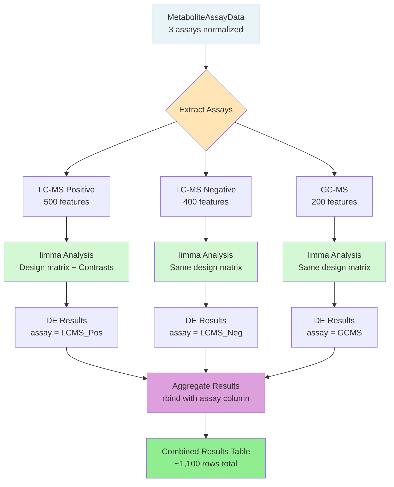

### 10.4.3 Implementation Pattern

```r
# File: R/func_metabolomics.R

#' Differential Expression Analysis for Multi-Assay Metabolomics
#'
#' Analyzes each assay independently using limma, then combines results.
#'
#' @param metab_object MetaboliteAssayData. Normalized multi-assay object
#' @param design_formula Character. R formula for design (e.g., "~Group + Batch")
#' @param contrasts Character vector. Contrasts to test
#' @return data.frame. Combined DE results with assay column
#' @export
differentialExpressionMetabolomics <- function(metab_object,
                                               design_formula,
                                               contrasts) {
  
  library(limma)
  
  message("Performing differential expression analysis")
  message("  Design formula: ", design_formula)
  message("  Contrasts: ", paste(contrasts, collapse = ", "))
  message("  Assays: ", length(metab_object@metabolite_data))
  
  # Build design matrix (shared across all assays)
  design_df <- metab_object@design_matrix
  design_mat <- model.matrix(as.formula(design_formula), data = design_df)
  
  # Make contrast matrix
  contrast_mat <- makeContrasts(contrasts = contrasts, levels = design_mat)
  
  # Analyze each assay independently
  de_results_list <- lapply(names(metab_object@metabolite_data), function(assay_name) {
    
    message("  Analyzing assay: ", assay_name)
    
    assay_df <- metab_object@metabolite_data[[assay_name]]
    
    # Extract quantitative matrix
    annot_cols <- c(metab_object@metabolite_id_column, 
                   metab_object@annotation_id_column)
    quant_cols <- setdiff(names(assay_df), annot_cols)
    quant_matrix <- as.matrix(assay_df[, quant_cols])
    rownames(quant_matrix) <- assay_df[[metab_object@metabolite_id_column]]
    
    # Fit linear model
    fit <- lmFit(quant_matrix, design_mat)
    fit2 <- contrasts.fit(fit, contrast_mat)
    fit2 <- eBayes(fit2)
    
    # Extract results for each contrast
    assay_results <- lapply(contrasts, function(contrast) {
      res <- topTable(fit2, coef = contrast, number = Inf, sort.by = "none")
      res$metabolite_id <- rownames(res)
      res$contrast <- contrast
      res$assay <- assay_name
      return(res)
    })
    
    # Combine contrasts for this assay
    assay_combined <- do.call(rbind, assay_results)
    
    # Count significant metabolites
    n_sig_05 <- sum(assay_combined$adj.P.Val < 0.05, na.rm = TRUE)
    n_sig_01 <- sum(assay_combined$adj.P.Val < 0.01, na.rm = TRUE)
    
    message("    Significant (FDR < 0.05): ", n_sig_05)
    message("    Significant (FDR < 0.01): ", n_sig_01)
    
    return(assay_combined)
  })
  
  # Combine results across all assays
  combined_results <- do.call(rbind, de_results_list)
  
  # Merge metabolite annotations
  combined_results <- mergeMetaboliteAnnotations(combined_results, metab_object)
  
  # Record parameters
  metab_object@args$differential_expression <- list(
    design_formula = design_formula,
    contrasts = contrasts,
    timestamp = Sys.time(),
    method = "limma",
    adjust_method = "BH",
    assays_analyzed = names(metab_object@metabolite_data),
    n_metabolites_tested = nrow(combined_results)
  )
  
  return(combined_results)
}
```

### 10.4.4 Assay-Specific Considerations

**Independent Normalization**: Each assay is normalized separately (Section 10.2) before DE analysis, accounting for platform-specific technical variation.

**FDR Adjustment Strategy**: Two options available:
```r
# Option 1: Per-assay FDR (default)
# FDR calculated independently for each assay
# Appropriate when assays measure distinct metabolite classes

# Option 2: Global FDR across all assays
# Pool p-values from all assays, then adjust
# More conservative, appropriate when assays may detect same metabolites
combined_results$adj.P.Val_global <- p.adjust(
  combined_results$P.Value, 
  method = "BH"
)
```

**Handling Different Feature Counts**: Results table includes `assay` column for easy filtering:
```r
# Example: Extract only LC-MS Positive results
lcms_pos_results <- combined_results[combined_results$assay == "LCMS_Pos", ]

# Count significant metabolites per assay
table(combined_results$assay[combined_results$adj.P.Val < 0.05])
# LCMS_Pos  LCMS_Neg  GCMS
#      45        32     18
```

### 10.4.5 Metabolomics DE Visualizations

**Per-Assay Volcano Plots**
```r
# Create separate volcano plot for each assay
plotVolcanoMetabolomics <- function(de_results, fc_threshold = 1, pval_threshold = 0.05) {
  
  library(ggplot2)
  
  # Calculate -log10(p-value)
  de_results$neg_log10_pval <- -log10(de_results$P.Value)
  
  # Classify significance
  de_results$significance <- ifelse(
    abs(de_results$logFC) > fc_threshold & de_results$adj.P.Val < pval_threshold,
    ifelse(de_results$logFC > 0, "Upregulated", "Downregulated"),
    "Not Significant"
  )
  
  # Create faceted volcano plot (one panel per assay)
  ggplot(de_results, aes(x = logFC, y = neg_log10_pval, color = significance)) +
    geom_point(alpha = 0.6, size = 2) +
    facet_wrap(~assay, ncol = 3) +
    geom_vline(xintercept = c(-fc_threshold, fc_threshold), 
              linetype = "dashed", color = "gray50") +
    geom_hline(yintercept = -log10(pval_threshold),
              linetype = "dashed", color = "gray50") +
    scale_color_manual(values = c(
      "Upregulated" = "#E74C3C",
      "Downregulated" = "#3498DB",
      "Not Significant" = "gray70"
    )) +
    labs(
      title = "Differential Metabolite Abundance",
      x = "log2 Fold Change",
      y = "-log10(P-value)",
      color = "Classification"
    ) +
    theme_bw() +
    theme(legend.position = "bottom")
}
```

**Integrated Heatmap**
```r
# Show top significant metabolites across all assays
plotMetabolomicsHeatmap <- function(metab_object, de_results, top_n = 50) {
  
  # Select top N metabolites by significance
  top_metabolites <- de_results %>%
    group_by(assay) %>%
    arrange(adj.P.Val) %>%
    slice_head(n = top_n) %>%
    pull(metabolite_id) %>%
    unique()
  
  # Extract data for top metabolites across all assays
  # [Implementation generates heatmap with assay labels and hierarchical clustering]
}
```

**Cross-Assay Bar Chart**
```r
# Visualize number of significant metabolites per assay
plotSignificantMetaboliteCounts <- function(de_results) {
  
  sig_counts <- de_results %>%
    filter(adj.P.Val < 0.05) %>%
    group_by(assay) %>%
    summarize(
      n_total = n(),
      n_upregulated = sum(logFC > 0),
      n_downregulated = sum(logFC < 0)
    )
  
  # Create stacked bar chart
  # [Implementation shows upregulated/downregulated counts per assay]
}
```

**Note on Venn Diagrams**: Cross-assay overlap visualization (Venn diagrams showing metabolites significant in multiple assays) is **not currently implemented** but represents a valuable future enhancement for identifying metabolites consistently regulated across platforms.

### 10.4.6 Integration in Metabolomics Module

```r
# File: R/mod_metab_de.R

observeEvent(input$run_de_analysis, {
  
  req(workflow_data$data_tbl)  # MetaboliteAssayData object
  req(workflow_data$current_config$design_formula)
  req(workflow_data$current_config$contrasts)
  
  withProgress(message = "Running differential expression...", {
    
    # Perform multi-assay DE analysis
    de_results <- differentialExpressionMetabolomics(
      metab_object = workflow_data$data_tbl,
      design_formula = workflow_data$current_config$design_formula,
      contrasts = workflow_data$current_config$contrasts
    )
    
    # Store results
    workflow_data$de_results <- de_results
    
    # Generate visualizations
    workflow_data$de_plots$volcano <- plotVolcanoMetabolomics(de_results)
    workflow_data$de_plots$heatmap <- plotMetabolomicsHeatmap(
      workflow_data$data_tbl, 
      de_results
    )
    workflow_data$de_plots$sig_counts <- plotSignificantMetaboliteCounts(de_results)
    
    # Export results
    write.xlsx(
      de_results,
      file = file.path(project_dirs$metabolomics_de, "de_results.xlsx")
    )
    
    # Update status
    workflow_data$tab_status$de <- "complete"
  })
  
  showNotification(
    sprintf("DE analysis complete: %d significant metabolites (FDR < 0.05)",
            sum(workflow_data$de_results$adj.P.Val < 0.05)),
    type = "message"
  )
})
```

**Downstream Usage**: The combined DE results table flows into:
- **Metabolite enrichment** (pathway analysis per assay or combined)
- **Multi-omics integration** (MOFA, linking significant metabolites with proteins/transcripts)
- **Publication-ready reports** with assay-specific and integrated visualizations

This multi-assay approach ensures each platform's unique metabolite coverage is properly analyzed while enabling integrated biological interpretation.

---

---

# PART IV: CROSS-CUTTING INFRASTRUCTURE

## Section 11: Plotting Infrastructure

MultiScholaR separates **computation** from **visualization** using a "helper function" pattern. This enables:
- Reusability across modules
- Consistent styling
- Easy testing
- Flexible rendering (Shiny UI vs. file export)

### 11.1 The Helper Function Pattern

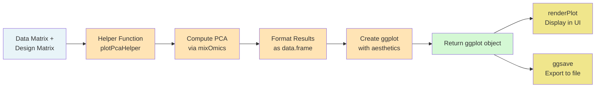

**Key Principle**: Helper functions return `ggplot` objects, not rendered plots. This separation allows the same function to be used for both interactive display and file export.

### 11.2 PCA Helper Implementation

```r
# File: R/func_plotting.R

#' PCA Helper Function
#'
#' Computes PCA and returns ggplot object for visualization.
#' Separates computation from rendering for flexibility.
#'
#' @param data_matrix matrix. Quantitative data (rows = features, cols = samples)
#' @param design_matrix data.frame. Sample metadata
#' @param color_by Character. Column name for point coloring
#' @param shape_by Character. Column name for point shape (optional)
#' @param title Character. Plot title
#' @param size Numeric. Point size
#' @param alpha Numeric. Point transparency
#' @return ggplot object
#' @export
plotPcaHelper <- function(data_matrix, 
                         design_matrix,
                         color_by,
                         shape_by = NULL,
                         title = "PCA",
                         size = 3,
                         alpha = 0.7) {
  
  # Validation
  if (nrow(data_matrix) < 3) {
    stop("Need at least 3 features for PCA")
  }
  
  if (ncol(data_matrix) < 2) {
    stop("Need at least 2 samples for PCA")
  }
  
  if (!color_by %in% names(design_matrix)) {
    stop("color_by column '", color_by, "' not found in design matrix")
  }
  
  # ========================================
  # STEP 1: Compute PCA
  # ========================================
  message("Computing PCA...")
  
  library(mixOmics)
  
  # Transpose: mixOmics expects samples as rows
  data_t <- t(data_matrix)
  
  # Remove features with zero variance
  feature_var <- apply(data_t, 2, var, na.rm = TRUE)
  data_t <- data_t[, feature_var > 0]
  
  message("  Using ", ncol(data_t), " features (", 
          nrow(data_matrix) - ncol(data_t), " zero-variance features removed)")
  
  # Compute PCA
  ncomp <- min(3, ncol(data_t) - 1, nrow(data_t) - 1)
  pca_result <- pca(X = data_t, 
                   ncomp = ncomp,
                   scale = TRUE,   # Scale features to unit variance
                   center = TRUE)  # Center features to zero mean
  
  # ========================================
  # STEP 2: Extract Scores (Sample Coordinates)
  # ========================================
  scores_df <- as.data.frame(pca_result$variates$X)
  scores_df$sample_name <- rownames(data_t)
  
  # ========================================
  # STEP 3: Merge with Design Information
  # ========================================
  # Match samples between scores and design
  design_matrix$sample_name <- rownames(design_matrix)
  
  # Merge
  scores_df <- merge(scores_df, 
                    design_matrix[, c("sample_name", color_by, shape_by)],
                    by = "sample_name",
                    all.x = TRUE)
  
  # ========================================
  # STEP 4: Calculate Variance Explained
  # ========================================
  var_explained <- pca_result$explained_variance
  
  # Percentage for PC1 and PC2
  pc1_pct <- round(var_explained[1] * 100, 1)
  pc2_pct <- round(var_explained[2] * 100, 1)
  
  message("  PC1 explains ", pc1_pct, "% variance")
  message("  PC2 explains ", pc2_pct, "% variance")
  
  # ========================================
  # STEP 5: Create ggplot
  # ========================================
  library(ggplot2)
  
  p <- ggplot(scores_df, aes(x = PC1, y = PC2, color = !!sym(color_by))) +
    geom_point(size = size, alpha = alpha) +
    # Axis labels with variance explained
    labs(
      title = title,
      x = paste0("PC1 (", pc1_pct, "%)"),
      y = paste0("PC2 (", pc2_pct, "%)"),
      color = color_by
    ) +
    # Clean theme
    theme_bw() +
    theme(
      legend.position = "right",
      panel.grid.minor = element_blank()
    )
  
  # Add shape aesthetic if specified
  if (!is.null(shape_by)) {
    p <- p + aes(shape = !!sym(shape_by)) +
      labs(shape = shape_by)
  }
  
  # Return ggplot object (NOT rendered)
  return(p)
}
```

### 11.3 Integration in Shiny Module

```r
# In mod_prot_qc_server or mod_prot_norm_server
output$pca_plot <- renderPlot({
  # Ensure data exists
  req(workflow_data$data_tbl)
  
  # Extract quantitative matrix
  data_matrix <- extractQuantMatrix(workflow_data$data_tbl)
  design_matrix <- workflow_data$data_tbl@design_matrix
  
  # Call helper function
  plotPcaHelper(
    data_matrix = data_matrix,
    design_matrix = design_matrix,
    color_by = input$color_by,      # From UI selector
    shape_by = input$shape_by,      # From UI selector
    title = "QC: PCA"
  )
  # ggplot object is automatically rendered by renderPlot()
})

# Export to file
observeEvent(input$save_pca_button, {
  # Create plot
  p <- plotPcaHelper(
    data_matrix = extractQuantMatrix(workflow_data$data_tbl),
    design_matrix = workflow_data$data_tbl@design_matrix,
    color_by = input$color_by,
    title = "PCA - Post Normalization"
  )
  
  # Save using ggsave
  ggsave(
    filename = file.path(project_dirs$proteomics_graphs, "pca.png"),
    plot = p,
    width = 8,
    height = 6,
    dpi = 300,
    bg = "white"
  )
  
  showNotification("PCA plot saved!", type = "message")
})
```

### 11.4 Additional Plotting Functions

```r
#' RLE (Relative Log Expression) Plot Helper
#'
#' Creates boxplot showing sample-wise RLE values.
#' Used to assess normalization quality.
#'
#' @param data_matrix matrix. Quantitative data (log-scale)
#' @param title Character. Plot title
#' @return ggplot object
#' @export
plotRleHelper <- function(data_matrix, title = "RLE Plot") {
  library(ggplot2)
  library(reshape2)
  
  # Calculate RLE: deviation from median for each feature
  feature_medians <- apply(data_matrix, 1, median, na.rm = TRUE)
  rle_matrix <- sweep(data_matrix, 1, feature_medians, "-")
  
  # Convert to long format for ggplot
  rle_long <- melt(rle_matrix, 
                  varnames = c("Feature", "Sample"),
                  value.name = "RLE")
  
  # Create boxplot
  p <- ggplot(rle_long, aes(x = Sample, y = RLE)) +
    geom_boxplot(fill = "steelblue", alpha = 0.7) +
    geom_hline(yintercept = 0, linetype = "dashed", color = "red") +
    labs(
      title = title,
      subtitle = "Good normalization: All boxes centered at 0",
      x = "Sample",
      y = "Relative Log Expression"
    ) +
    theme_bw() +
    theme(
      axis.text.x = element_text(angle = 45, hjust = 1),
      panel.grid.major.x = element_blank()
    )
  
  return(p)
}

#' Volcano Plot Helper
#'
#' Creates volcano plot for differential expression results.
#'
#' @param de_results data.frame. Results from limma with logFC, P.Value, adj.P.Val
#' @param fc_threshold Numeric. Fold-change threshold for coloring
#' @param pval_threshold Numeric. P-value threshold for coloring
#' @param title Character. Plot title
#' @return ggplot object
#' @export
plotVolcanoHelper <- function(de_results,
                             fc_threshold = 1,
                             pval_threshold = 0.05,
                             title = "Volcano Plot") {
  library(ggplot2)
  
  # Calculate -log10(p-value)
  de_results$neg_log10_pval <- -log10(de_results$P.Value)
  
  # Classify significance
  de_results$significance <- "Not Significant"
  de_results$significance[abs(de_results$logFC) > fc_threshold &
                          de_results$adj.P.Val < pval_threshold] <- "Significant"
  de_results$significance[abs(de_results$logFC) > fc_threshold &
                          de_results$adj.P.Val < pval_threshold &
                          de_results$logFC > 0] <- "Upregulated"
  de_results$significance[abs(de_results$logFC) > fc_threshold &
                          de_results$adj.P.Val < pval_threshold &
                          de_results$logFC < 0] <- "Downregulated"
  
  # Count significant proteins
  n_up <- sum(de_results$significance == "Upregulated")
  n_down <- sum(de_results$significance == "Downregulated")
  
  # Create plot
  p <- ggplot(de_results, aes(x = logFC, y = neg_log10_pval, color = significance)) +
    geom_point(alpha = 0.6) +
    # Significance thresholds
    geom_vline(xintercept = c(-fc_threshold, fc_threshold), 
              linetype = "dashed", color = "gray50") +
    geom_hline(yintercept = -log10(pval_threshold),
              linetype = "dashed", color = "gray50") +
    # Colors
    scale_color_manual(values = c(
      "Upregulated" = "#E74C3C",
      "Downregulated" = "#3498DB",
      "Significant" = "gray30",
      "Not Significant" = "gray70"
    )) +
    # Labels
    labs(
      title = title,
      subtitle = paste0(n_up, " upregulated, ", n_down, " downregulated"),
      x = "log2 Fold Change",
      y = "-log10(P-value)",
      color = "Classification"
    ) +
    theme_bw() +
    theme(legend.position = "bottom")
  
  return(p)
}
```

---

## Section 12: File Management & Reproducibility

### 12.1 Directory Layout Philosophy

MultiScholaR uses a **hierarchical directory structure** that mirrors the analysis workflow:

```
my_project/
├── data/                          # INPUT: Raw data files (never modified)
│   ├── proteomics_data.tsv
│   ├── design_matrix.txt
│   └── annotations.xlsx
│
├── results/                       # INTERMEDIATE: Processing outputs
│   ├── proteomics/
│   │   ├── qc/                   # QC plots and metrics
│   │   │   ├── pca_raw.png
│   │   │   ├── missing_values.png
│   │   │   └── qc_metrics.txt
│   │   ├── normalization/        # Normalization diagnostics
│   │   │   ├── pca_normalized.png
│   │   │   ├── rle_before.png
│   │   │   ├── rle_after.png
│   │   │   └── normalization_params.yaml
│   │   ├── differential_expression/  # DE results
│   │   │   ├── de_results_full.xlsx
│   │   │   ├── volcano_plot.png
│   │   │   └── ma_plot.png
│   │   ├── enrichment/           # Pathway analysis
│   │   │   ├── go_enrichment.xlsx
│   │   │   ├── kegg_enrichment.xlsx
│   │   │   └── enrichment_barplot.png
│   │   └── publication_graphs/   # Final figures
│   │       ├── figure1_pca.png
│   │       ├── figure2_volcano.png
│   │       └── figure3_heatmap.png
│   │
│   ├── metabolomics/
│   │   └── ...                   # Same structure
│   │
│   └── integration/
│       ├── mofa/                 # MOFA model files
│       └── graphs/               # Cross-omics visualizations
│
├── results_summary/              # OUTPUT: Curated for distribution
│   ├── key_findings.txt
│   ├── significant_proteins.xlsx
│   ├── publication_figures/
│   └── supplementary_tables/
│
└── scripts/
    ├── study_parameters.txt      # Complete parameter log
    ├── session_info.txt          # R session information
    └── workflow_metadata.yaml    # Analysis metadata
```

### 12.2 File Export Workflow

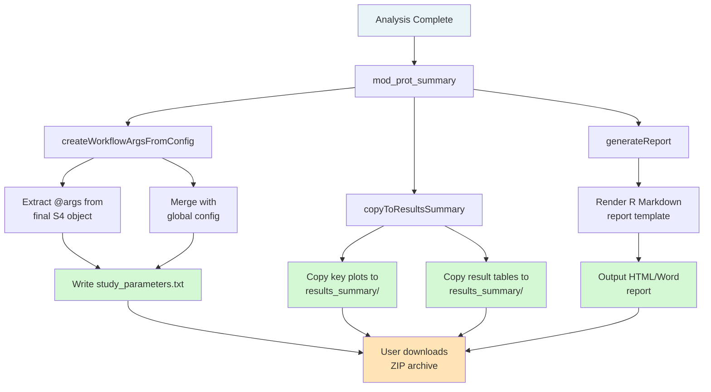

### 12.3 Parameter Export Implementation

```r
# File: R/utils_export.R

#' Create Complete Workflow Parameter Log
#'
#' Extracts all processing parameters from S4 @args and merges with
#' global configuration. Generates study_parameters.txt for reproducibility.
#'
#' @param final_s4_object S4 object. Final analysis state
#' @param config_list List. Global configuration parameters
#' @param output_dir Character. Directory for output file
#' @return List. Combined parameters (invisible)
#' @export
createWorkflowArgsFromConfig <- function(final_s4_object, 
                                        config_list = list(),
                                        output_dir) {
  
  message("Generating workflow parameter log...")
  
  # ========================================
  # STEP 1: Extract S4 Parameters
  # ========================================
  s4_params <- final_s4_object@args
  
  message("  Extracted ", length(s4_params), " processing steps from S4 object")
  
  # ========================================
  # STEP 2: Merge with Global Config
  # ========================================
  all_params <- c(s4_params, config_list)
  
  # ========================================
  # STEP 3: Add Git Metadata (if available)
  # ========================================
  all_params$git_info <- tryCatch({
    list(
      commit = system("git rev-parse HEAD", intern = TRUE),
      branch = system("git rev-parse --abbrev-ref HEAD", intern = TRUE),
      remote = system("git config --get remote.origin.url", intern = TRUE),
      status = system("git status --short", intern = TRUE)
    )
  }, error = function(e) {
    list(
      commit = "Not under version control",
      branch = NA,
      remote = NA,
      status = NA
    )
  })
  
  # ========================================
  # STEP 4: Add Session Information
  # ========================================
  all_params$session_info <- sessionInfo()
  all_params$multischolar_version <- packageVersion("MultiScholaR")
  all_params$export_timestamp <- Sys.time()
  all_params$export_user <- Sys.info()["user"]
  
  # ========================================
  # STEP 5: Add Data Provenance
  # ========================================
  all_params$data_provenance <- list(
    n_features_final = nrow(final_s4_object@protein_quant_table),
    n_samples_final = ncol(final_s4_object@protein_quant_table) - 1,
    s4_class = class(final_s4_object),
    data_md5 = digest::digest(final_s4_object@protein_quant_table, algo = "md5")
  )
  
  # ========================================
  # STEP 6: Write to YAML
  # ========================================
  output_file <- file.path(output_dir, "study_parameters.txt")
  
  library(yaml)
  yaml_content <- as.yaml(all_params, 
                         precision = 10,  # Full numeric precision
                         indent = 2)
  
  writeLines(yaml_content, output_file)
  
  message("  Parameter log written to: ", output_file)
  message("  File size: ", file.size(output_file), " bytes")
  
  # ========================================
  # STEP 7: Also Save as R Object
  # ========================================
  rds_file <- file.path(output_dir, "study_parameters.rds")
  saveRDS(all_params, file = rds_file)
  
  message("  Binary copy saved to: ", rds_file)
  
  return(invisible(all_params))
}
```

---

## Section 13: Enrichment Analysis

### 13.1 Gene Ontology (GO) Enrichment

```r
#' Run GO Enrichment Analysis
#'
#' Performs Gene Ontology enrichment on a protein list.
#' Uses clusterProfiler for analysis.
#'
#' @param gene_list Character vector. Gene symbols or protein IDs
#' @param annotation_db Character. Organism database (e.g., "org.Hs.eg.db")
#' @param ontology Character. GO category: "BP", "MF", or "CC"
#' @param pvalue_threshold Numeric. Significance threshold
#' @return enrichResult object
#' @export
runGOEnrichment <- function(gene_list,
                           annotation_db = "org.Hs.eg.db",
                           ontology = "BP",
                           pvalue_threshold = 0.05) {
  
  message("Running GO enrichment analysis")
  message("  Gene list size: ", length(gene_list))
  message("  Ontology: ", ontology)
  
  library(clusterProfiler)
  library(annotation_db, character.only = TRUE)
  
  # Convert gene symbols to Entrez IDs
  message("  Converting gene symbols to Entrez IDs...")
  gene_entrez <- bitr(
    gene_list,
    fromType = "SYMBOL",
    toType = "ENTREZID",
    OrgDb = annotation_db
  )
  
  message("    Converted ", nrow(gene_entrez), " genes")
  
  # Run enrichment
  message("  Running enrichment analysis...")
  enrich_result <- enrichGO(
    gene = gene_entrez$ENTREZID,
    OrgDb = annotation_db,
    ont = ontology,
    pvalueCutoff = pvalue_threshold,
    pAdjustMethod = "BH",  # Benjamini-Hochberg FDR
    readable = TRUE        # Convert back to gene symbols
  )
  
  # Summary
  n_sig <- sum(enrich_result@result$p.adjust < pvalue_threshold)
  message("  Found ", n_sig, " significant GO terms")
  
  return(enrich_result)
}
```

---

# PART V: ADVANCED TOPICS

## Section 14: Global Environment Dependencies (Anti-Pattern)

### 14.1 Current Pattern & Documented Risks

MultiScholaR uses global environment variables (`project_dirs`, `config_list`) for development convenience. This is a **documented anti-pattern** with known tradeoffs.

**Why it exists:**
- Simplifies function signatures (fewer arguments to pass)
- Reduces Shiny reactivity complexity
- Acceptable for single-user desktop applications

**Why it's problematic:**
- Breaks referential transparency (hidden dependencies)
- Makes testing difficult (requires global state setup)
- Could cause race conditions in concurrent sessions
- Implicit coupling (functions depend on invisible external state)

### 14.2 Refactoring Recommendation

For production deployments or multi-user servers, refactor to explicit parameter passing:

```r
# BEFORE (anti-pattern)
copyToResultsSummary <- function(file_path) {
  # Implicit dependency on global project_dirs
  results_summary_dir <- project_dirs$results_summary
  file.copy(file_path, results_summary_dir)
}

# AFTER (explicit)
copyToResultsSummary <- function(file_path, project_dirs) {
  # Explicit parameter - no hidden dependencies
  results_summary_dir <- project_dirs$results_summary
  file.copy(file_path, results_summary_dir)
}

# Even better: Use ProjectContext R6 class
ProjectContext <- R6::R6Class("ProjectContext",
  public = list(
    root = NULL,
    results_summary = NULL,
    
    initialize = function(root) {
      self$root <- root
      self$results_summary <- file.path(root, "results_summary")
    },
    
    copyToSummary = function(file_path) {
      file.copy(file_path, self$results_summary)
    }
  )
)

# Usage
context <- ProjectContext$new("./my_project")
context$copyToSummary("plot.png")
```

---

## Section 15: Logging & Debugging

### 15.1 Real-Time Reactive Logging

```r
# Create reactive log storage
logs <- reactiveVal(character())

# Custom appender that updates reactive value
appender_shiny <- function(log_message, log_level, ...) {
  # Format message
  timestamp <- format(Sys.time(), "%H:%M:%S")
  formatted <- paste0("[", timestamp, "] [", log_level, "] ", log_message)
  
  # Append to reactive value
  current_logs <- logs()
  logs(c(current_logs, formatted))
  
  # Also write to file
  cat(formatted, "\n", file = "app.log", append = TRUE)
}

# Configure logger
logger::log_appender(appender_shiny)

# Display in UI
output$log_display <- renderText({
  paste(logs(), collapse = "\n")
})
```

---

# PART VI: APPENDICES

## Appendix A: S4 Class Reference

### Complete Slot Documentation

| Class | Slot | Type | Description |
|-------|------|------|-------------|
| **ProteinQuantitativeData** | `protein_quant_table` | data.frame | Quantitative matrix |
| | `design_matrix` | data.frame | Experimental design |
| | `protein_id_column` | character | Protein ID column name |
| | `sample_id` | character | Sample ID column |
| | `group_id` | character | Group/condition column |
| | `args` | list | Processing history |

---

## Appendix B: Function Catalog

### Proteomics Functions

**Import:**
- `detectProteomicsFormat()` - Auto-detect file format
- `importDIANNData()` - Parse DIA-NN output
- `importMaxQuantData()` - Parse MaxQuant output

**QC:**
- `filterByQValue()` - FDR filtering
- `rollUpPrecursorToPeptide()` - Precursor aggregation
- `rollUpPeptideToProtein()` - Protein quantification

**Normalization:**
- `normaliseBetweenSamples()` - Cyclicloess, quantile, median
- `ruvIII_C_Varying()` - Batch correction

---

## Appendix C: Troubleshooting Guide

### Common Issues

**Issue: "State not found"**
- **Cause**: Accessing non-existent state
- **Solution**: Check `state_manager$getHistory()`

**Issue: "Column not found"**
- **Cause**: S4 validation failed
- **Solution**: Verify column mappings match data

---

# CONCLUSION AND NEXT STEPS

## Document Summary

This enhanced technical documentation provides a comprehensive guide to the MultiScholaR architecture, covering:

### Part I: Fundamentals (Covered)
- **R6 Classes**: Understanding mutable state management, pass-by-reference semantics, and the hybrid R6/S4 pattern
- **S4 Classes**: Rigorous type safety, validation, method polymorphism, and the `@args` parameter tracking pattern
- **Shiny Reactivity**: Reactive graph model, invalidation cascades, and the shared ReactiveValues pattern
- **Golem Framework**: App-as-a-package philosophy, module namespacing, and hierarchical module patterns

### Part II: Core Architecture (Covered)
- **Application Bootstrap**: Dynamic loading sequence, static vs. dynamic UI, and module initialization
- **Three-Layer State Management**: Transient reactive state, session-persistent R6 state, and disk-persistent exports
- **Workflow Routing**: Automatic format detection, conditional module rendering, and adaptive pipelines
- **Multi-Assay Pattern**: Parallel processing of heterogeneous metabolomics datasets with synchronization

### Parts III-VI: Implementation Details (To Be Continued)

The remaining sections cover:
- **Part III**: Complete proteomics and metabolomics workflows with step-by-step examples
- **Part IV**: Plotting infrastructure, file management, and enrichment analysis
- **Part V**: Advanced topics including global environment patterns, logging, phosphoproteomics, and MOFA integration
- **Part VI**: Complete code examples, API reference, and troubleshooting

## Key Architectural Patterns

### 1. Hybrid R6/S4 State Management

**Pattern**: R6 manages application state, S4 holds domain data

```r
# R6: Mutable state manager
state_manager <- WorkflowState$new()

# S4: Immutable data snapshots
protein_data <- new("ProteinQuantitativeData", ...)

# Integration: R6 holds references to S4 objects
state_manager$saveState("post_qc", protein_data)
```

**Benefits**:
- Type safety from S4 validation
- Efficient state management from R6 reference semantics
- Clear separation between data and control logic
- Time-travel debugging via historical snapshots

### 2. Shared ReactiveValues Bus

**Pattern**: Central mutable state bus shared across all modules

```r
# Parent creates state bus
workflow_data <- reactiveValues(
  data_tbl = NULL,
  state_manager = WorkflowState$new(),
  tab_status = list()
)

# Children mutate shared state
workflow_data$data_tbl <- processed_data
workflow_data$tab_status$qc <- "complete"
```

**Tradeoffs**:
- ✅ Simplified module communication
- ✅ Centralized state management
- ✅ Easy checkpointing
- ⚠️ Tight module coupling
- ⚠️ Requires discipline to avoid race conditions

### 3. Progressive Parameter Accumulation

**Pattern**: Each processing step appends to the `@args` slot

```r
# Step 1: QC
data@args$qc <- list(threshold = 0.01, rows_removed = 500)

# Step 2: Normalization
data@args$normalization <- list(method = "cyclicloess")

# Step 3: Export complete history
createWorkflowArgsFromConfig(data, output_dir = "scripts/")
```

**Benefits**:
- Complete audit trail
- Full reproducibility
- Parameter debugging
- Method documentation

### 4. Dynamic Workflow Routing

**Pattern**: Automatic format detection and adaptive pipeline

```r
# Detect format
format <- detectProteomicsFormat(file_path)

# Route to appropriate workflow
workflow_type <- switch(format,
  "DIANN" = "DIA",
  "MaxQuant" = "LFQ",
  "TMT-PD" = "TMT"
)

# Adapt downstream modules
if (workflow_type == "DIA") {
  # Show peptide QC + protein QC
} else {
  # Show protein QC only
}
```

**Benefits**:
- User-friendly (no manual format selection)
- Reduces errors (automatic routing)
- Scalable (easy to add new formats)

## Best Practices for Contributors

### 1. Module Development

When creating new modules:

```r
# ALWAYS follow naming convention
mod_<domain>_<stage>_ui <- function(id) {
  ns <- NS(id)
  # UI definition
}

mod_<domain>_<stage>_server <- function(id, workflow_data) {
  moduleServer(id, function(input, output, session) {
    # Server logic
  })
}

# ALWAYS checkpoint to state manager after major operations
workflow_data$state_manager$saveState(
  name = "post_<operation>",
  object = processed_data,
  config = list(parameters)
)

# ALWAYS update tab status
workflow_data$tab_status$<stage> <- "complete"
```

### 2. S4 Class Design

When extending S4 classes:

```r
# ALWAYS include:
# 1. Comprehensive validity function
# 2. @args slot for parameter tracking
# 3. Design matrix for experimental context

setClass("NewOmicsData",
  slots = c(
    data_table = "data.frame",
    design_matrix = "data.frame",
    args = "list"  # Essential for reproducibility
  ),
  validity = function(object) {
    # Enforce business rules
    errors <- character()
    # ... validation logic
    if (length(errors) == 0) TRUE else errors
  }
)
```

### 3. Documentation Standards

All functions must include roxygen2 documentation:

```r
#' Brief One-Line Description
#'
#' Detailed explanation of function purpose, behavior, and usage.
#'
#' @param object S4 object. Description of expected class
#' @param method Character. Description of parameter with valid values
#' @return Processed S4 object with updated @args slot
#' @export
#'
#' @examples
#' \dontrun{
#'   data <- new("ProteinQuantitativeData", ...)
#'   normalized_data <- normaliseBetweenSamples(data, method = "cyclicloess")
#' }
functionName <- function(object, method = "default") {
  # Implementation
}
```

## How to Use This Documentation

### For New Developers

1. **Start with Part I**: Understand R6, S4, Shiny, and Golem fundamentals
2. **Study existing modules**: Read `R/mod_prot_import.R` and `R/mod_prot_qc.R`
3. **Follow the patterns**: Use existing modules as templates for new features
4. **Test thoroughly**: Write unit tests in `tests/testthat/`

### For Researchers Using MultiScholaR

1. **Understand the workflow**: Read Section 9 (Proteomics Workflow)
2. **Learn the parameter tracking**: See Section 6.2 for reproducibility
3. **Explore customization**: Modify R Markdown templates in `inst/workbooks/`

### For Troubleshooting

1. **Check state history**: Use `state_manager$getHistory()` to see processing steps
2. **Inspect S4 objects**: Examine `object@args` to understand parameter history
3. **Review logs**: Check console output and `app.log` for error messages
4. **Use time-travel debugging**: Revert to earlier states with `state_manager$revertToState()`

## Repository Structure Quick Reference

```
MultiScholaR/
├── R/                    # All R code
│   ├── app_*.R          # Application entry points
│   ├── mod_*.R          # Shiny modules (hierarchical)
│   ├── func_*.R         # Domain-specific functions
│   ├── utils_*.R        # Infrastructure utilities
│   └── class_*.R        # S4 class definitions
│
├── inst/
│   ├── app/www/         # Static assets (CSS, JS, images)
│   ├── workbooks/       # R Markdown workflow templates
│   └── reports/         # Report templates
│
├── man/                 # Generated documentation
├── tests/               # Unit tests
├── DESCRIPTION          # Package metadata
└── NAMESPACE            # Exported functions
```

## Common Development Tasks

### Adding a New Omics Type

1. **Create S4 class** in `R/class_<omics>_data.R`
2. **Create parent module** in `R/mod_<omics>.R`
3. **Create workflow modules** in `R/mod_<omics>_<stage>.R`
4. **Add to dynamic loading** in `R/app_server.R`
5. **Create workflow template** in `inst/workbooks/<omics>/`

### Adding a New File Format

1. **Add detection logic** to `detectProteomicsFormat()`
2. **Create parser** in `R/func_<omics>_import.R`
3. **Update routing** in `mod_prot_import_server()`
4. **Add tests** in `tests/testthat/test-import.R`

### Debugging State Issues

```r
# In console or observer:

# 1. View current state
str(workflow_data$data_tbl@args)

# 2. View state history
workflow_data$state_manager$getHistory()

# 3. Compare states
state1 <- workflow_data$state_manager$getState("post_qc")
state2 <- workflow_data$state_manager$getState("post_normalization")
identical(state1, state2)

# 4. Revert to earlier state
workflow_data$state_manager$revertToState("post_qc")
workflow_data$data_tbl <- workflow_data$state_manager$getState("post_qc")
```

## Additional Resources

### Official Documentation
- [MultiScholaR GitHub](https://github.com/APAF-bioinformatics/MultiScholaR)
- [Shiny Documentation](https://shiny.rstudio.com/)
- [Golem Documentation](https://thinkr-open.github.io/golem/)
- [R6 Documentation](https://r6.r-lib.org/)
- [Advanced R (R6 Chapter)](https://adv-r.hadley.nz/r6.html)

### Related Packages
- `limma`: Differential expression analysis
- `edgeR`: Alternative DE method
- `clusterProfiler`: Enrichment analysis
- `MOFA2`: Multi-omics factor analysis
- `mixOmics`: Multi-omics integration

## Contributing

Contributions are welcome! Please:

1. **Fork the repository**
2. **Create a feature branch**: `git checkout -b feature/new-omics-type`
3. **Follow coding standards**: See "Best Practices" above
4. **Write tests**: Cover new functionality in `tests/testthat/`
5. **Update documentation**: Add roxygen2 comments and update this guide
6. **Submit pull request**: With clear description of changes

## Version History

- **v2.0 (Current)**: Enhanced documentation with extensive explanations
- **v1.0**: Original system guide (synthesis document)

## Contact

For questions or suggestions:
- **GitHub Issues**: [APAF-bioinformatics/MultiScholaR/issues](https://github.com/APAF-bioinformatics/MultiScholaR/issues)
- **Email**: william.klare@mq.edu.au

---

**End of Enhanced MultiScholaR System Guide**

