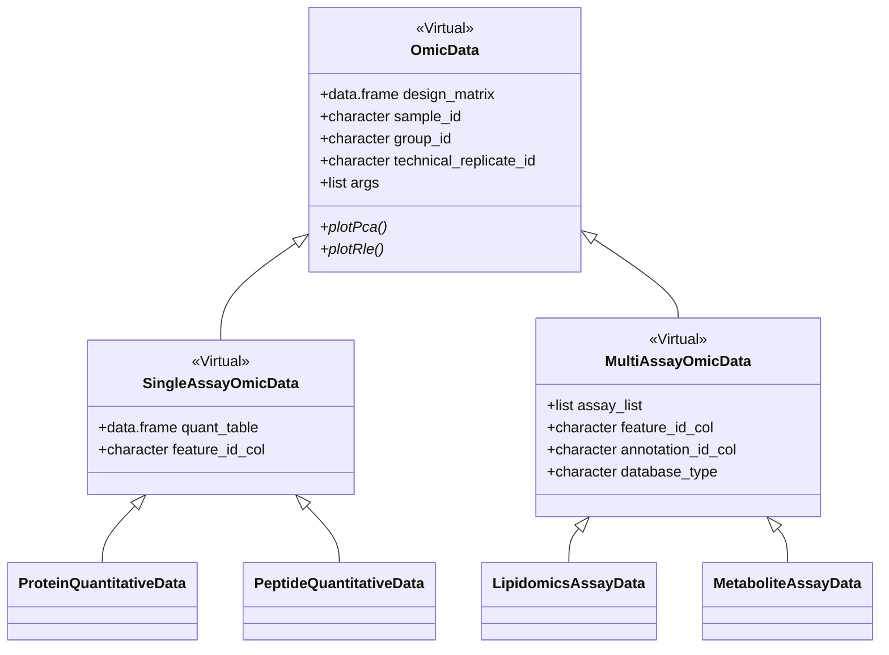

# MultiScholaR OOP Refactoring: S4 Inheritance Hierarchy

This plan outlines the refactoring of biological data objects (Proteins, Peptides, Lipids, Metabolites) into a structured S4 inheritance hierarchy to reduce code duplication and improve maintainability.

## User Review Required

> [!IMPORTANT]
> This refactoring will change the internal structure of the S4 objects. While I will maintain backward compatibility for existing methods, this is a significant architectural change.

## Current Architecture Audit

| Object Type | Class Name | Functional Pattern | Key Commonalities |
| :--- | :--- | :--- | :--- |
| **Proteins** | `ProteinQuantitativeData` | Single Data Table | `design_matrix`, `sample_id`, `group_id`, `args` |
| **Peptides** | `PeptideQuantitativeData` | Single Data Table | `design_matrix`, `sample_id`, `group_id`, `args` |
| **Lipids** | `LipidomicsAssayData` | List of Assays | `design_matrix`, `sample_id`, `group_id`, `args` |
| **Metabolites** | `MetaboliteAssayData` | List of Assays | `design_matrix`, `sample_id`, `group_id`, `args` |

## Proposed S4 Hierarchy

I recommend an S4-based inheritance model to centralize shared logic. S4 is chosen for its formal structure, Bioconductor compatibility, and existing use in the project.

## Proposed Changes

### [R Component]

#### [NEW] [func_base_s4_objects.R](file:///Users/ignatiuspang/Workings/2025/MultiScholaR/R/func_base_s4_objects.R)
*   Define `OmicData` virtual base class.
*   Define `SingleAssayOmicData` and `MultiAssayOmicData` subclasses.
*   Implement base methods for `OmicData` (e.g., parameter extraction, design matrix cleaning).
*   Implement common plotting dispatch logic for `SingleAssayOmicData` vs `MultiAssayOmicData`.

#### [MODIFY] [func_prot_s4_objects.R](file:///Users/ignatiuspang/Workings/2025/MultiScholaR/R/func_prot_s4_objects.R)
*   Update `ProteinQuantitativeData` to inherit from `SingleAssayOmicData`.
*   Remove redundant slots and methods now handled by the base class.

#### [MODIFY] [func_pept_s4_objects.R](file:///Users/ignatiuspang/Workings/2025/MultiScholaR/R/func_pept_s4_objects.R)
*   Update `PeptideQuantitativeData` to inherit from `SingleAssayOmicData`.

#### [MODIFY] [func_lipid_s4_objects.R](file:///Users/ignatiuspang/Workings/2025/MultiScholaR/R/func_lipid_s4_objects.R)
*   Update `LipidomicsAssayData` to inherit from `MultiAssayOmicData`.

#### [MODIFY] [func_metab_s4_objects.R](file:///Users/ignatiuspang/Workings/2025/MultiScholaR/R/func_metab_s4_objects.R)
*   Update `MetaboliteAssayData` to inherit from `MultiAssayOmicData`.

## Verification Plan

### Automated Tests
1.  **Instantiation Test**: Ensure all specialized classes can still be created using existing constructors.
2.  **Slot Access Test**: Verify that base class slots (e.g., `@design_matrix`) are accessible from subclass instances.
3.  **Method Dispatch Test**: Ensure `plotPca` and `plotRle` still work correctly for both single-assay and multi-assay types.
4.  **Validation Test**: Trigger S4 validity checks to ensure the hierarchy maintains data integrity.

### Manual Verification
1.  Launch the MultiScholaR app and verify that Proteomics and Lipidomics modules still load data and generate QC plots successfully.

<!-- APAF Bioinformatics | R_is_for_Robot | Approved -->
